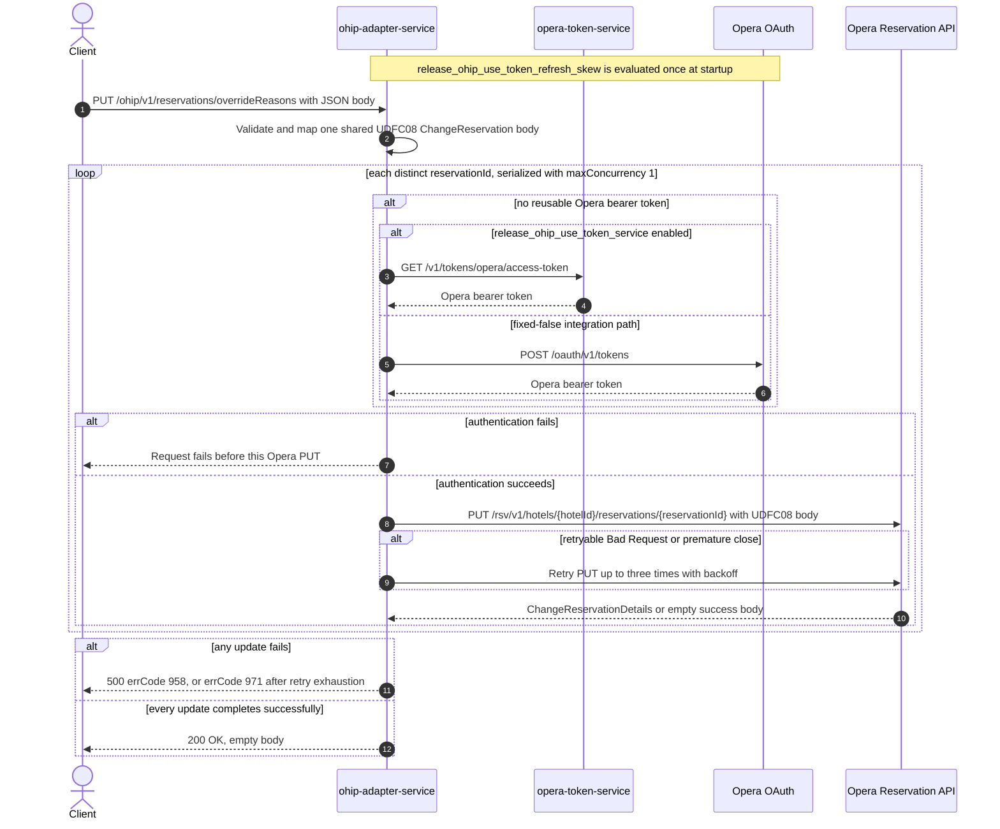

# OHIP Adapter Service: updateReservationOverrideReasons Flow

Writes the same override-reason audit value to character UDF `UDFC08` on every distinct
Opera reservation id supplied for one hotel.

```http
PUT /ohip/v1/reservations/overrideReasons
Host: ohip-adapter-service:9100
Content-Type: application/json
```

The servlet context path is `/ohip/` and `HotelReservationController` is mapped under `/v1`,
so the effective public route is `/ohip/v1/reservations/overrideReasons`. The controller has
no endpoint-level authentication guard. Outbound Opera requests carry a bearer token,
`x-app-key`, `x-hotelid`, and JSON content type. Success is `200 OK` with an empty body.

## Flow

`HotelReservationController.updateReservationOverrideReasons` Bean-validates
`UpdateReservationOverrideReasonsRequestDto`, maps it one-for-one through
`UpdateReservationOverrideReasonsRequestMapper`, and calls
`HotelReservationInPortImpl.updateReservationOverrideReasons`. The in-port only logs and
delegates to `HotelReservationOutPortImpl.updateReservationOverrideReasons`; it adds no
business guard, read, cache, or endpoint-specific feature-flag decision.

The out-port maps the request once to one shared `ChangeReservation` body. That body contains
one reservation instruction with the request `hotelId` and one character UDF named `UDFC08`.
The value is the comma-joined sequence `reasonCode,reasonName,callerName`; a non-blank
`managerName` is appended as the fourth component. The reservation id is carried only in the
request URL and is not included in the shared body.

The out-port iterates the request's `Set<String> reservationIds` and sends the shared body to
the Opera Reservation API once per distinct id as
`PUT /rsv/v1/hotels/{hotelId}/reservations/{reservationId}`. `Flux.flatMap` uses
`config.service.ohip.maxConcurrency`; the checked-in value is `1`, so the calls are serialized
under repository configuration, although their order follows non-contractual set iteration.
`collectList().block()` waits for the complete update fan-out before the controller returns.
The response bodies are not inspected, so an Opera success with an empty body is accepted.
There is no read-before-write call, compensating action, or rollback.

The shared Opera WebClient reuses a valid OAuth client token when available. Otherwise
`release_ohip_use_token_service` selects `opera-token-service` or direct Opera OAuth as the
token source. The integration workflow fixes that flag false, so its supported path is direct
Opera OAuth, using client credentials when `ENABLE_CLIENT_CREDENTIALS=true` and the password
grant otherwise. A non-retryable Opera error maps to HTTP 500 with errCode `958`. An error
envelope whose `type` is `Bad Request`, or a premature connection close, is retried up to
three times with backoff; exhaustion maps to HTTP 500 with errCode `971`. With the checked-in
concurrency of one, earlier successful reservations remain updated and later ids are not
processed after a terminal failure.

## Mermaid Flow



## Features

- Bulk update over a `Set`, so duplicate reservation ids collapse before execution
- One Opera change-reservation PUT per distinct reservation id
- One shared body for every id, with the reservation identity supplied only by the URL
- Serialized PUT fan-out under the checked-in `maxConcurrency: 1` configuration
- Override-reason audit data written as comma-joined character UDF `UDFC08`
- Optional non-blank manager name appended as the fourth UDF value component
- No reservation GET, cache lookup, downstream business collaborator other than Opera, or
  rollback
- Shared Opera OAuth selection and selective three-retry handling

## Feature Flags

No endpoint-specific business flag changes validation, mapping, fan-out, or response shaping.
The shared Opera authentication path evaluates these flags in `ohip-adapter-service`:

| Flag | Effect when enabled | Evaluation and override reachability |
| --- | --- | --- |
| `release_ohip_use_token_service` | Selects `opera-token-service` (`GET /v1/tokens/opera/access-token`) instead of direct Opera OAuth when a bearer token is required. | Evaluated by the OHIP WebClient filter for each outbound Opera request. The integration override wrapper can consult propagated baggage at this call site, but the integration environment fixes the flag false, so it is not an ON/OFF scenario axis. |
| `release_ohip_use_token_refresh_skew` | Applies `config.service.ohip.tokenRefreshClockSkew` to refresh directly acquired Opera OAuth tokens early. It does not change the reservation PUT or public response. | Evaluated once while `WebClientAuthConfig.customAuthClientProvider` is constructed, so request baggage cannot pin it. The integration workflow treats it as fixed false. |

## Request

Body: `UpdateReservationOverrideReasonsRequestDto`.

| Field | Required | Effect |
| --- | --- | --- |
| `reservationIds` | yes, non-null set with at least one entry | Each distinct value becomes the reservation-id path segment for one Opera PUT; duplicate JSON values collapse during set deserialization |
| `hotelId` | yes, non-null | Supplies the Opera hotel path value, body hotel id, and `x-hotelid` header; an empty string is not rejected by the declared DTO validation |
| `reasonCode` | yes, non-empty | First comma-separated component of `UDFC08` |
| `reasonName` | yes, non-empty | Second comma-separated component of `UDFC08` |
| `callerName` | yes, non-empty | Third comma-separated component of `UDFC08` |
| `managerName` | no | Appended as the fourth `UDFC08` component only when non-blank |

There are no path or query parameters.

## Branches

| Trigger | Behavior |
| --- | --- |
| Duplicate ids in the JSON array | Deserialization into a `Set` collapses them, so each distinct id is updated once |
| `managerName` is null, empty, or whitespace-only | The UDF contains only reason code, reason name, and caller name |
| `managerName` is non-blank | The manager name is appended as the fourth comma-separated UDF component |
| A valid OAuth client token is reusable | Skips both token-acquisition HTTP endpoints for that Opera call |
| No valid token and `release_ohip_use_token_service` is fixed false | Gets a token directly from configured Opera OAuth, using client credentials when `ENABLE_CLIENT_CREDENTIALS=true`, otherwise the password grant |
| Token acquisition fails | The affected reservation PUT is not sent and the public request fails |
| Opera returns a successful response with an empty body | The inner publisher completes empty; the out-port does not inspect it and the public request can still return `200 OK` |
| Opera returns a non-retryable error | Returns HTTP 500 with errCode `958`; earlier serialized updates remain applied and later ids are not processed |
| Opera error body has `type=Bad Request`, or the connection closes prematurely | Retries that PUT up to three times with backoff; exhaustion returns HTTP 500 with errCode `971` |
| `config.service.ohip.maxConcurrency` is externally raised above one | Multiple distinct-id PUTs may overlap and a failure may leave other already-started updates in flight |

The controller annotation and checked-in OpenAPI also advertise HTTP 404, but this runtime
path performs no lookup and contains no endpoint-specific not-found branch. Opera PUT errors
are translated to the HTTP 500 paths above.
