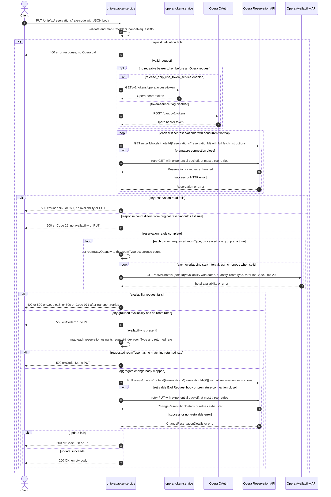

# OHIP Adapter Service: updateReservationRatePlanCode Flow

Changes the rate plan for one or more Opera reservations after reading the current reservations
and pricing the requested rate code for each distinct requested room type.

```http
PUT /ohip/v1/reservations/rate-code
Host: ohip-adapter-service:9100
Content-Type: application/json
```

The servlet context path is `/ohip/`, and `HotelReservationController` is mapped under `/v1`.
The handler returns `200 OK` with an empty body, although the checked-in OpenAPI contract declares
`201` for success. It has no endpoint-level authentication guard.

## Flow

`HotelReservationController.updateReservationRatePlanCode` validates `RatePlanChangeRequestDto`,
maps it to `RatePlanRoomTypeChangeRequest`, and calls
`HotelReservationInPortImpl.changeReservationRatePlan`. The in-port logs the request and delegates
directly to `HotelReservationOutPortImpl.changeReservationRatePlan`; it adds no business rule or
endpoint-specific feature-flag check.

The out-port first passes `Set.copyOf(reservationIds)` to
`OhipReservationClient.getReservations`. That client concurrently issues one
`GET /rsv/v1/hotels/{hotelId}/reservations/{reservationId}` per distinct id, with
`fetchInstructions=Reservation,InventoryItems,ReservationPolicies,Packages,ReservationPaymentMethods,RoutingInstructions,Comments,Preferences,LinkedReservations,Alerts`.
It collects the complete fan-out before continuing. An empty result or a result count different
from the original request list size fails with errCode `26`; this also rejects a request list that
contains duplicate ids because the read set collapses them.

Next, the out-port groups the request's `roomTypes` by value. For every distinct room type it
calls `ApiLimitsService.getHotelAvailabilityResponses` with the request hotel, stay dates, rate
code, that one room type, and the number of occurrences of that room type. This produces
`GET /par/v1/hotels/{hotelId}/availability` with `roomStayStartDate`, `roomStayEndDate`,
`roomStayQuantity`, `roomType`, `ratePlanCode`, `limit=20`, and
`reservationGuestIdType=Profile`. Stays longer than the configured 89-day request window are
split into overlapping intervals; later intervals begin one day earlier, and those interval calls
run asynchronously. Distinct room-type groups are processed one group at a time.

If any collected availability entry has null or empty room rates, the request fails with errCode
`27`. `RoomTypeChangeRequestOhipMapper` then builds one `ChangeReservation` body. For every
returned reservation it finds the reservation id's index in the original request and uses the
`roomTypes` entry at that index. It selects the first returned availability rate for that room
type, preserves the reservation's id list and current source code, sets market code `OTH` and
`fixedRate=true`, and copies the availability rate-plan code and nightly base amounts into the
new room stay. Despite its name, the endpoint uses `RoomTypeChangeRequestOhipMapper`; the
injected `RatePlanChangeRequestOhipMapper` is not used on this runtime path. If no availability
rate matches the requested room type, mapping fails with errCode `42`.

Finally, the out-port sends the aggregate body once to
`PUT /rsv/v1/hotels/{hotelId}/reservations/{reservationIds[0]}`. The URL always uses the first id
in the original request list, while the body contains one reservation instruction per distinct
reservation successfully read. A retryable Opera error body with type `Bad Request`, or a
premature connection close, is retried up to three times with exponential backoff. A normal
change-reservation error maps to errCode `958`; retry exhaustion maps to errCode `971`.

Every Opera request uses the shared OHIP WebClient. It reuses a valid authorized-client token
when possible. Otherwise, the default token-service-disabled path obtains a bearer token directly
from `POST /oauth/v1/tokens`, using client credentials when `ENABLE_CLIENT_CREDENTIALS=true` and
the password grant otherwise. Outbound Opera calls carry `Authorization: Bearer`, `x-app-key`,
and `x-hotelid`; the final PUT also carries JSON content type.

## Mermaid Flow



## Features

- Read-before-price-before-write orchestration, with no cache annotation on the reservation or
  availability calls.
- Concurrent reservation GET fan-out over distinct ids, followed by a completeness check against
  the original request list.
- One availability search per distinct requested room type and per configured date interval;
  grouped room-type counts become `roomStayQuantity`.
- Long stays are split at Opera's configured availability limit and merged only when every
  interval has availability.
- The aggregate PUT body can contain several reservation instructions, but the request URL uses
  only `reservationIds[0]` and exactly one PUT is sent.
- The returned availability rate supplies the outgoing rate-plan code and nightly prices. The
  mapper preserves each current reservation's source code and sets market code `OTH` and
  `fixedRate=true`.
- Runtime success is `200 OK` with an empty body; the checked-in OpenAPI contract declares `201`.
- `basketReferenceId` is used only in the wrong-reservation-id error message. `currency`,
  `adultsNumber`, and `childrenNumber` are accepted but do not affect any runtime call or mapping.
- OAuth authorized-client caching can avoid a credential call while a token remains reusable.

## Feature Flags

No endpoint-specific flag changes the read, availability, mapping, or update behavior. The shared
Opera transport evaluates these flags in `ohip-adapter-service`:

| Flag | Effect when enabled | Evaluation and override reachability |
| --- | --- | --- |
| `release_ohip_use_token_service` | Selects `opera-token-service` (`GET /v1/tokens/opera/access-token`) for a missing or expired Opera bearer token instead of direct Opera OAuth. | Evaluated by the OHIP WebClient filter for every outbound Opera request. In the integration environment it is fixed false, cannot be changed through the usable request baggage path, and is never an ON/OFF scenario axis. |
| `release_ohip_use_token_refresh_skew` | Applies `config.service.ohip.tokenRefreshClockSkew` when deciding whether a directly acquired Opera OAuth token should be refreshed early. | Evaluated once by `WebClientAuthConfig.customAuthClientProvider` when the provider bean is created, so request baggage cannot pin it. It changes token refresh timing, not the endpoint's reservation flow. |

## Request

Body: `RatePlanChangeRequestDto`. There are no public path or query parameters.

| Field | Required | Runtime effect |
| --- | --- | --- |
| `basketReferenceId` | yes, non-empty | Appears only in the errCode `26` debug message |
| `hotelId` | yes, non-empty | Supplies every Opera path hotel and `x-hotelid` header |
| `reservationIds` | yes, non-empty list | Drives distinct reservation reads and index-based mapping; element zero selects the only PUT URL |
| `rateCode` | yes, non-empty | Sends `ratePlanCode` on every availability search; the outgoing PUT uses the rate-plan code returned by availability |
| `startDate` | yes, non-empty | Availability start date and date-splitting input |
| `endDate` | yes, non-empty | Availability end date and date-splitting input |
| `roomTypes` | yes, non-empty list | Groups availability searches and maps each returned reservation by its original id index |
| `currency` | yes, non-empty | Validated but otherwise unused on this runtime path |
| `adultsNumber` | yes, non-empty list | Validated but otherwise unused on this runtime path |
| `childrenNumber` | no | Unused on this runtime path |

The DTO does not validate that `reservationIds`, `roomTypes`, `adultsNumber`, and
`childrenNumber` have aligned lengths.

## Branches

| Trigger | Behavior |
| --- | --- |
| Valid reusable OAuth token | Skips both credential endpoints for the affected Opera call |
| `release_ohip_use_token_service` fixed false with no reusable token | Uses direct Opera OAuth; `ENABLE_CLIENT_CREDENTIALS` selects client-credentials versus password grant |
| Reservation GET closes prematurely | Retries that GET up to three times; exhaustion returns HTTP 500 errCode `971` |
| Reservation GET returns an HTTP error | Returns HTTP 500 errCode `960`; no availability search or PUT starts |
| A reservation GET completes with an empty body | That publisher emits no item, so the count check returns HTTP 500 errCode `26` |
| Duplicate request reservation ids | `Set.copyOf` collapses the reads but the original list size remains larger; returns HTTP 500 errCode `26` |
| Reservation response count differs from the original id-list size | Returns HTTP 500 errCode `26`; no availability search or PUT starts |
| More than one distinct room type | Runs one blocking availability group after another; each group uses its occurrence count as quantity |
| Stay exceeds the configured 89-day availability window | Splits that room-type search into overlapping intervals and runs its interval calls asynchronously |
| Availability GET returns 4xx | Returns HTTP 400 errCode `913`; no PUT starts |
| Availability GET returns other HTTP error | Returns HTTP 500 errCode `913`; no PUT starts |
| Availability GET closes prematurely | Retries up to three times through the shared GET filter; exhaustion returns HTTP 500 errCode `971` |
| Any interval or room-type group has no room rates | Merged availability is empty and the out-port returns HTTP 500 errCode `27`; no PUT starts |
| Returned rate rows do not contain a request-index room type | Returns HTTP 500 errCode `42`; no PUT starts |
| Reservation ids returned by Opera do not occur in the original request list | Index-based room-type lookup fails before the PUT |
| Request lists have incompatible lengths | Index-based mapping can fail before the PUT; no cross-list validation protects this branch |
| PUT error body has type `Bad Request`, or the connection closes prematurely | Retries up to three times; exhaustion returns HTTP 500 errCode `971` |
| Other Opera PUT error | Returns HTTP 500 errCode `958` |
