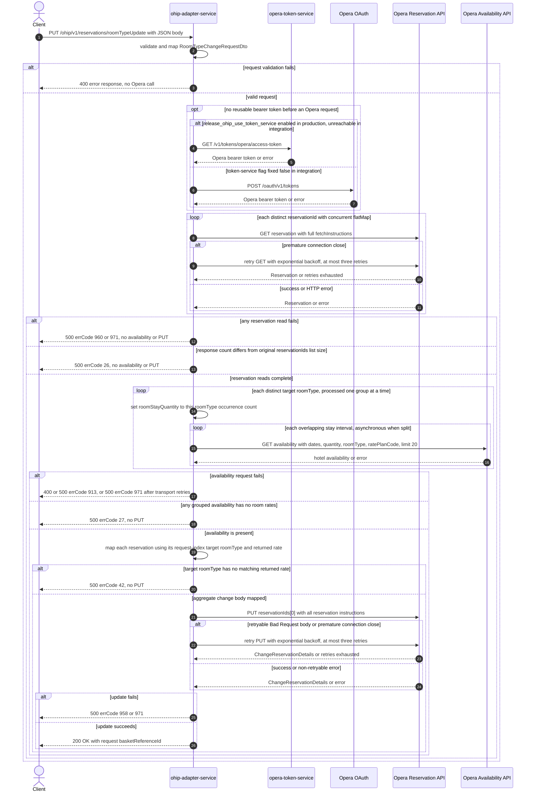

# OHIP Adapter Service: updateReservationRoomType Flow

Changes the room type for Opera reservations after reading the current reservations and pricing
each distinct requested target room type.

```http
PUT /ohip/v1/reservations/roomTypeUpdate
Host: ohip-adapter-service:9100
Content-Type: application/json
```

The servlet context path is `/ohip/`, and `HotelReservationController` is mapped under `/v1`.
The handler returns `200 OK` with the request's basket reference. The checked-in OpenAPI contract
instead declares `201` for success. There is no endpoint-level authentication guard.

## Flow

`HotelReservationController.updateReservationRoomType` validates `RoomTypeChangeRequestDto`, maps
it to `RatePlanRoomTypeChangeRequest`, and calls
`HotelReservationInPortImpl.changeReservationRoomType`. The in-port logs the request and delegates
directly to `HotelReservationOutPortImpl.changeReservationRoomType`; it adds no validation,
business rule, cache lookup, or endpoint-specific feature-flag check.

The out-port first passes `Set.copyOf(reservationIds)` to
`OhipReservationClient.getReservations`. The client concurrently issues one
`GET /rsv/v1/hotels/{hotelId}/reservations/{reservationId}` per distinct id, with
`fetchInstructions=Reservation,InventoryItems,ReservationPolicies,Packages,ReservationPaymentMethods,RoutingInstructions,Comments,Preferences,LinkedReservations,Alerts`.
It collects the entire fan-out before continuing. An empty result or a result count different from
the original request list size fails with errCode `26`; duplicate request ids therefore fail this
check because the read set collapses them.

Next, the out-port groups the requested `roomTypes` by value. For each distinct target room type,
in sequential group order, it calls `ApiLimitsService.getHotelAvailabilityResponses` with the
request hotel, stay dates, rate code, that room type, and its occurrence count. The resulting
Opera request is `GET /par/v1/hotels/{hotelId}/availability` with `roomStayStartDate`,
`roomStayEndDate`, `roomStayQuantity`, `roomType`, `ratePlanCode`, `limit=20`, and
`reservationGuestIdType=Profile`. A stay longer than the configured 89-day request window is
split into overlapping intervals; each later interval begins one day earlier, and a split group's
interval calls run asynchronously.

If any availability entry has null or empty room rates, the request fails with errCode `27`.
`RoomTypeChangeRequestOhipMapper` then builds one aggregate `ChangeReservation` body. For each
returned reservation, it finds the Opera reservation id in the original request list and uses the
`roomTypes` value at that index. It selects the first returned availability rate matching that
target room type, preserves the reservation id list, hotel id, and current source code, sets market
code `OTH` and `fixedRate=true`, and copies the availability rate-plan code and nightly base
amounts into the replacement room stay. No matching room type fails with errCode `42`.

Finally, the out-port sends the aggregate body once to
`PUT /rsv/v1/hotels/{hotelId}/reservations/{reservationIds[0]}`. The URL always uses the first id
in the original request list, while the body has one reservation instruction per distinct
reservation successfully read. A retryable Opera error body whose type is `Bad Request`, or a
premature connection close, is retried up to three times with exponential backoff. A normal
change-reservation failure maps to errCode `958`; retry exhaustion maps to errCode `971`. On
success the controller ignores the Opera response body and returns
`{"basketReferenceId":"<request basketReferenceId>"}` with status `200`.

Every Opera request uses the shared OHIP WebClient. It reuses a valid authorized-client token when
possible. Otherwise, production can acquire a token through `opera-token-service` when
`release_ohip_use_token_service` is enabled, or directly from Opera OAuth when it is disabled. In
the integration environment both Opera token flags are fixed false, so no enabled token-flag path
is a reachable journey axis. Outbound Opera calls carry `Authorization: Bearer`, `x-app-key`, and
`x-hotelid`; the final PUT also carries JSON content type.

## Mermaid Flow



## Features

- Read-before-price-before-write orchestration, with no cache annotation on the reservation or
  availability calls.
- Concurrent reservation GET fan-out over distinct ids, followed by completeness validation
  against the original request list.
- One availability search per distinct target room type and configured date interval; the count
  of that target type becomes `roomStayQuantity`.
- Long stays are split at Opera's configured availability limit and merged only when every
  interval has availability.
- The aggregate PUT body can contain several reservation instructions, but exactly one PUT is
  sent and its URL uses only `reservationIds[0]`.
- The availability result supplies the new rate-plan code and nightly base prices. The mapper
  preserves the existing Opera source code and sets market code `OTH` and `fixedRate=true`.
- Runtime success is `200 OK` with the input `basketReferenceId`; checked-in OpenAPI declares
  `201`.
- OAuth authorized-client caching can avoid a credential call while a token remains reusable.

## Feature Flags

No endpoint-specific flag changes reservation reading, pricing, mapping, or writing. The shared
Opera transport evaluates these two fixed-false flags in `ohip-adapter-service`:

| Flag | Effect when enabled | Evaluator | Pinnability in integration |
| --- | --- | --- | --- |
| `release_ohip_use_token_service` | Selects `opera-token-service` (`GET /v1/tokens/opera/access-token`) for a missing or expired Opera bearer token instead of direct Opera OAuth. | `WebClientConfig.ohipWebClient`, before every outbound Opera request | Fixed false. Request baggage cannot make the enabled path reachable, so scenarios pin `OhipFeatureFlag.USE_TOKEN_SERVICE=false` and never create an ON state. |
| `release_ohip_use_token_refresh_skew` | Applies `config.service.ohip.tokenRefreshClockSkew` to the direct client-credentials and password OAuth providers, causing earlier refresh. It does not change this endpoint's Opera business calls. | `WebClientAuthConfig.customAuthClientProvider`, once when the provider bean is created | Fixed false and not request-pinnable because evaluation happens at service startup. There is no ON-state journey. |

## Request

Body: `RoomTypeChangeRequestDto`. There are no public path or query parameters.

| Field | Required | Runtime effect |
| --- | --- | --- |
| `basketReferenceId` | yes, non-empty | Returned on success and included in the errCode `26` debug message |
| `hotelId` | yes, non-empty | Supplies every Opera path hotel and `x-hotelid` header |
| `reservationIds` | yes, non-empty list | Drives distinct reservation reads and index-based mapping; element zero selects the only PUT URL |
| `rateCode` | yes, non-empty | Sent as `ratePlanCode` on every availability search; the PUT uses the rate-plan code returned by availability |
| `roomTypes` | yes, non-empty list | Groups availability searches and selects each reservation's target room type by original request index |
| `startDate` | yes, non-empty | Availability start date and date-splitting input |
| `endDate` | yes, non-empty | Availability end date and date-splitting input |
| `currency` | yes, non-empty | Validated but otherwise unused on this runtime path |
| `adultsNumber` | yes, non-empty list | Validated but otherwise unused on this runtime path |
| `childrenNumber` | no | Unused on this runtime path |

The DTO does not validate that `reservationIds`, `roomTypes`, `adultsNumber`, and
`childrenNumber` have aligned lengths.

## Branches

| Trigger | Behavior |
| --- | --- |
| Valid reusable OAuth token | Skips both credential endpoints for the affected Opera call |
| Fixed-false `release_ohip_use_token_service` with no reusable token | Uses direct Opera OAuth; `ENABLE_CLIENT_CREDENTIALS` selects client credentials versus password grant |
| Reservation GET closes prematurely | Retries that GET up to three times; exhaustion returns HTTP 500 errCode `971` |
| Reservation GET returns an HTTP error | Returns HTTP 500 errCode `960`; no availability search or PUT starts |
| A reservation GET completes with an empty body | That publisher emits no item, so the count check returns HTTP 500 errCode `26` |
| Duplicate request reservation ids | `Set.copyOf` collapses the reads while the original list size stays larger; returns HTTP 500 errCode `26` |
| Reservation response count differs from the original id-list size | Returns HTTP 500 errCode `26`; no availability search or PUT starts |
| More than one distinct target room type | Runs one blocking availability group after another; each uses its occurrence count as quantity |
| Stay exceeds the configured 89-day availability window | Splits each target-type search into overlapping intervals and runs that group's interval calls asynchronously |
| Availability GET returns 4xx | Returns HTTP 400 errCode `913`; no PUT starts |
| Availability GET returns another HTTP error | Returns HTTP 500 errCode `913`; no PUT starts |
| Availability GET closes prematurely | The shared GET filter retries up to three times; exhaustion returns HTTP 500 errCode `971` |
| Any interval or target-type group has no room rates | Returns HTTP 500 errCode `27`; no PUT starts |
| Returned rates do not contain a request-index target room type | Returns HTTP 500 errCode `42`; no PUT starts |
| Opera returns a reservation id absent from the original request | Index-based target-room lookup fails before the PUT |
| Request lists have incompatible lengths | Index-based mapping can fail before the PUT; no cross-list validation protects this branch |
| PUT error body has type `Bad Request`, or the connection closes prematurely | Retries up to three times; exhaustion returns HTTP 500 errCode `971` |
| Other Opera PUT error | Returns HTTP 500 errCode `958` |
