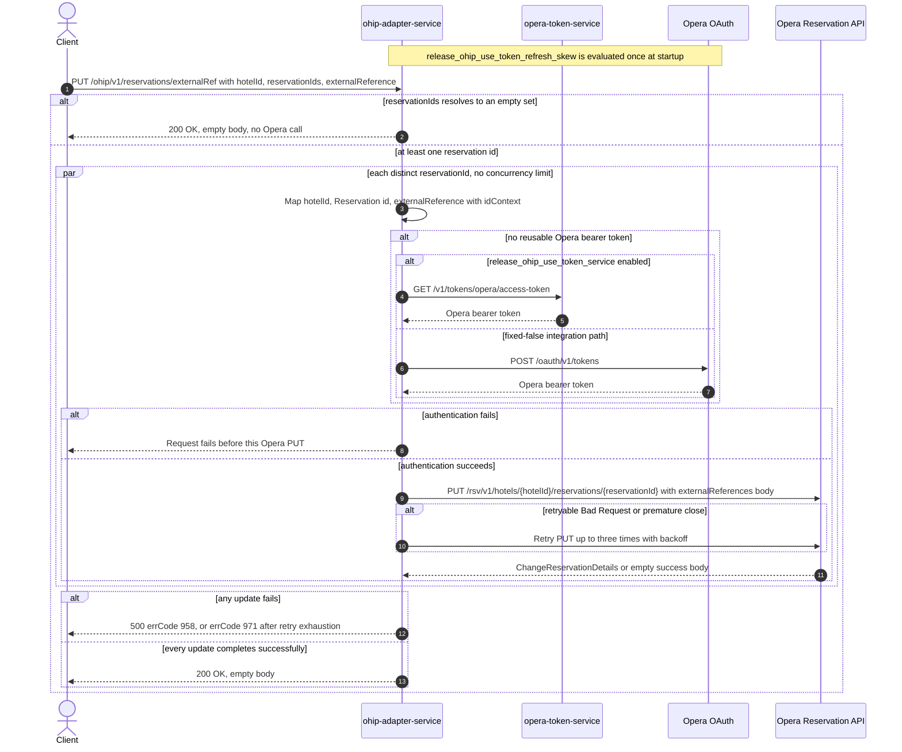

# OHIP Adapter Service: updateReservationsWithExternalRef Flow

Writes the same external reference, under the configured Opera id context, to every distinct
Opera reservation id supplied for one hotel.

```http
PUT /ohip/v1/reservations/externalRef?hotelId={hotelId}&reservationIds={id1,id2}&externalReference={ref}
Host: ohip-adapter-service:9100
```

The servlet context path is `/ohip/` and `HotelReservationController` is mapped under `/v1`, so
the effective public route is `/ohip/v1/reservations/externalRef`. The request carries no body;
all three inputs are required query parameters. The controller has no endpoint-level
authentication guard. Outbound Opera requests carry a bearer token, `x-app-key`, `x-hotelid`,
and JSON content type. Success is `200 OK` with an empty body, which matches the checked-in
OpenAPI contract for this operation.

## Flow

`HotelReservationController.updateReservationsWithExternalRef` binds `hotelId`,
`reservationIds` (a `Set<String>`), and `externalReference` from the query string. There is no
request DTO, no mapper, and no Bean Validation annotation on the parameters, so the controller
passes the bound values straight to
`HotelReservationInPortImpl.updateReservationsWithExternalRef`. The in-port neither logs nor
guards; it delegates directly to
`HotelReservationOutPortImpl.updateReservationsWithExternalRef`.

The out-port iterates the `Set<String> reservationIds` with `Flux.fromIterable(...).flatMap(...)`.
For every distinct id it builds a separate `ChangeReservation` body through the private
`mapToChangeReservationWithExternalRef` helper. That body holds exactly one reservation
instruction carrying the request `hotelId`, a `reservationIdList` with one entry whose `type` is
`Reservation` and whose `id` is that reservation id, and an `externalReferences` list with one
entry whose `id` is the request `externalReference` and whose `idContext` is the configured
`config.service.ohip.contextId` (checked-in value `WB_DIGITAL`). No other instruction field is
set, and nothing else about the reservation is read or reused.

Each body is sent to the Opera Reservation API as
`PUT /rsv/v1/hotels/{hotelId}/reservations/{reservationId}`. This `flatMap` supplies no
concurrency argument, so it uses Reactor's default rail count rather than
`config.service.ohip.maxConcurrency`: the PUTs may be in flight concurrently and have no
ordering guarantee, unlike the sibling override-reasons path which passes the configured
concurrency of one. `collectList().block()` waits for the whole fan-out before the controller
returns. The Opera response bodies are never inspected, so a successful empty Opera response is
also accepted. There is no reservation read, cache lookup, compensating action, or rollback
anywhere on this path, and no downstream collaborator other than Opera authentication and the
Opera reservation update.

The shared Opera WebClient reuses a valid OAuth client token when available. Otherwise
`release_ohip_use_token_service` selects `opera-token-service` or direct Opera OAuth as the
token source; the integration workflow fixes that flag false, so its supported path is direct
Opera OAuth, using client credentials when `ENABLE_CLIENT_CREDENTIALS=true` and the password
grant otherwise. A non-retryable Opera error maps to HTTP 500 with errCode `958`
(`OHIP_CHANGE_RESERVATION_EXCEPTION`). An error envelope whose `type` is `Bad Request`, or a
premature connection close, is retried up to three times with backoff; exhaustion maps to HTTP
500 with errCode `971` (`OHIP_RETRIES_EXHAUSTED_EXCEPTION`). Because the fan-out is unbounded,
one id failing can occur after another id's update has already reached Opera, and nothing
reverts it.

## Mermaid Flow



## Features

- Bulk update driven entirely by query parameters, with no request body
- Duplicate reservation ids collapse during `Set` binding, so each distinct id is updated once
- One independently mapped Opera change-reservation PUT per distinct reservation id
- Concurrent, unordered PUT fan-out with synchronous completion at the public boundary
- The same external reference value, tagged with the configured `contextId`, is applied to every
  requested reservation
- Reservation identity is carried both in the URL and in the body's `reservationIdList`
- No reservation GET, cache lookup, business collaborator other than Opera, or rollback
- Shared Opera OAuth selection and selective three-retry handling

## Feature Flags

No endpoint-specific business flag is evaluated by the controller, in-port, out-port, or mapping
helper. The shared Opera transport evaluates these flags in `ohip-adapter-service`:

| Flag | Effect when enabled | Evaluation and override reachability |
| --- | --- | --- |
| `release_ohip_use_token_service` | Selects `opera-token-service` (`GET /v1/tokens/opera/access-token`) instead of direct Opera OAuth when an Opera bearer token is required. | Evaluated in the `ohipWebClient` filter for each outbound Opera request, so propagated baggage can reach the call site, but the integration environment fixes the flag false. It is never an ON/OFF scenario axis. |
| `release_ohip_use_token_refresh_skew` | Applies `config.service.ohip.tokenRefreshClockSkew` so directly acquired Opera OAuth tokens refresh early. It does not change the reservation PUT or the public response. | Evaluated once while `WebClientAuthConfig.customAuthClientProvider` is constructed, so request baggage cannot pin it. The integration workflow treats it as fixed false. |

## Request

No request body. All parameters are query parameters.

| Parameter | Required | Effect |
| --- | --- | --- |
| `hotelId` | yes (Spring `required=true`; no emptiness validation) | Opera hotel path value, outgoing instruction `hotelId`, and `x-hotelid` header |
| `reservationIds` | yes (`Set<String>`; comma-separated or repeated values) | Each distinct value produces one Opera PUT and supplies both the URL reservation id and the body's `reservationIdList` entry of type `Reservation` |
| `externalReference` | yes (no emptiness validation) | Written as the single `externalReferences[0].id` on every reservation instruction; `idContext` comes from configuration, not the request |

## Branches

| Trigger | Behavior |
| --- | --- |
| Duplicate ids in the query value | Binding into a `Set` collapses them, so each distinct id is updated once |
| `reservationIds` present but empty (for example `reservationIds=`) | Binds to an empty set, the `Flux` completes with no element, no Opera call is made, and the endpoint still returns `200 OK` |
| A required query parameter is absent | Spring rejects the request before the in-port; no Opera call is made |
| A valid OAuth client token is reusable | Skips both token-acquisition endpoints for that Opera call |
| No valid token and `release_ohip_use_token_service` is fixed false | Gets the token directly from configured Opera OAuth, using client credentials when `ENABLE_CLIENT_CREDENTIALS=true`, otherwise the password grant |
| Token acquisition fails | The affected reservation PUT is not sent and the public request fails |
| Opera returns a successful response with an empty body | The inner publisher completes empty, the out-port does not inspect it, and the public request can still return `200 OK` |
| Opera returns a non-retryable error | HTTP 500 with errCode `958`; concurrently started updates may already have succeeded and are not rolled back |
| Opera error body has `type=Bad Request`, or the connection closes prematurely | Up to three retries with backoff for that PUT; exhaustion returns HTTP 500 with errCode `971` |

The controller annotation and the checked-in OpenAPI also advertise HTTP 404, but this runtime
path performs no lookup and has no endpoint-specific not-found branch. Opera PUT errors are
translated to the HTTP 500 paths above.
