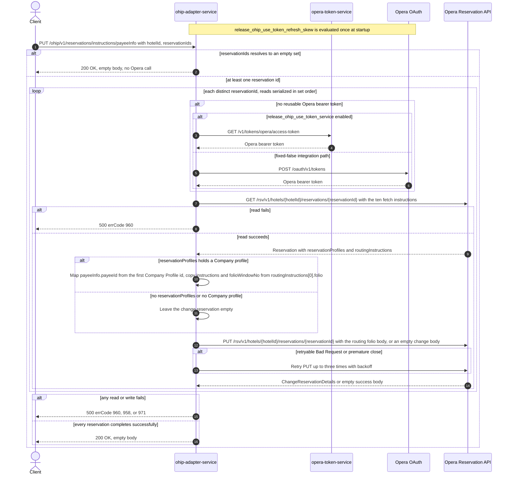

# OHIP Adapter Service: updateRoutingInstructionsWithPayeeInfo Flow

Re-points the first routing-instruction folio of each requested Opera reservation at the
reservation's attached company profile, by reading the reservation and writing back a folio whose
payee is that company.

```http
PUT /ohip/v1/reservations/instructions/payeeInfo?hotelId={hotelId}&reservationIds={id1,id2}
Host: ohip-adapter-service:9100
```

The servlet context path is `/ohip/` and `HotelReservationController` is mapped under `/v1`, so
the effective public route is `/ohip/v1/reservations/instructions/payeeInfo`. The request carries
no body; both inputs are required query parameters. The controller has no endpoint-level
authentication guard. Outbound Opera requests carry a bearer token, `x-app-key`, `x-hotelid`, and
JSON content type on the write. Success is `200 OK` with an empty body, which matches the
checked-in OpenAPI contract for this operation.

## Flow

`HotelReservationController.updateRoutingInstructionsWithPayeeInfo` binds `hotelId` and
`reservationIds` (a `Set<String>`) from the query string. There is no request DTO, no mapper, and
no Bean Validation annotation on the parameters, so the controller passes the bound values
straight to `HotelReservationInPortImpl.updateRoutingInstructionsWithPayeeInfo`, which neither
logs nor guards and delegates directly to
`HotelReservationOutPortImpl.updateRoutingInstructionsWithPayeeInfo`.

The out-port iterates the `Set<String> reservationIds` with `Flux.fromIterable(...).flatMap(...)`.
For every distinct id it first reads the reservation from the Opera Reservation API through
`OhipReservationClient.getReservation`, as
`GET /rsv/v1/hotels/{hotelId}/reservations/{reservationId}` with `fetchInstructions` exactly
`Reservation`, `InventoryItems`, `ReservationPolicies`, `Packages`, `ReservationPaymentMethods`,
`RoutingInstructions`, `Comments`, `Preferences`, `LinkedReservations`, `Alerts`. The read is
consumed with `block()` inside the mapping function and wrapped in `Objects.requireNonNull`, so
the reads are serialized in `Set` iteration order: the write for one id is already in flight while
the next id is still being read.

The private `mapToChangeReservationRoutings` helper then derives the write body from the read
reservation, using `reservations.reservation[0]` only. It takes that reservation's
`reservationProfiles.reservationProfile` list, keeps the entries whose `reservationProfileType` is
`Company`, and uses the first of them. From that company entry's `profileIdList` it takes the
first id whose `type` is `Profile` and writes it as the folio's `payeeInfo.payeeId.id`, with
`payeeInfo.payeeId.type` fixed to the literal `Profile`. The rest of the folio is copied verbatim
from the reservation's own `routingInstructions[0].folio`: its `instructions` list and its
`folioWindowNo`. Nothing else is copied, and no other reservation field, hotel id, or reservation
id is written into the body — the reservation is identified by URL only.

The body is sent as `PUT /rsv/v1/hotels/{hotelId}/reservations/{reservationId}` through
`OhipReservationClient.sendChangeReservationRequest`. Because the Opera client's JSON mapper is
configured `NON_NULL`, the wire body carries exactly the members the mapper set:

```json
{
  "reservations": [
    {
      "routingInstructions": [
        {
          "folio": {
            "payeeInfo": { "payeeId": { "id": "<company profile id>", "type": "Profile" } },
            "instructions": [ "<copied verbatim from the read folio>" ],
            "folioWindowNo": 1
          }
        }
      ]
    }
  ],
  "reservationNotification": false
}
```

`instructions` and `folioWindowNo` are omitted when the read folio carries neither.
`reservationNotification` is a non-null field defaulted to `false` on the generated
`ChangeReservation`, so it is always present.

When the read reservation has no `reservationProfiles` block at all, or has one whose profile list
holds no `Company` entry, the helper returns an untouched `ChangeReservation`. The write is still
sent, with the body `{"reservationNotification": false}` — the endpoint has no
skip-the-write branch and no way for a caller to tell that nothing was routed. Opera responses are
never inspected, so a successful empty write response is also accepted.
`collectList().block()` waits for the whole fan-out before the controller returns, and there is no
compensating action or rollback: one id failing can happen after another id's write has already
reached Opera.

The shared Opera WebClient reuses a valid OAuth client token when available. Otherwise
`release_ohip_use_token_service` selects `opera-token-service` or direct Opera OAuth as the token
source; the integration workflow fixes that flag false, so its supported path is direct Opera
OAuth, using client credentials when `ENABLE_CLIENT_CREDENTIALS=true` and the password grant
otherwise. A read failure maps to HTTP 500 with errCode `960`
(`OHIP_GET_RESERVATION_EXCEPTION`) and is not retried on an HTTP error status, though the shared
client retries any GET up to three times on a premature connection close. A non-retryable write
error maps to HTTP 500 with errCode `958` (`OHIP_CHANGE_RESERVATION_EXCEPTION`); a write whose
error envelope has `type=Bad Request`, or which closes prematurely, is retried up to three times
with a three-second minimum backoff, and exhaustion maps to HTTP 500 with errCode `971`
(`OHIP_RETRIES_EXHAUSTED_EXCEPTION`).

The same out-port method is also called internally from the confirm-reservation flow, for a single
reservation id, when that reservation already had routing instructions and its payment option
changed. That internal caller is not part of this public route.

## Mermaid Flow



## Features

- Bulk operation driven entirely by query parameters, with no request body and no response body
- Duplicate reservation ids collapse during `Set` binding, so each distinct id is handled once
- One reservation read and one reservation write per distinct id, in that order
- Reads are serialized in `Set` iteration order because each read is blocked on inside the
  mapping function; the write for one id overlaps the read of the next, and the whole fan-out
  completes before the public response
- The payee is taken from the reservation's own attached `Company` profile, never from the
  request: the caller cannot choose a payee
- Only the first routing-instruction folio of the first reservation in the read payload is
  considered, and only its `instructions` and `folioWindowNo` are preserved
- The written body carries no hotel id and no `reservationIdList`; reservation identity is in the
  URL alone
- A reservation with no attached company still receives a write, carrying an empty change body
- No profile read, cache lookup, business collaborator other than Opera, or rollback
- Shared Opera OAuth selection, premature-close retry on reads, and selective three-retry
  handling on writes
- No other backend service in this repository calls this route; consumers only carry a copy of
  the adapter's OpenAPI contract

## Feature Flags

No endpoint-specific business flag is evaluated by the controller, in-port, out-port, or mapping
helper. The shared Opera transport evaluates these flags in `ohip-adapter-service`:

| Flag | Effect when enabled | Evaluation and override reachability |
| --- | --- | --- |
| `release_ohip_use_token_service` | Selects `opera-token-service` (`GET /v1/tokens/opera/access-token`) instead of direct Opera OAuth when an Opera bearer token is required. | Evaluated in the `ohipWebClient` filter for each outbound Opera request, so propagated baggage can reach the call site, but the integration environment fixes the flag false. It is never an ON/OFF scenario axis. |
| `release_ohip_use_token_refresh_skew` | Applies `config.service.ohip.tokenRefreshClockSkew` so directly acquired Opera OAuth tokens refresh early. It does not change the reservation read or write, or the public response. | Evaluated once while `WebClientAuthConfig.customAuthClientProvider` is constructed, so request baggage cannot pin it. The integration workflow treats it as fixed false. |

## Request

No request body. All parameters are query parameters.

| Parameter | Required | Effect |
| --- | --- | --- |
| `hotelId` | yes (Spring `required=true`; no emptiness validation) | Opera hotel path value on both calls and the `x-hotelid` header; it is not written into the change body |
| `reservationIds` | yes (`Set<String>`; comma-separated or repeated values) | Each distinct value produces one Opera reservation read followed by one Opera reservation write, and supplies the reservation id in both URLs |

## Branches

| Trigger | Behavior |
| --- | --- |
| Duplicate ids in the query value | Binding into a `Set` collapses them, so each distinct id is read and written once |
| `reservationIds` present but empty (for example `reservationIds=`) | Binds to an empty set, the `Flux` completes with no element, no Opera call is made, and the endpoint still returns `200 OK` |
| A required query parameter is absent | Spring rejects the request before the in-port; no Opera call is made |
| A valid OAuth client token is reusable | Skips both token-acquisition endpoints for that Opera call |
| No valid token and `release_ohip_use_token_service` is fixed false | Gets the token directly from configured Opera OAuth, using client credentials when `ENABLE_CLIENT_CREDENTIALS=true`, otherwise the password grant |
| Read reservation has a `Company` reservation profile whose `profileIdList` holds a `Profile` entry | The write carries `routingInstructions[0].folio` with `payeeInfo.payeeId` set to that profile id and type `Profile`, plus the read folio's `instructions` and `folioWindowNo` |
| Read reservation has a `Company` reservation profile whose `profileIdList` holds no `Profile`-typed entry | `payeeInfo.payeeId.type` is still written as `Profile` but `id` is left unset, so the folio is written with a payee that has no id |
| Read reservation has a `reservationProfiles` block with no `Company` entry | The change body stays empty; the write is still sent as `{"reservationNotification": false}` and the endpoint returns `200 OK` |
| Read reservation has no `reservationProfiles` block | Same empty-body write and `200 OK` |
| Read reservation has a `Company` profile but no routing instructions | `routingInstructions[0]` is dereferenced unguarded, so the request fails with an unmapped HTTP 500 whose envelope carries the literal number `400` in `errCode` |
| Opera answers the read with its not-found envelope (`{"reservations":{}}`) or an empty `reservation` array | `reservations.reservation[0]` is dereferenced unguarded, so the request fails with an unmapped HTTP 500 whose envelope carries the literal number `400` in `errCode`, in the same way as the sibling routing and comment flows |
| Opera answers the read with HTTP 200 and no body | `Objects.requireNonNull` on the blocked read throws, and the request fails with the same unmapped HTTP 500 shape |
| Opera returns an error status on the read | HTTP 500 with errCode `960`; the write for that id is never sent, and no retry is attempted for an HTTP error |
| A read connection closes prematurely | The shared client retries that GET up to three times with backoff before failing |
| Opera returns a successful write response with an empty body | The inner publisher completes empty, the out-port does not inspect it, and the public request can still return `200 OK` |
| Opera returns a non-retryable error on the write | HTTP 500 with errCode `958`; writes already sent for other ids are not rolled back |
| Write error body has `type=Bad Request`, or the write connection closes prematurely | Up to three retries with backoff for that PUT; exhaustion returns HTTP 500 with errCode `971` |

The controller annotation and the checked-in OpenAPI advertise HTTP 200 for success, which matches
the runtime status. They also advertise HTTP 400 and HTTP 404, but this runtime path has no
endpoint-specific bad-request or not-found branch: Opera read and write failures are translated to
the HTTP 500 paths above.
