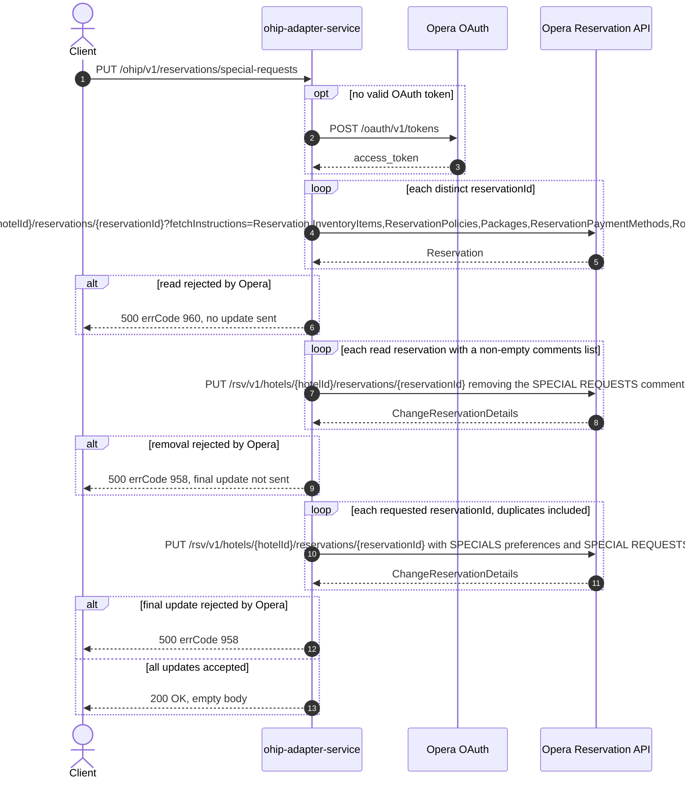

# OHIP Adapter Service: updateSpecialRequests Flow

Replaces the special-request preferences and Special Requests booking notes on one or more
Opera reservations, removing any pre-existing Special Requests comment first.

```http
PUT /ohip/v1/reservations/special-requests
Host: ohip-adapter-service:9100
Content-Type: application/json
```

The servlet context path is `/ohip/` and `HotelReservationController` is mapped under
`/v1`, so the public path is `/ohip/v1/reservations/special-requests`. There is no inbound
authentication on the endpoint; Opera calls use the service OAuth client when no valid
token is present. The handler returns `200 OK` with an empty body
(`ResponseEntity<Void>`).

## Flow

`HotelReservationController.updateReservationsSpecialRequests` maps the validated
`SpecialRequestsDto` to the `SpecialRequests` model and calls
`HotelReservationInPortImpl.updateSpecialRequests`, which only logs and delegates
straight to `HotelReservationOutPortImpl.updateSpecialRequests` — no domain rules, no
validation, no flag checks between the two.

The out-port runs two phases against the Opera Reservation API.

Phase 1 (read and clean up): it reads every requested reservation with
`OhipReservationClient.getReservations(hotelId, Set.copyOf(reservationIds))`, which
issues one `GET /rsv/v1/hotels/{hotelId}/reservations/{reservationId}` per **distinct**
reservation id with the broad fetch-instruction set (including `Comments`). For each
reservation whose `reservations.reservation[0].comments` list is present and non-empty, it
collects the ids of the comments typed `Comment` whose `commentTitle` equals
`SPECIAL REQUESTS` (case-insensitive) and sends a preliminary comment-removal
`PUT /rsv/v1/hotels/{hotelId}/reservations/{reservationId}` carrying those comment ids, so
the earlier Special Requests note is not duplicated. The reservation id used for the
removal PUT is re-read from the Opera response's `reservationIdList` entry typed
`Reservation`, not from the request. These removal PUTs are sequential and blocking, one
per reservation that has comments; a reservation with no comments is skipped.

Phase 2 (apply): it then iterates the request's `reservationIds` **as supplied** (list
order, duplicates retained) and sends one final
`PUT /rsv/v1/hotels/{hotelId}/reservations/{reservationId}` per entry, whose
change-reservation body carries the special requests as a `SPECIALS` preference collection
and each non-blank booking note as a `SPECIAL REQUESTS` comment. Both phases are collected
with `block()`, so any Opera error surfaces synchronously: a failed read maps to errCode
`960` (`OHIP_GET_RESERVATION_EXCEPTION`) and a failed removal or final update maps to
errCode `958` (`OHIP_CHANGE_RESERVATION_EXCEPTION`), both as HTTP 500. A read failure
stops the flow before any PUT; a removal failure stops the flow before that
reservation's final PUT.

## Mermaid Flow



## Features

- Bulk update: one request carries many reservation ids for a single hotel
- Reads are deduplicated (`Set.copyOf`), final updates are not — a duplicated id is read
  once and updated twice
- Special requests become a single `SPECIALS` preference collection
  (`preferenceType=SPECIALS`) with one preference per request string
- Booking notes become `SPECIAL REQUESTS` comments; blank notes are dropped, and an empty
  or absent `bookingNotes` list simply leaves the comment collection unset
- Pre-existing `SPECIAL REQUESTS` comments are removed by a preliminary change-reservation
  PUT so notes are replaced rather than appended
- Empty response body on success; failures are the standard OHIP error envelope
- No inbound authentication; outbound Opera OAuth bearer token per client config

## Feature Flags

No endpoint-specific flag gates this flow. Neither the controller, the in-port
(`HotelReservationInPortImpl.updateSpecialRequests`), nor the out-port path evaluates
`unleashWrapper`. The shared Opera transport-authentication flags apply outside the
request context:

| Flag | Effect when enabled |
| --- | --- |
| `release_ohip_use_token_service` | Obtains Opera bearer tokens from `opera-token-service` instead of authenticating directly with Opera OAuth. |
| `release_ohip_use_token_refresh_skew` | Applies the configured early-refresh clock skew to directly acquired Opera OAuth tokens. |

## Request

Body: `SpecialRequestsDto`.

| Field | Required | Effect |
| --- | --- | --- |
| `hotelId` | yes (`@NotNull`) | Opera hotel for every read and PUT, and the `x-hotelid` header value |
| `reservationIds` | yes (`@NotNull`) | Distinct values drive the reads; the raw list drives the final PUTs one-for-one |
| `specialRequests` | yes (`@NotNull`) | Non-empty list becomes the `SPECIALS` preference collection; an empty list leaves preferences unset |
| `bookingNotes` | no | Non-blank entries become `SPECIAL REQUESTS` comments; empty or absent leaves comments unset |

## Branches

| Trigger | Behavior |
| --- | --- |
| Duplicate reservation ids | One read for the distinct id, one final PUT per list entry |
| Empty `reservationIds` list | No Opera call at all, `200 OK` |
| Reservation read returns an empty HTTP body | The reactive stream emits nothing for it, the removal phase is skipped, and the final PUT is still sent |
| Reservation has no comments, or an empty comments list | No removal PUT for that reservation |
| Reservation has comments but none titled `SPECIAL REQUESTS` | A removal PUT is still sent, carrying an empty comment-id list |
| Reservation read rejected by Opera | HTTP 500 errCode `960`, no PUT is sent |
| Comment-removal PUT rejected by Opera | HTTP 500 errCode `958`, the final PUT is not sent |
| Final PUT rejected by Opera | HTTP 500 errCode `958` after the removal already applied |
| Opera returns a success envelope whose `reservations.reservation` is null or an empty array | `updateReservationComments` dereferences `reservation.getReservations().getReservation().get(0)` without a guard, so the request fails with HTTP 500 instead of skipping the reservation |
