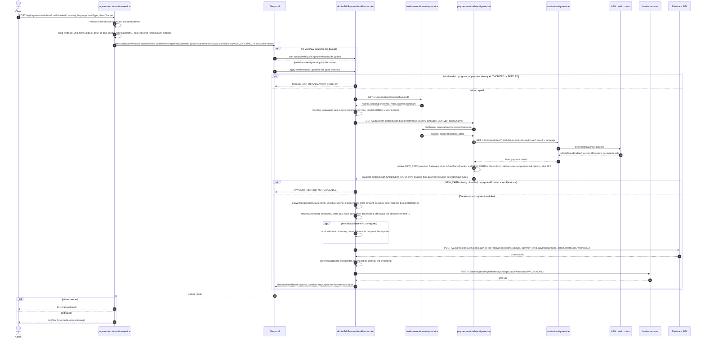

# Payment Orchestration Service: initMobileSdk Flow

This endpoint opens a card payment session for native apps: it resolves the basket's reservation, checks with `payment-methods-entity-service` that new-card payment for this hotel is served by Datatrans, converts the stay total into Datatrans minor units, resolves the hotel's Datatrans merchant ID, creates a Datatrans v2 transaction with a Mobile SDK alias option and a webhook callback URL, moves the basket to `PAY_PENDING`, and returns the transaction ID the app hands to Datatrans Mobile SDK v4.

```http
POST /api/payments/mobile-sdk
Host: payment-orchestration-service:9200
Content-Type: application/json

{"basketId": "AQN-147756bb-bb71-4842-959a-2efe87e378ed",
 "country": "gb", "language": "en", "userType": "LEISURE", "clientChannel": "APPS_IOS"}
```

No authentication or authorization is applied. A successful call returns `201 Created` with `{"transactionId": "..."}`.

## Flow

The controller validates the body. All five fields are `@NotBlank`, and `basketId` must additionally match `^[A-Z]{3}-[0-9a-f]{8}-[0-9a-f]{4}-[0-9a-f]{4}-[0-9a-f]{4}-[0-9a-f]{12}$`; any failure returns `400 INVALID_REQUEST` without touching a dependency. Unlike the Secure Fields request there is no `returnUrl` - the native SDK, not a browser redirect, carries 3-D Secure.

Orchestration runs in Temporal, not in the request thread. Before the call the service assembles the public Datatrans callback URL from the configured `integrations.datatrans.webhook.callback-base-url` plus `/mobile-sdk?basketId={basketId}` (URL-encoded), and snapshots the reconciliation settings from configuration; both travel on the update payload alongside `country`, `language`, `userType`, and `clientChannel`, so the workflow stays free of configuration concerns. When no callback base URL is configured the URL is `null` and no `webhook.url` is sent to Datatrans, leaving reconciliation polling as the only way the payment can progress.

The service then issues a Temporal Update-With-Start against workflow ID `payment-{basketId}` with conflict policy `USE_EXISTING`: the first call for a basket starts a `MobileSdkPaymentWorkflow` and delivers the `initMobileSdk` update, while later calls send the same update to the workflow already running for it. The workflow ID space is shared with the Secure Fields flow, so a basket has one payment workflow whichever channel initialized it. Workflow and activities run on the `payment-workflows` task queue served by the service's own in-process worker. No workflow execution timeout is set, because the workflow must stay open to receive the asynchronous Datatrans webhook as a signal. Update-With-Start blocks until the update handler returns, so the request thread receives the init result directly - there is no query polling on this path.

The update handler first rejects overlapping work: a second init while one is still in flight, or any init after the payment reached `AUTHORIZED` or `SETTLED`, returns `MOBILE_SDK_INITIALIZATION_CONFLICT`.

Otherwise the handler runs five activities interleaved with two in-workflow steps. It reads the reservation from `hotel-reservation-entity-service` via `GET /v1/reservations/basket/{basketReference}`, taking `hotelId`, `bookingReference`, and `refno` from the response and `totalCostOfStay` plus `currencyCode` from the first reservation's `rateInfo.summary`. It then calls `payment-methods-entity-service` `GET /v1/payment-methods` with `basketReference`, `country`, `language`, `userType`, and `clientChannel` as query parameters, and requires that response to contain a `CARD`/`NEW_CARD` entry that is `enabled` and whose `paymentProvider` is exactly `Datatrans`; the entry's `acceptedCardTypes[].type` values become the Datatrans `paymentMethods` list. Anything else - empty response, no `NEW_CARD` entry, `NEW_CARD` disabled, or a non-Datatrans provider such as `3CP` - fails the init as `PAYMENT_METHOD_NOT_AVAILABLE`. This check is decisive rather than cosmetic: with a hotel whose AEM content does not enable Datatrans, no Mobile SDK session can be created at all.

With card payment confirmed, the workflow converts the total to minor units using the currency's exponent (2 for GBP, EUR, USD, and CHF; 0 for JPY and KRW; 2 for anything unrecognised), stores the amount, currency, reservation ID, and booking reference in workflow state, and resolves the Datatrans merchant ID for the reservation's `hotelId` through a dedicated `resolveMerchantId` activity. Outside the `opera-prod` profile the sandbox resolver returns `{prefix}{hotelCode}` only when the hotel code is listed in `integrations.datatrans.merchant-id.provisioned-hotels` (`HARHOR`, `GRESOU`, `HAVFOR` by default) and otherwise falls back to `integrations.datatrans.merchant-id.default-merchant-id` (`deWB-default`); under `opera-prod` it always returns `{prefix}{hotelCode}` and rejects a blank hotel code. The merchant ID is used as the HTTP Basic username on `POST /v2/transactions` and is stored in workflow state so the later status, settle, and cancel calls authenticate as the same merchant. The Datatrans body carries `amount`, `currency`, `refno` (the booking reference), `paymentMethods`, `option.createAlias = true`, and `webhook.url` when a callback URL was assembled.

The returned transaction ID is stored in workflow state alongside the reconciliation settings and the init completion timestamp, then the workflow calls `basket-service` `PUT /v1/baskets/{bookingReference}/changeStatus` with `{"status": "PAY_PENDING"}` before returning the transaction ID to the caller. The workflow keeps `paymentStatus = INITIALIZED` and its `run` method stays open until the payment reaches a terminal state, so the later Datatrans webhook (delivered to `POST /api/payments/webhooks/mobile-sdk`) or the reconciliation poller can authorize the transaction, and a `booking-completed` Kafka event can then settle or cancel it. That post-response work is outside this endpoint. Every init activity runs with a 30-second start-to-close timeout and up to three attempts, so a transient reservation, payment-method, or Datatrans failure is retried before the workflow gives up.

Error reporting on this path is narrow. Only `PAYMENT_METHOD_NOT_AVAILABLE` is raised as an explicitly typed non-retryable failure, mapping to `422`. Every other activity failure reaches the caller as a Temporal failure whose type is the thrown exception's class name, which the service's error-code switch does not recognise, so basket-not-found, gateway, and unreachable-dependency failures all fall to the default branch and surface as `503 SERVICE_UNAVAILABLE`. `MOBILE_SDK_INITIALIZATION_CONFLICT` is also unmapped and surfaces as `503`, not the `409` the Secure Fields conflict returns.

## Mermaid Flow



## Features

- Native card payment session creation backed by Datatrans v2 for Mobile SDK v4
- Card availability decided by `payment-methods-entity-service`, not by the orchestrator: only a hotel whose `NEW_CARD` option resolves to the `Datatrans` provider can open a Mobile SDK session, and that service's accepted Datatrans card codes become the gateway `paymentMethods` list
- Hotel-derived Datatrans merchant ID: the merchant the transaction is created under is resolved per hotel code and reused for status, settle, and cancel calls on the same transaction
- Locale and caller identity (`country`, `language`, `userType`, `clientChannel`) forwarded to `payment-methods-entity-service`, which uses country and language to fetch hotel payment content and user type to choose the rule executor
- Card alias creation always requested via `option.createAlias = true`, so the authorised payment can carry a reusable card alias downstream
- Webhook registration on the gateway call: the callback URL carries `basketId` as its correlation key, so Datatrans can address the right workflow without a separate index
- Basket transitioned to `PAY_PENDING` before the transaction ID is returned to the app
- One long-lived payment workflow per basket, addressed by the deterministic ID `payment-{basketId}` and shared with the Secure Fields flow, so repeat calls reuse the existing workflow instead of creating a second one
- Synchronous HTTP response over asynchronous orchestration via Temporal Update-With-Start, which returns the update result without polling
- Reservation and amount resolution from `hotel-reservation-entity-service` rather than from client input
- Currency-aware major-to-minor unit conversion before the gateway call
- Booking reference stored in workflow state and reused as the Datatrans `refno` at init and settle, carrying correlation into settlement
- Re-initialization guards: concurrent inits and inits after authorization are rejected as a conflict rather than silently overwriting the session
- Activity-level retry (three attempts, 30-second start-to-close) over reservation, payment-method, merchant-ID, gateway, and basket-status calls
- Reconciliation settings captured at init (enabled flag, initial delay, poll interval, max duration) so the workflow can poll Datatrans for the transaction status if the webhook never arrives
- Workflow left open after init so the Datatrans webhook, or reconciliation polling, can authorize and publish `PaymentAuthorisedEvent`, after which a `booking-completed` Kafka event settles or cancels the transaction

## Feature Flags

The orchestration service itself has no Unleash integration and gates nothing on flags. One flag inside the downstream `payment-methods-entity-service` can nonetheless decide whether this endpoint succeeds.

| Flag | Effect when enabled |
| --- | --- |
| `kill_switch_pi_bb_ccui_disable_payments` (payment-methods-entity-service, evaluated with the `basketReference` as Unleash context) | `GET /v1/payment-methods` returns the fail-safe payment-method set instead of the rule-engine result. That set carries no Datatrans-provider `NEW_CARD` entry, so the orchestrator's card check fails and the endpoint returns `422 PAYMENT_METHOD_NOT_AVAILABLE` |

Three configuration switches also change the shape of the flow: `integrations.datatrans.webhook.callback-base-url` (blank means no `webhook.url` is registered with Datatrans), `integrations.datatrans.reconciliation.enabled` (default `true`, disabling it leaves the workflow webhook-only), and, in `payment-methods-entity-service`, `datatrans.not-supported-card-options` (whose default includes `NEW_CARD`, which would make every Mobile SDK init fail; the integration environment removes `NEW_CARD` from that list).

## Request

| Field | Required | Effect |
| --- | --- | --- |
| `basketId` | Yes | Identifies the basket whose reservation is priced and paid; derives the Temporal workflow ID `payment-{basketId}`, is sent as `basketReference` to `payment-methods-entity-service`, and is appended to the Datatrans webhook callback URL as the correlation key. Must match the three-letter-prefix-plus-UUID pattern |
| `country` | Yes | Forwarded as the `country` query parameter to `payment-methods-entity-service`, which lowercases it and uses it to fetch the hotel's payment content from `content-entity-service`. A country/language pair with no hotel content makes the payment-method lookup fail |
| `language` | Yes | Forwarded as the `language` query parameter and used with `country` for the same hotel-content lookup |
| `userType` | Yes | Forwarded as the `userType` query parameter; `payment-methods-entity-service` parses it as its `UserType` enum (e.g. `LEISURE`, `BUSINESS`) and selects the rule executor that decides which payment methods are offered |
| `clientChannel` | Yes | Forwarded as the `clientChannel` query parameter. `payment-methods-entity-service` only treats `APPS_ANDROID`/`APPS_IOS` specially when the request also carries `flow=CHECKINONLINE`, which this endpoint never sends, so on this path the value does not change which downstream calls happen or which methods are returned |

## Branches

| Trigger | Behavior |
| --- | --- |
| Any of `basketId`, `country`, `language`, `userType`, `clientChannel` missing or blank, or `basketId` failing the pattern | `400 INVALID_REQUEST`; no reservation, Temporal, or Datatrans call is made |
| Second call for the same `basketId` while its first init is still running | `MOBILE_SDK_INITIALIZATION_CONFLICT`, surfaced as `503 SERVICE_UNAVAILABLE` because the code is not in the service's error-code mapping; no downstream call is made for the second request |
| Call for a `basketId` whose payment is already `AUTHORIZED` or `SETTLED` | Same conflict path and same `503` |
| Second call for the same `basketId` after a completed init, still in `INITIALIZED` | Update-With-Start reuses the running workflow and re-runs the init handler on it, overwriting the stored transaction ID, merchant ID, amount, currency, and reconciliation settings |
| A Secure Fields session already exists for this basket | The Mobile SDK update lands on the same `payment-{basketId}` workflow ID, and `SecureFieldsPaymentWorkflow` defines no `initMobileSdk` update handler, so the update cannot be applied. The resulting failure carries no mapped error code, so the caller sees a `503` rather than a channel-specific error |
| Callback base URL not configured | Init still succeeds, but no `webhook.url` is sent to Datatrans, so the payment can only progress through reconciliation polling |
| Hotel content has `isDataTransEnabled` false, or `NEW_CARD` is still in `datatrans.not-supported-card-options` | `payment-methods-entity-service` resolves the `NEW_CARD` provider to `3CP`, the orchestrator rejects it, and the caller gets `422 PAYMENT_METHOD_NOT_AVAILABLE`; Datatrans is never called |
| `payment-methods-entity-service` returns an empty list, no `CARD`/`NEW_CARD` entry, or a disabled one | Same `422 PAYMENT_METHOD_NOT_AVAILABLE` |
| `payment-methods-entity-service` returns an error status or is unreachable | Raised as a service-unavailable failure, retried up to three times, then `503 SERVICE_UNAVAILABLE` |
| `NEW_CARD` present with the Datatrans provider but no `acceptedCardTypes` | Init proceeds and Datatrans is called with an empty `paymentMethods` list; the availability check keys on the provider, not on the brand list being non-empty |
| Hotel code not in `provisioned-hotels` (non-`opera-prod` profiles) | Init still succeeds, but the transaction is created under the configured default merchant ID rather than a hotel-specific one |
| Blank or missing hotel code under `opera-prod` | Merchant-ID resolution throws, the activity is retried, and the caller gets `503 SERVICE_UNAVAILABLE` |
| Reservation lookup returns 404, an empty reservation list, or incomplete rate info | Retried up to three times, then reported as `503 SERVICE_UNAVAILABLE`; the basket-not-found detail is lost because the failure type is the exception class name, which the error-code switch does not match |
| Reservation response missing `bookingReference`, `totalCostOfStay`, or `currencyCode` | Same `503` path, after the three activity attempts are exhausted |
| Datatrans returns an error status, an empty body, or a body without `transactionId` | `503 SERVICE_UNAVAILABLE` (raised as a gateway failure inside the workflow, but unmapped at the edge) |
| Basket status change to `PAY_PENDING` returns 404 or an error, or `basket-service` is unreachable | The transaction already exists at Datatrans, but the init still fails after retries with `503 SERVICE_UNAVAILABLE` and no transaction ID is returned to the app |
| Any dependency unreachable | Retried up to three times per activity, then `503 SERVICE_UNAVAILABLE` |
| Temporal itself unreachable, or the Update-With-Start call fails without an application failure | `503 SERVICE_UNAVAILABLE` |
| Any init failure | The workflow sets `paymentStatus = FAILED` before rethrowing, so it does not stay open awaiting a webhook that will never arrive |
| Currency outside the known exponent table | Treated as a two-decimal currency when converting to minor units |
