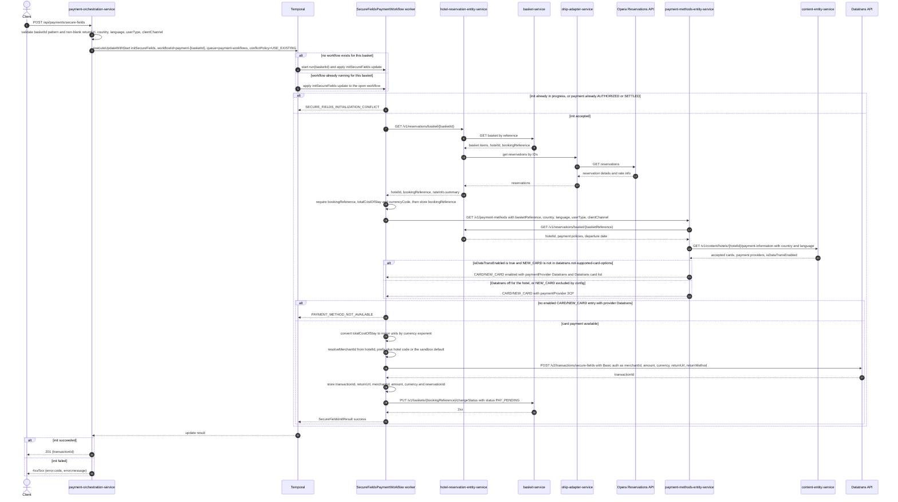

# Payment Orchestration Service: initSecureFields Flow

This endpoint opens a card payment session for web clients: it resolves the basket's reservation, checks with `payment-methods-entity-service` that new-card payment for the hotel is served by Datatrans, converts the stay total into Datatrans minor units, creates a Datatrans Secure Fields transaction under the hotel's merchant ID, moves the basket to `PAY_PENDING`, and returns the transaction ID the browser uses to mount the hosted card fields.

```http
POST /api/payments/secure-fields
Host: payment-orchestration-service:9200
Content-Type: application/json
```

No authentication or authorization is applied. A successful call returns `201 Created` with `{"transactionId": "..."}`.

## Flow

The controller validates the body. All six fields are required: `basketId` must match `^[A-Z]{3}-[0-9a-f]{8}-[0-9a-f]{4}-[0-9a-f]{4}-[0-9a-f]{4}-[0-9a-f]{12}$`, and `returnUrl`, `country`, `language`, `userType`, and `clientChannel` must be non-blank. Any failure returns `400 INVALID_REQUEST` carrying the first field message, without touching a dependency.

Orchestration runs in Temporal, not in the request thread. The service issues a Temporal Update-With-Start against workflow ID `payment-{basketId}` with conflict policy `USE_EXISTING`: the first call for a basket starts a `SecureFieldsPaymentWorkflow` and delivers the `initSecureFields` update, while later calls send the same update to the workflow already running for it. The update payload is an `InitSecureFieldsCommand` carrying `returnUrl`, `country`, `language`, `userType`, and `clientChannel`. The workflow and its activities execute on the `payment-workflows` task queue served by the service's own in-process worker. Update-With-Start blocks until the update handler returns, so the request thread receives the init result directly - there is no query polling on this path.

The update handler first rejects overlapping work: a second init while one is still in flight, or any init after the payment has reached `AUTHORIZED` or `SETTLED`, returns `SECURE_FIELDS_INITIALIZATION_CONFLICT`, which the service maps to `409`.

Otherwise the handler runs eight numbered steps. **(1)** It reads the reservation from `hotel-reservation-entity-service` via `GET /v1/reservations/basket/{basketReference}`, taking `hotelId` and `bookingReference` from the response and `totalCostOfStay` plus `currencyCode` from the first reservation's `rateInfo.summary`; the client itself rejects a response missing any of those three. **(2)** It stores `bookingReference` in workflow state for the later authorize and settle calls. **(3)** It validates payment methods by calling `payment-methods-entity-service` `GET /v1/payment-methods` with query params `basketReference`, `country`, `language`, `userType`, and `clientChannel` - the four client-supplied values are forwarded verbatim and `hotelId` is used only for logging, never sent. Card payment counts as available only if the response contains an entry with `name = "CARD"` and `type = "NEW_CARD"` that is `enabled` **and** whose `paymentProvider` is exactly `Datatrans`; its `acceptedCardTypes[].type` values become the card brand list. Anything else - empty array, no `CARD`/`NEW_CARD` entry, disabled entry, or a `3CP` provider - is "not available" and returns `PAYMENT_METHOD_NOT_AVAILABLE` (`422`) before Datatrans is contacted. **(4)** It converts the total to minor units using the currency's exponent (2 for GBP, EUR, USD, and CHF; 0 for JPY and KRW; 2 for anything unrecognised) and stores amount, currency, and reservation ID. **(5)** It resolves the Datatrans merchant ID from the hotel code and calls Datatrans `POST /v2/transactions/secure-fields` with HTTP Basic authentication, the merchant ID as username and the configured merchant password as the password; the body carries `amount`, `currency`, `returnUrl`, and `returnMethod` (`POST`). **(6)** It stores the returned transaction ID and the return URL in workflow state. **(7)** It transitions the basket by calling `basket-service` `PUT /v1/baskets/{bookingReference}/changeStatus` with `{"status": "PAY_PENDING"}` - this happens after the transaction ID exists but before it is returned, and a failure here fails the whole init. **(8)** It returns the transaction ID.

Merchant ID resolution is hotel-derived, not fixed. Under the `opera-prod` profile every hotel is provisioned, so the merchant ID is always `integrations.datatrans.merchant-id.prefix` + hotel code (`deWB-HARHOR`); a null or blank hotel code is a hard error. Without `opera-prod` (the sandbox default, and the profile the integration stack runs) the hotel code is looked up in `integrations.datatrans.merchant-id.provisioned-hotels` - `HARHOR`, `GRESOU`, `HAVFOR` - and matching hotels get `deWB-{hotelCode}` while every other hotel, including a null or blank one, falls back to `deWB-default`. The resolved merchant ID is kept in workflow state so authorize, settle, cancel, and status calls authenticate as the same merchant.

The workflow keeps `paymentStatus = INITIALIZED` and its `run` method stays parked until the payment reaches `SETTLED`, `FAILED`, or `CANCELLED`, so the workflow remains open for the later `authorize` signal and, after authorization, for the `bookingCompleted` signal fed by the `booking-completed` Kafka topic that decides between settle and cancel. That post-response work is outside this endpoint. Every init activity runs with a 30-second start-to-close timeout and up to three attempts, so a transient downstream failure is retried before the workflow gives up.

Error reporting is deliberately coarse on this path: the update handler wraps all eight steps in one blanket `catch (Exception e)` and reports `GATEWAY_ERROR`, which maps to `502` with the raw Temporal failure string as the message. Only an unavailable card payment method (`422`), an initialization conflict (`409`), a request-validation failure (`400`), and a failure to reach Temporal itself (`503`) surface differently. Notably, an unknown basket surfaces as `502 GATEWAY_ERROR` even though `BASKET_NOT_FOUND` -> `404` is already wired end to end in `PaymentOrchestrationInPortImpl` and `GlobalExceptionHandler` - the workflow simply never emits that code. This is a known bug, recorded in `bug/init-secure-fields-unknown-basket-gateway-error.md`.

## What makes the card check pass or fail

The `422` branch is reachable in practice, so the decisive logic downstream is worth stating. `payment-methods-entity-service` reads the basket reservation from `hotel-reservation-entity-service`, then fetches hotel payment details from `content-entity-service` via `GET /v1/content/hotels/{hotelId}/payment-information?country=&language=` (AEM-sourced). Two conditions must both hold for the `NEW_CARD` method to come back with `paymentProvider = Datatrans`:

- the hotel payment information has `isDataTransEnabled = true`, and
- `NEW_CARD` is **absent** from the service's `datatrans.not-supported-card-options` list.

`RuleData.resolveCardSource` / `resolvePaymentProvider` apply exactly that pair: when both hold, the accepted card types come from the hotel's Datatrans provider block and the provider is `Datatrans`; otherwise the method falls back to the 3CP card list and provider `3CP`, which the orchestrator treats as card payment unavailable. The service default for `not-supported-card-options` **includes** `NEW_CARD`, so an unconfigured deployment always answers no; the integration environment overrides `DATATRANS_NOT_SUPPORTED_CARD_OPTIONS` to `SAVED_CARD,NEW_PIBA,AP,GP,RESERVE_WITHOUT_CARD,ACCOUNT_COMPANY,PAYPAL`, dropping `NEW_CARD` and making the hotel's `isDataTransEnabled` the deciding input there. The accepted-card list can still be empty if the hotel exposes no Datatrans payment methods; an empty list does not by itself fail the check, since the orchestrator only tests availability and provider.

## Mermaid Flow



## Features

- Web card payment session creation backed by Datatrans Secure Fields v2
- Real card-availability check against `payment-methods-entity-service`, gated on the hotel resolving `NEW_CARD` to the Datatrans provider rather than to 3CP
- Client context (`country`, `language`, `userType`, `clientChannel`) forwarded to the payment-methods lookup, so the same basket can resolve differently per market and channel
- Hotel-derived Datatrans merchant ID, with a sandbox provisioned-hotel list and a `deWB-default` fallback, stored in workflow state so every later Datatrans call authenticates as the same merchant
- Basket transitioned to `PAY_PENDING` before the transaction ID reaches the browser
- One long-lived payment workflow per basket, addressed by the deterministic ID `payment-{basketId}`, so repeat calls reuse the existing workflow instead of creating a second one
- Synchronous HTTP response over asynchronous orchestration via Temporal Update-With-Start, which returns the update result without polling
- Reservation and amount resolution from `hotel-reservation-entity-service` rather than from client input
- Currency-aware major-to-minor unit conversion before the gateway call
- Booking reference stored in workflow state and reused as the Datatrans `refno` at authorize and settle, carrying correlation into settlement
- Re-initialization guards: concurrent inits and inits after authorization are rejected as a conflict rather than silently overwriting the session
- Activity-level retry (three attempts, 30-second start-to-close) over every init call
- Workflow state retained after init so the later `POST /api/payments/authorize` signal, and then the `booking-completed` Kafka signal, can settle or cancel the same transaction

## Feature Flags

`payment-orchestration-service` has no Unleash integration, so this endpoint gates nothing on a flag of its own. One flag in the downstream card check can change the answer:

| Flag | Effect when enabled |
| --- | --- |
| `kill_switch_pi_bb_ccui_disable_payments` | Evaluated by `payment-methods-entity-service` per `basketReference`. It abandons the rule engine and returns the fail-safe payment-method list, which carries no Datatrans provider, so `GET /v1/payment-methods` answers no card availability and this endpoint returns `422 PAYMENT_METHOD_NOT_AVAILABLE`. Fallback is `false`. |

The Datatrans eligibility switches - the hotel's `isDataTransEnabled` and `datatrans.not-supported-card-options` - are configuration and AEM content, not Unleash flags. The `opera-prod` Spring profile is likewise configuration, and selects the production merchant-ID resolver.

## Request

| Field | Required | Effect |
| --- | --- | --- |
| `basketId` | Yes | Identifies the basket whose reservation is priced and paid; also derives the Temporal workflow ID `payment-{basketId}` and is sent to `payment-methods-entity-service` as `basketReference`. Must match the three-letter-prefix-plus-UUID pattern |
| `returnUrl` | Yes | Passed through to Datatrans as the 3-D Secure redirect target, paired with a fixed `returnMethod` of `POST`. Non-blank only; no URL structure is enforced by the service |
| `country` | Yes | Forwarded as the `country` query param on the payment-methods lookup, which lower-cases it and uses it both to fetch hotel payment content and to drive country-specific card rules. Example `gb` |
| `language` | Yes | Forwarded as the `language` query param, used for the hotel payment-information content lookup. Example `en` |
| `userType` | Yes | Forwarded as the `userType` query param; selects the leisure or business rule set in the payment-methods engine, which can change whether `NEW_CARD` is offered. Example `LEISURE` |
| `clientChannel` | Yes | Forwarded as the `clientChannel` query param; drives channel-specific payment-method rules. Example `PI` |

None of the four context fields reach Datatrans; they only shape the card-availability answer.

## Branches

| Trigger | Behavior |
| --- | --- |
| `basketId` fails the pattern, or any of `returnUrl`, `country`, `language`, `userType`, `clientChannel` is blank or missing | `400 INVALID_REQUEST` with the first field message; no reservation, payment-methods, Temporal, or Datatrans call is made |
| Second call for the same `basketId` while its first init is still running | `409 SECURE_FIELDS_INITIALIZATION_CONFLICT`; no downstream call is made for the second request |
| Call for a `basketId` whose payment is already `AUTHORIZED` or `SETTLED` | `409 SECURE_FIELDS_INITIALIZATION_CONFLICT` |
| Second call for the same `basketId` after a completed init, still in `INITIALIZED` | Update-With-Start reuses the running workflow and re-runs the init handler on it, overwriting the stored transaction ID, merchant ID, amount, currency, and return URL, and re-issuing the `PAY_PENDING` status change |
| Payment-methods response has no enabled `CARD`/`NEW_CARD` entry, or its provider is not `Datatrans` | `422 PAYMENT_METHOD_NOT_AVAILABLE`; merchant ID is never resolved and Datatrans is never called |
| Payment-methods service returns an error status or is unreachable | Raised as service-unavailable inside the activity, retried up to three times, then collapsed by the workflow's catch-all into `502 GATEWAY_ERROR` |
| Hotel is in `provisioned-hotels` (sandbox) or profile is `opera-prod` | Datatrans Basic-auth username is `deWB-{hotelId}` |
| Hotel is absent from `provisioned-hotels` outside `opera-prod` | Datatrans Basic-auth username falls back to `deWB-default` |
| Reservation lookup returns 404 for an unknown basket | Reported as `502 GATEWAY_ERROR` with a raw Temporal failure message, not the `404 BASKET_NOT_FOUND` the mapping supports - see `bug/init-secure-fields-unknown-basket-gateway-error.md` |
| Reservation response missing `bookingReference`, `totalCostOfStay`, or `currencyCode` | Same `502 GATEWAY_ERROR` path, after the three activity attempts are exhausted |
| Datatrans returns an error status, an empty body, or a body without `transactionId` | `502 GATEWAY_ERROR` |
| Basket status change to `PAY_PENDING` returns 404 or another error | Init fails with `502 GATEWAY_ERROR` even though the Datatrans transaction was already created |
| Any downstream unreachable | Retried up to three times per activity, then reported as `502 GATEWAY_ERROR` |
| Temporal itself unreachable, or the Update-With-Start call fails | `503 SERVICE_UNAVAILABLE` |
| Currency outside the known exponent table | Treated as a two-decimal currency when converting to minor units |
