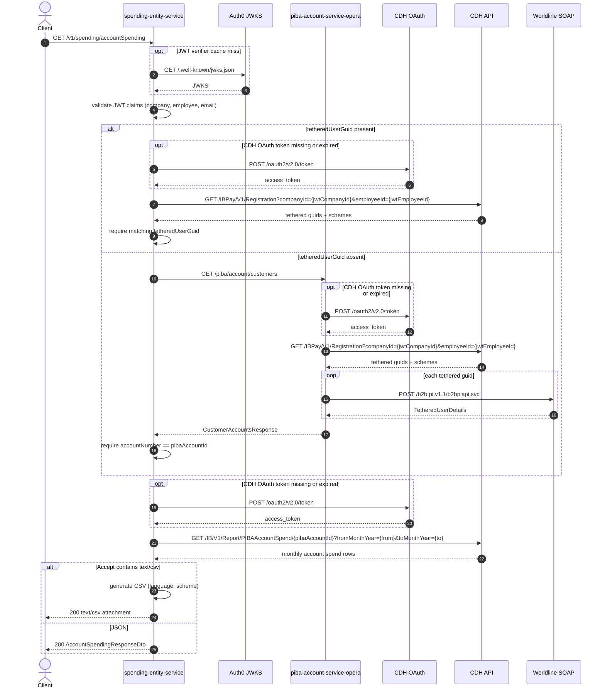

# Spending Entity Service: getAccountSpending Flow

Returns monthly PIBA account spending for a date range after confirming the caller owns the account.

```http
GET /v1/spending/accountSpending?pibaAccountId={pibaAccountId}&fromMonthYear={MM-yyyy}&toMonthYear={MM-yyyy}[&tetheredUserGuid={guid}][&language={EN|DE}][&scheme={GB|DE}]
Host: spending-entity-service:9132
Accept: application/json
WB-Authorization: Bearer {jwt}
```

Requires an authenticated JWT (`@PreAuthorize("isAuthenticated()")`). When `Accept` includes `text/csv`, the same spend data is returned as a CSV attachment instead of JSON.

## Flow

1. Validate the JWT and require company, employee, and email claims.
2. Prove account ownership:
   - If `tetheredUserGuid` is present, call CDH Registration with JWT company/employee ids and require a matching tethered guid.
   - If absent, call `piba-account-service-opera` `GET /piba/account/customers` with the caller's authorization token and require an account whose `accountNumber` equals `pibaAccountId`. PIBA resolves tethered guids from CDH Registration and enriches each with Worldline SOAP user details.
3. Fetch monthly spend from CDH `GET /IB/V1/Report/PIBAAccountSpend/{pibaAccountId}` using `fromMonthYear` / `toMonthYear`, `accessContext=InnBusiness`, and `accessedBy` set to the JWT email.
4. Return JSON by default, or generate a localized CSV report when `Accept: text/csv` (optional `language` and `scheme` shape the CSV headers/currency formatting).

## Mermaid Flow



## Features

- Monthly account-level spend for a `fromMonthYear` / `toMonthYear` range (`MM-yyyy`).
- Account ownership check via optional `tetheredUserGuid` (CDH Registration) or PIBA customer accounts.
- Authenticated access only (`WB-Authorization` JWT).
- Dual response formats: JSON (`application/json`) or CSV (`Accept: text/csv`).
- CSV localization via optional `language` (`EN` / `DE`) and currency formatting via optional `scheme` (`GB` / `DE`).

## Feature Flags

None. This endpoint does not gate behavior on feature flags.

## Request

| Parameter | In | Required | Effect |
| --- | --- | --- | --- |
| `WB-Authorization` | header | Yes | Bearer JWT for the logged-in user |
| `pibaAccountId` | query | Yes | PIBA account to report on and match for ownership |
| `fromMonthYear` | query | Yes | Range start (`MM-yyyy`) |
| `toMonthYear` | query | Yes | Range end (`MM-yyyy`) |
| `tetheredUserGuid` | query | No | Skips PIBA; validates guid via CDH Registration |
| `language` | query | No | CSV only: month names / report labels (`EN`, `DE`) |
| `scheme` | query | No | CSV only: booking value currency style (`GB`, `DE`) |
| `Accept` | header | No | `text/csv` selects CSV; otherwise JSON |

## Branches

- **Ownership path**: `tetheredUserGuid` present uses CDH Registration only; absent uses PIBA (CDH Registration + Worldline SOAP per guid).
- **Response format**: `Accept: text/csv` returns a downloadable report; otherwise JSON.
- **Unknown account**: no matching tethered guid or account number fails ownership validation.
- **CDH Registration cache**: commons-cdh-lib may cache registration results when Redis cache is enabled.
