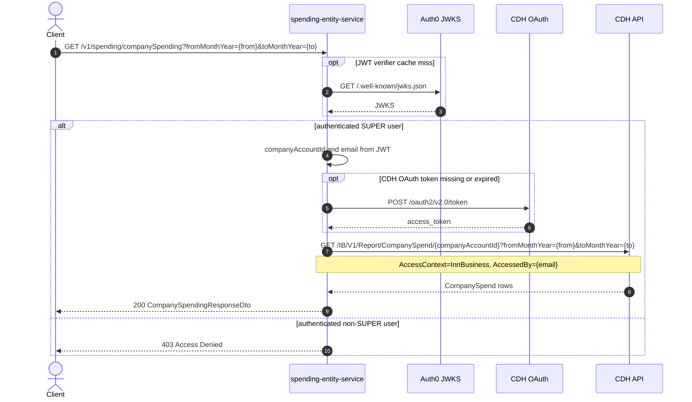

# Spending Entity Service: getCompanySpending Flow

Returns monthly company-level spend for the authenticated SUPER user's company over a month range.

```http
GET /v1/spending/companySpending?fromMonthYear={MM-yyyy}&toMonthYear={MM-yyyy}
Host: spending-entity-service:9132
Accept: application/json
WB-Authorization: Bearer {jwt}
```

Requires an authenticated SUPER user:

```text
@PreAuthorize("isAuthenticated() and authentication.account.accessLevel == 'SUPER'")
```

## Flow

1. Enforce authentication and `accessLevel == SUPER` from the JWT account.
2. Read `companyAccountId` and email from the JWT (not from the public request).
3. Obtain a CDH OAuth token when needed.
4. Call CDH `GET /IB/V1/Report/CompanySpend/{companyAccountId}` with `fromMonthYear`, `toMonthYear`, `accessContext=InnBusiness`, and `accessedBy` set to the JWT email.
5. Map the CDH monthly rows to the public company spending response.

Non-SUPER authenticated callers are rejected with access denied before any CDH call.

## Mermaid Flow



## Features

- Company-wide monthly spend for a `fromMonthYear` / `toMonthYear` range (`MM-yyyy`).
- Company id taken from the JWT account, not from query parameters.
- SUPER-only authorization at the method level.
- Direct CDH report call (`accessContext=InnBusiness`).

## Feature Flags

None. This endpoint does not gate behavior on feature flags.

## Request

| Parameter | In | Required | Effect |
| --- | --- | --- | --- |
| `WB-Authorization` | header | Yes | Bearer JWT; must include SUPER access level |
| `fromMonthYear` | query | Yes | Range start (`MM-yyyy`) |
| `toMonthYear` | query | Yes | Range end (`MM-yyyy`) |

Derived from JWT (not public query params):

| Value | Source |
| --- | --- |
| `companyAccountId` | authenticated account company id |
| `accessedBy` | authenticated account email |
| `accessContext` | fixed `InnBusiness` |

## Branches

- **SUPER vs non-SUPER**: only SUPER reaches CDH; others get 403.
- **CDH OAuth**: token is requested when missing or expired before the report call.
