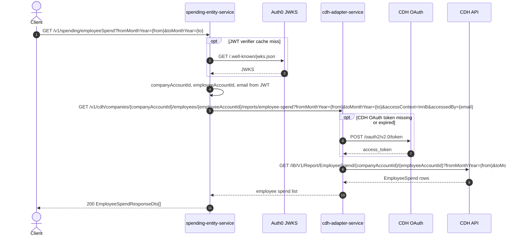

# Spending Entity Service: getEmployeeSpend Flow

Returns monthly spend for the authenticated employee within their company over a month range.

```http
GET /v1/spending/employeeSpend?fromMonthYear={MM-yyyy}&toMonthYear={MM-yyyy}
Host: spending-entity-service:9132
Accept: application/json
WB-Authorization: Bearer {jwt}
```

Requires `WB-Authorization`. Unlike the other spending endpoints, this method has no method-level `@PreAuthorize`; identity still comes from the JWT security context, and blank company/employee/email claims fail token validation.

## Flow

1. Read company id, employee id, and email from the JWT and validate they are present.
2. Build the adapter request with public `fromMonthYear` / `toMonthYear` plus:
   - `companyAccountId` and `employeeAccountId` from JWT
   - `accessContext=InnB`
   - `accessedBy` = JWT email
3. Call `cdh-adapter-service` `GET /v1/cdh/companies/{companyAccountId}/employees/{employeeAccountId}/reports/employee-spend`.
4. The adapter obtains a CDH OAuth token when needed and calls CDH `GET /IB/V1/Report/EmployeeSpend/{companyAccountId}/{employeeAccountId}` with the month range.
5. Return the mapped employee spend list to the client.

## Mermaid Flow



## Features

- Employee-scoped monthly spend for a `fromMonthYear` / `toMonthYear` range (`MM-yyyy`).
- Company and employee ids taken from the JWT, not from query parameters.
- Downstream path goes through `cdh-adapter-service` rather than direct CDH report clients used by other spending endpoints.
- Access context sent to the adapter as `InnB`.

## Feature Flags

None. This endpoint does not gate behavior on feature flags.

## Request

| Parameter | In | Required | Effect |
| --- | --- | --- | --- |
| `WB-Authorization` | header | Yes | Bearer JWT for the logged-in employee |
| `fromMonthYear` | query | Yes | Range start (`MM-yyyy`) |
| `toMonthYear` | query | Yes | Range end (`MM-yyyy`) |

Derived from JWT / fixed constants for the adapter call:

| Value | Source |
| --- | --- |
| `companyAccountId` | authenticated account company id |
| `employeeAccountId` | authenticated account employee id |
| `accessedBy` | authenticated account email |
| `accessContext` | fixed `InnB` |

## Branches

- **Token claims missing**: blank company, employee, or email fails before the adapter call.
- **CDH OAuth (adapter)**: token is requested when missing or expired before CDH EmployeeSpend.
