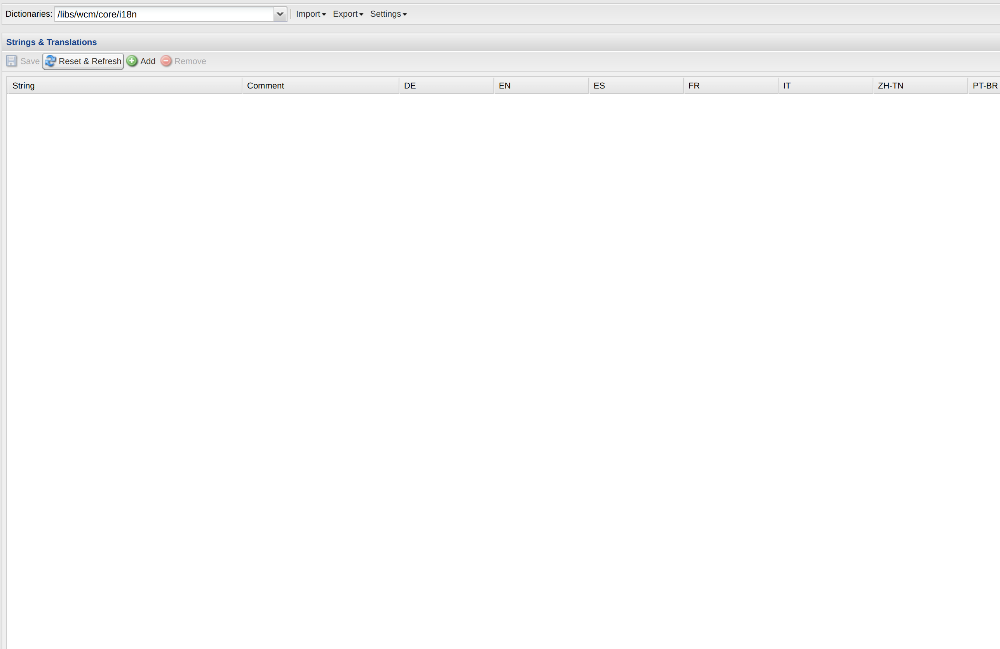
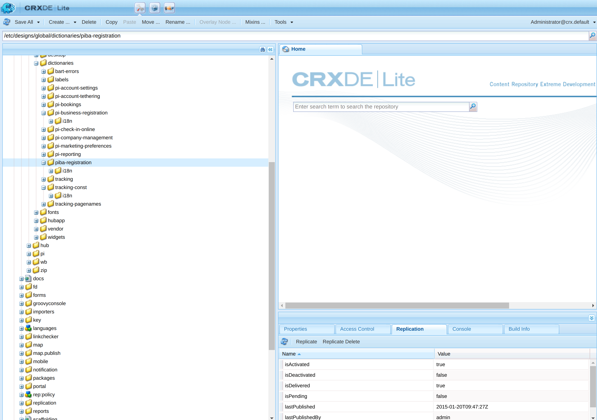

# Creating Dictionaries and importing them to the ODE's

*example **author** path ``https://author-ode-{branchname}.ode.dev.premierinn.digital``* (replace {branchname} with your branch name)

*example **publisher** path ``https://publisher-ode-{branchname}.ode.dev.premierinn.digital``* (replace {branchname} with your branch name)

*At the time of writing the ODE's do not replicate the dictionary folders from the author to the publisher. 
Once this is fixed parts of this documentation will no longer be relevant.*

Each repository should have a npm script called ``generate:dictionary``, once run this will look for dictionary 
files and generate **xliff** files which can be imported via the translator tool located at the following path on your author

```/libs/cq/i18n/translator.html```

These files are produced inside the root of the application you are running the script in, navigate to the translator tool and make sure you have the correct dictionary selected where you would like to import.



Click import and navigate to the application folder where the files have been generated, you will need to import each of the files. If you already have dictionary keys within this dictionary it is wise to select "overwrite" when importing each file. 

## Creating a dictionary package and importing to publisher

### This will not be relevant if replication on the ODE is fixed
When you have imported all the files we need to then create a package to then install on the publisher so navigate to ```/crx/de/index.jsp``` click on the package manager (middle icon in the top most bar) and then "Create Package", enter the package name and version number and then click ok. 

You should see the package now in the main window, first we need to edit this package to collect the correct folders, so click "edit" then click on the tab "filters", in this tab we will put the folder we want to build into the package. Click "Add Filter" and enter the Root Path of what you want included in this package.

For example ```/etc/designs/global/dictionaries/piba-registration```.  

Then click "Done" then "Save", Finally click "Build", this will build your package from the specified folder, you can then download the package to your local machine.

Next we need to install this package on the publisher, so on the publisher navigate to ``/crx/de/index.jsp`` and enter the package manager and click "Upload Package", navigate to your downloaded package and upload it, then click "Install / Reinstall", then open the "More" dropdown and click replicate, this has then installed and replicated the dictionaries onto the publishers.

## Replicating from the author 

### (Not relevant if replication on the ODE's is still broken)

Navigate to the dictionary folder in the navigation pane and select it then click on the replication tab in the tool window.



Then click "Replicate" this should then replicate to the publishers.

# Clearing the ODE cache

AEM has a dispatcher cache that requires clearing once new packages or changes have been replicated to do this you can run the npm script in the mono repo

`ode:cache` - Clears a cache for an ODE, ```npm run ode:cache {branchname}``` (replace {branchname} with your branch name or manual built ODE name) e.g.

```bash
npm run ode:cache sprint-21-1-6
```
