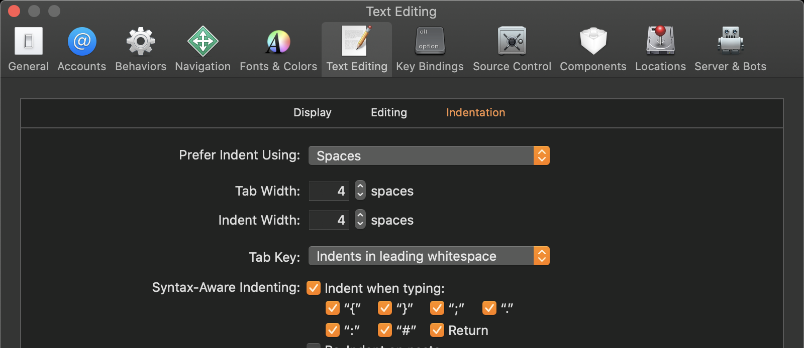

# Code Style Guide

For developers new to Swift see recommended guide [here](https://github.com/raywenderlich/swift-style-guide)

Below there are a list of exceptions to the the industry standard style guides.
These are chosen to increase readability and decrease coupling to suit the complexity of the Whitbread domain.


## Indent with 4 spaces

Indent using 4 spaces rather than tabs to conserve space and help prevent line wrapping. Be sure to set this preference in Xcode and in the Project settings as shown below:




## Id and asset names

Use lowercase dash separated words for ids and assets names.

**Preferred**:
```
name-name
```
**Not Preferred**:
```
name_Name
```


## Functional Programming
Lean towards functional programming code but sometimes where it is not clearly readable avoid.

**Preferred**:
```swift
func passengersCount(passengerCounts: PassengerCounts) -> Int {
return passengerCounts.adults + passengerCounts.youngAdults + passengerCounts.children + passengerCounts.infants
}
```

**Not Preferred**:
```swift
func passengersCount(passengerCounts: PassengerCounts) -> Int {
return Mirror(reflecting: passengerCounts).children.compactMap { $1 as? Int }.reduce(0, +)
}
```
