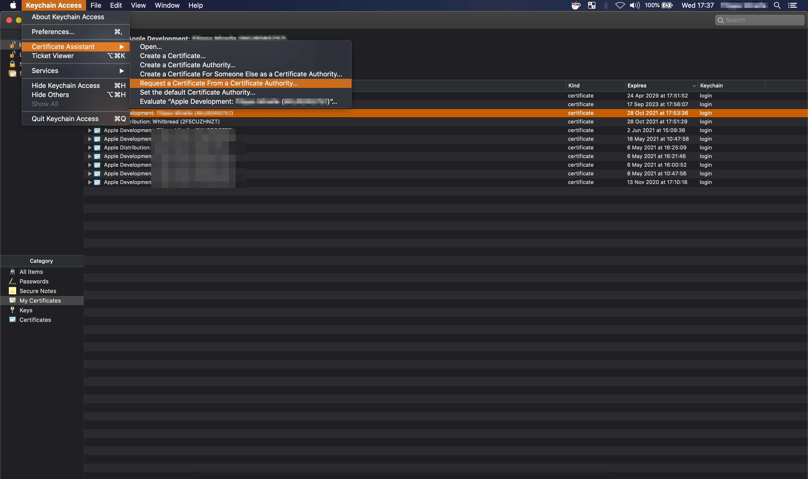
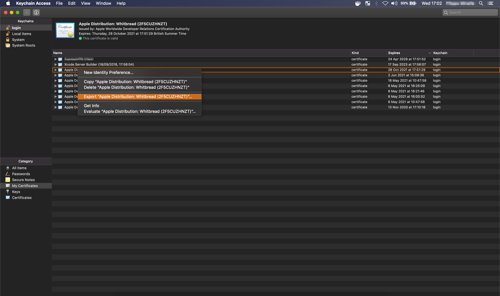
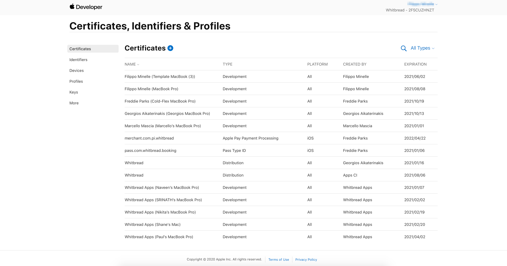
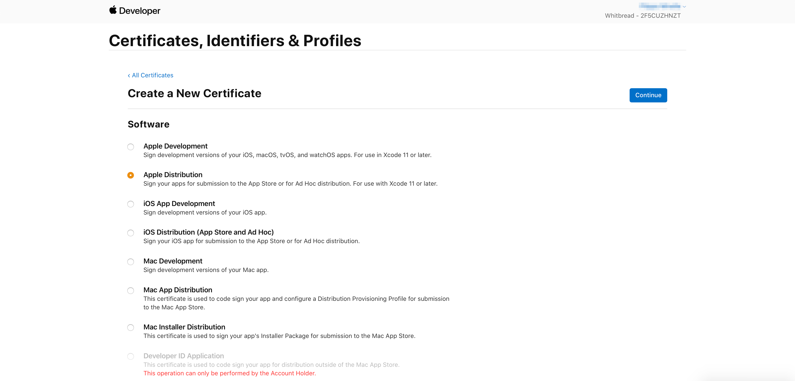
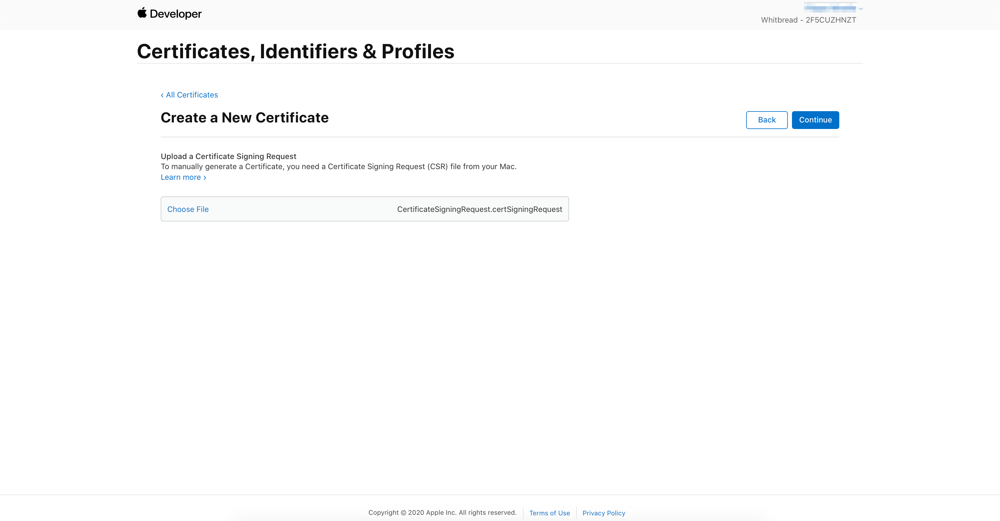
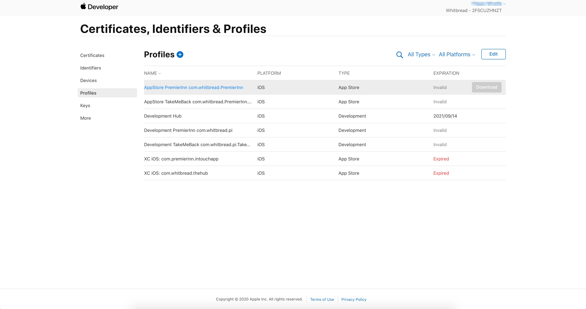
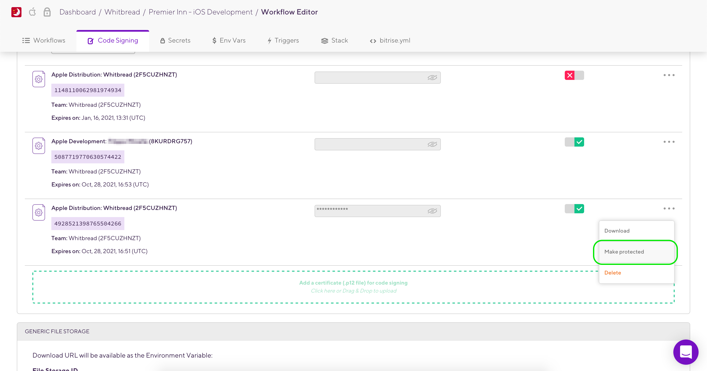
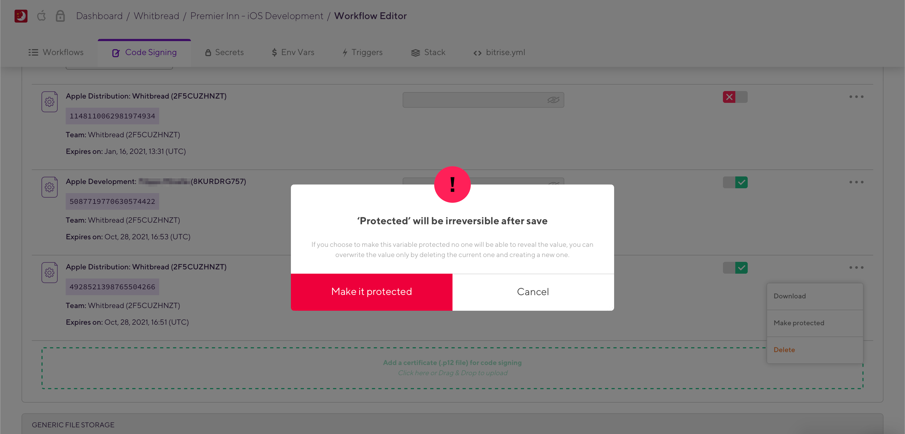

# Bitrise

## Index

* [Configuring iOS auto provisioning](#Configuring-iOS-auto-provisioning)

## Configuring iOS auto provisioning

[here](https://devcenter.bitrise.io/code-signing/ios-code-signing/ios-auto-provisioning/#configuring-ios-auto-provisioning) the link for Bitrise documentation.

To publish the app on the AppStore or to distribute the app to testers, the `.p12` files are required. Below, the procedure to follow to distribute the application through Bitrise is explained step by step.

### Create a `.certSigningRequest` CSR file

- Open Keychain Access from Utilities
- From Keychain Access toolbar select `Keychain Access`> `Preference`
- In the pop up window select Certificates tab
- Set both `Online Certificate Status Protocol` and `Certificate Revocation List` to `Off`
- Close this window

- Now from toolbar, open `Keychain Access` > `Certificate Assistant` > `Request a Certificate From a Certificate Authority`

- Enter email address and common name that you used to register in the `iOS Developer Program`
- Keep CA Email blank and select `Saved to disk` and `Let me specify key pair information` and click `Continue`
- Choose a filename & destination on your hard drive and click `Save`
- In the next window, set the password and click `Continue`
- This will create and save your `certSigningRequest` file (CSR) to your hard drive. A public and private key will also be created in Keychain Access with the Common Name entered.

### Create `.cer` file in iOS Developer Account

- Login to apple developer account Click `Certificates, Identifiers & Profiles`
- Click `Provisioning Profiles`
- In the `Certificates` section click `Production`
- Click the `Add` (+) button at the top-right of the main panel

- Now, choose `App Store Distribution` and click `Continue`

- Click `Choose File` & find CSR file you’ve made from your hard drive
- Click `Generate`
- Click `Download` to get the file

_Repeat the same process for Develop Distribution_

### Install `.cer` and generate `.p12` certificate

- Find `.cer` file you’ve downloaded and double-click
- Set Login drop-down to `login` and Click `Add`
- Open up KeyChain Access and you'll find profile created in Step "Create a `.certSigningRequest` CSR file"
- You can expand `private key` profile (shows certificate you added)
- Select only these two items (not the public key)
- Right click and click `Export 2 items…` from popup
- Now make sure file format is `.p12` and choose filename and destination on your hard drive
- Click `Save`. Now, you’ll be prompted to set a password but keep these both blank
- Click `OK`. Now, you have a `.p12` file on your hard drive
- Take a note that if issue still persists then try below step as well: If your keychain is present in iCloud then remove all keychain content from iCloud and do new setup in iCloud This should work.

### Certificates, Identifiers & Profiles

#### Bitrise - Export your code signing files with `Codesigndoc` - *Preferred*

- For installing code signing files in Bitrise, paste this script into your terminal and follow the instructions:

`bash -l -c "$(curl -sfL https://raw.githubusercontent.com/bitrise-tools/codesigndoc/master/_scripts/install_wrap.sh)"`

- *Upload all exported files below*: You'll have the `.p12` Identity file including the Certificate and Private Key, and the required Provisioning Profiles ready for upload. More info
- *Don't forget to add the Certificate and Provisioning Profile Installer step*: You’ll need this step in your workflow to make code signing work for your project

#### Export manually and install on Bitrise

- Download the profiles

- Drag & Drop in Bitrise `Code Signing` panel

- For *Distribution* configuration it's always good practice to protect the certificate

## Restoring .yml configuration on Bitrise

It is good practice to have a Bitrise workflow configuration backup in the project.

1. Open the `bitrise.yml` by one of your favourite text editors.
2. Copy the entire configuration settings.
3. Go to [bitrise dashboard](https://app.bitrise.io/dashboard).
4. Select `PremierInn` and go to the detail page.
5. Click on `Workflows` which will take you to `Workflow Editor`.
6. From the top navigation, select `bitrise.yml`. This will take you to `bitrise.yml` editor view.
7. Paste the copied entire configuration settings.
8. Click on `Save` or press `cmd + s` to save the changes.
