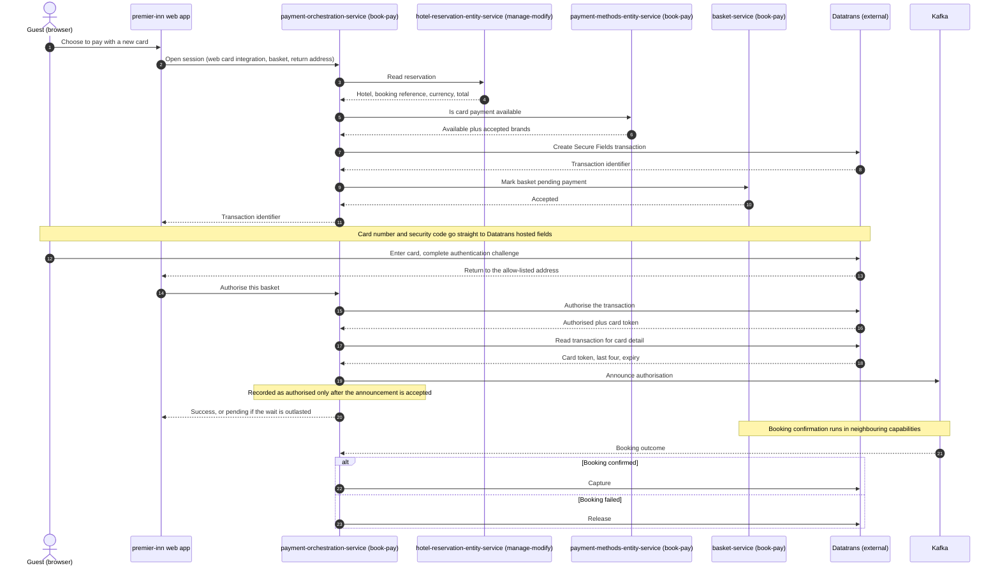
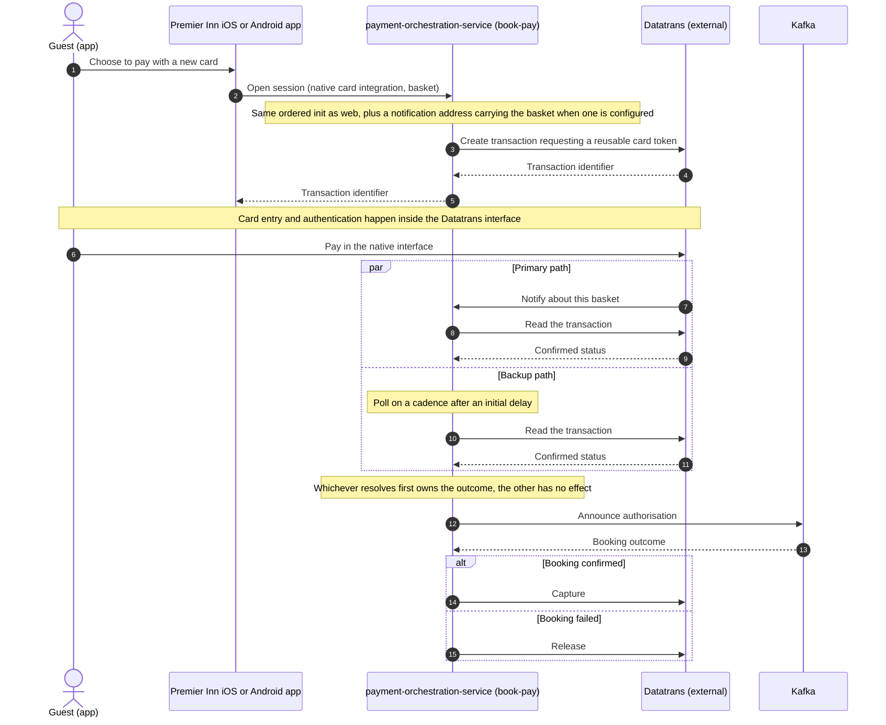

# New Card Payment Design

Related contract: [spec.md](spec.md)

## Boundary and participants

Capability owner: book-pay

This capability owns everything between the guest electing to pay with a new card and the
authorisation being captured or released. That means: opening a gateway payment session,
confining card data to the gateway, completing Strong Customer Authentication, authorising,
announcing the authorisation to the booking pipeline, and deciding capture or release once the
booking outcome is known.

It does **not** own booking confirmation. Confirming the reservation with the property, posting
the deposit folio and finalising the basket belong to neighbouring capabilities; this
capability consumes their verdict as a single signal and acts on it. See
[Neighbouring capabilities](#neighbouring-capabilities).

| Participant | Role |
|---|---|
| `payment-orchestration-service` (book-pay) | Owns the payment session, its state machine and its timers. The only service that talks to the card gateway for this capability. |
| `premier-inn` web app (shared frontend codebase, hosting squad not established) | Renders the payment page, hosts the gateway's card fields, and proxies payment calls through its own server-side routes. |
| Premier Inn iOS and Android apps (shared mobile codebases, hosting squad not established) | Render the gateway's native payment interface. Source of truth for these clients is outside this repository — see [Participating surfaces](#participating-surfaces). |
| Datatrans (external) | Card gateway. Hosts the web card fields and the native SDK, performs authentication and authorisation, returns a reusable card token, and captures or releases on instruction. |
| `hotel-reservation-entity-service` (manage-modify) | Supplies the reservation the payment is for: hotel, booking reference, currency and total cost of stay. |
| `payment-methods-entity-service` (book-pay) | States whether card payment is available for the hotel, channel and guest type, and which card brands it accepts. |
| `basket-service` (book-pay) | Holds basket state. Marked pending payment before the guest can pay, consumes the authorisation announcement, and is polled for the booking outcome when the signal does not arrive. |
| Temporal (platform) | Durable execution. One long-running workflow per basket holds the payment state and every timer this capability depends on. |
| Kafka (platform) | Carries the authorisation announcement outbound and, when `basket-service` (book-pay) publishes it, the booking outcome inbound. See [Feature flags and rollout](#feature-flags-and-rollout). |

## Architecture and workflow

The payment is a single long-running Temporal workflow per basket, identified `payment-`
followed by the basket identifier. The workflow — not a database — is the source of truth for
payment state, and it owns every timer: expiry, the native reconciliation poll, the booking
outcome poll, and the capture retry horizon. Two strategy objects sit inside it, one per
integration, selected deterministically from the payment method named at initialisation.

`payment-orchestration-service` (book-pay) exposes four HTTP operations for this capability,
alongside the standard API-documentation and actuator endpoints. Three are driven by clients;
the fourth is called by Datatrans.

### Implementation walkthrough

**Initialisation, both integrations.** A client opens a session by naming the basket and the
integration. `payment-orchestration-service` (book-pay) starts or attaches to the basket's
workflow in a single call, then runs an ordered sequence inside it:

1. Read the reservation from `hotel-reservation-entity-service` (manage-modify) — hotel,
   booking reference, currency, total cost of stay.
2. Validate card availability with `payment-methods-entity-service` (book-pay). Unavailable
   ends the session here.
3. Convert the total to minor units. Only GBP and EUR are supported; anything else ends the
   session rather than charging a guessed amount.
4. Resolve the hotel's Datatrans merchant account: `deWB-` followed by the hotel code in
   production; elsewhere only provisioned hotels get their own account and every other hotel
   uses `deWB-default`. One shared merchant password serves every account.
5. Create the gateway transaction — `/v2/transactions/secure-fields` for web,
   `/v2/transactions` for native.
6. Mark the basket pending payment in `basket-service` (book-pay). This is deliberately the
   last step before the client is let in, and its failure returns an error to the client. The
   transaction created in step 5 is already recorded in the workflow by then; see
   [Branches, failures and recovery](#branches-failures-and-recovery).
7. Return the transaction identifier.

Deferred capture is the default at the gateway: no auto-settle instruction is sent on either
integration.

**Authorisation differs by integration, and this is the only place they diverge.**

*Web.* The gateway's hosted fields collect the card, the browser is redirected for any
authentication challenge and returns to the allow-listed address, and the client then asks the
service to authorise. The client names only the basket; the workflow supplies the transaction
identifier it already holds. The workflow authorises with the gateway, reads the transaction
back to obtain card detail, announces the authorisation, and only then records the payment as
authorised. There is no backup path: if the client never asks, the payment expires.

*Native.* The app drives the gateway's own interface, including authentication. When a
notification address is configured, the gateway then notifies the service; independently, the
workflow polls the gateway on a cadence. With no notification address configured, the poll is
the only path. Both paths converge on the same authorise routine, guarded so exactly one of them
takes effect.

**Every gateway claim is verified.** A notification's claimed status is a hint. The workflow
reads the transaction from the gateway and acts on that answer — for a favourable claim and an
unfavourable one alike. A notification naming a transaction the session does not hold is
discarded. This is what currently protects the notification surface, since signature
verification is configured but unkeyed in practice.

**Announcement precedes authorisation.** The authorisation announcement is published to Kafka
*before* the payment is recorded as authorised. If publication cannot succeed within its
horizon the workflow compensates — releases the authorisation at the gateway and fails the
attempt — so the guest is never left with money held against a booking that never started.

**Capture waits for the booking.** After authorisation the workflow waits for the booking
outcome, then captures or releases. It never captures speculatively.





### State and completion

State lives in the workflow's own memory, made durable by Temporal's event history. Nothing
about payment state is persisted to a database by this capability.

Nine statuses exist, and three different predicates cut across them. Confusing the cuts is the
main hazard when reading this design:

| Status | Authorisation phase over | Workflow may close | Holds guest funds |
|---|---|---|---|
| `INITIALIZED` | no | no | no |
| `AUTHORIZED` | yes | no | no |
| `SETTLEMENT_PENDING` | no | no | yes |
| `SETTLED` | yes | yes | no |
| `SETTLEMENT_FAILED` | yes | yes | yes |
| `BOOKING_PENDING_TIMEOUT` | yes | yes | yes |
| `FAILED` | yes | **no** | no |
| `CANCELLED` | yes | yes | no |
| `EXPIRED` | yes | yes | no |

Three consequences worth stating plainly:

- `FAILED` is deliberately not closable. The workflow stays open so the guest can re-initialise
  the same payment inside the expiry window.
- `SETTLEMENT_PENDING` is neither closable nor authorisation-phase-complete, because the
  capture retry horizon has not resolved.
- The funds-held predicate is what refuses a second attempt on a basket whose money is already
  committed.

What each signal establishes:

- A returned transaction identifier means a gateway session exists and the basket is marked
  pending payment. It establishes nothing about the card or the money.
- `AUTHORIZED` means the gateway holds the amount **and** the booking pipeline has been told.
  The announcement is a precondition, not a consequence.
- `SETTLED` means the money has been captured. It is the only status that means the guest has
  paid.
- The two parked statuses mean the guest's money is committed and no automated path can
  resolve it.

Guest-visible completion is not payment capture. Once its own part is done each client follows
the **booking** status, not the payment status. Capture continues in the background and never
blocks the guest. The contract's one payment-status read is the web client resolving a
pending authorisation; the deployed web client does not make it (see
[Open questions](#open-questions)).

### Branches, failures and recovery

**Initialisation is all-or-nothing from the client's perspective, but not atomic underneath.**
A failure at any step returns an error and leaves the payment `INITIALIZED`, so the guest's
retry re-initialises the same workflow. Partial effects of a failed initialisation are not
rolled back: a gateway transaction created before a later step fails is left to lapse at the
gateway, and a basket already marked pending payment stays marked. If marking the basket is the
step that fails, the new transaction is already recorded in the workflow, so it can still be
authorised and, for native, polled, although the client never received it. See
[Open questions](#open-questions).

**Re-initialisation always replaces, never reuses.** A live gateway transaction is released and
a fresh one created. The gateway only accepts a cancellation for a transaction it reports as
authorised, so the workflow reads the status first and cancels only then; an un-progressed
transaction is left to lapse on its own. The invariant is one live transaction per basket
always reflecting the current amount — reusing a stale transaction could let a guest pay an
out-of-date, lower amount after changing their booking in another tab.

**Web expiry is absolute and starts when the payment starts.** It covers the wait for a first
successful initialisation, so a payment whose initialisation keeps failing still expires. The
expiry path is guarded: if an authorisation is in flight when the deadline fires, the workflow
waits for it rather than cancelling a transaction underneath the caller.

**Native expiry works differently.** A native attempt is bounded by the reconciliation deadline,
measured from each successful initialisation rather than from the start of the payment, and
expiring on that path does not release the transaction at the gateway. With reconciliation
polling disabled, nothing bounds the attempt. See [Open questions](#open-questions).

**Concurrency needs no locking.** Temporal runs a workflow's updates, signals and timer
callbacks one at a time on a single deterministic thread, so there are no data races. Each
transition still guards on current state, which is what prevents a native notification and
the backup poll from both taking effect. The web authorise operation is refused outright for a
native payment. Initialisation has no equivalent in-progress guard: two initialisations for the
same basket can interleave while each waits on its dependency calls. See
[Open questions](#open-questions).

**Capture is a long-horizon durable retry.** Once the booking is confirmed the guest holds a
confirmed booking, so a gateway outage is not a reason for a free stay: capture retries with
exponential backoff for far longer than a human would wait. Exhausting that horizon parks the
payment rather than dropping it.

**A failed release after a failed booking ends `FAILED`.** When the booking outcome is a
failure and releasing the authorisation fails, the payment is marked `FAILED` rather than
`CANCELLED` or parked. Because `FAILED` keeps the workflow open, the release is attempted again
by the expiry path or by a guest re-initialisation.

**Both parked outcomes end the execution by failing it.** Rather than returning normally, the
workflow throws a non-retryable failure whose type is the status name. Parked payments
therefore appear as failed executions in Temporal and in workflow-failure metrics instead of
hiding among completed ones. The payment status remains queryable on the failed execution.

## Participating surfaces

| Surface | Responsibility and impact |
|---|---|
| Backend | Owns the capability. `payment-orchestration-service` (book-pay) holds the session, state machine, timers, all gateway calls, and both event contracts. |
| Web | `premier-inn` web app renders the payment page, mounts the gateway's hosted card fields, performs the authentication redirect, and proxies both payment calls through its own server-side routes so the orchestrator is never called directly from a browser. |
| iOS | Renders the gateway's native payment interface and opens the session. **Not established in this repository** — the iOS tree here is a stale copy and was deliberately not read. See the open question. |
| Android | As iOS. **Not established in this repository**, and no Android specification exists for this capability. |
| GraphQL/BFF | Not affected for the payment calls. The web app's own server-side routes are the BFF hop; the federated GraphQL layer supplies payment-method availability to the page but carries no operation for this capability. Its payment mutations serve legacy payment flows. |

| Component or service | Surface | Current hosting squad | Contribution and role |
|---|---|---|---|
| `payment-orchestration-service` | Backend | book-pay | Capability implementation. Sole owner of payment state and gateway interaction. |
| `hotel-reservation-entity-service` | Backend | manage-modify | Reusable dependency. Read once per initialisation for hotel, booking reference, currency and total. |
| `payment-methods-entity-service` | Backend | book-pay | Reusable dependency. Read once per initialisation for card availability and accepted brands. |
| `basket-service` | Backend | book-pay | Reusable dependency. Marked pending payment at initialisation, and polled for the booking outcome when the signal is absent. |
| `premier-inn` web app | Web | Not established | Capability implementation for the web surface: hosted-field mounting, authentication redirect, and the two proxy routes. It does not restrict card brands in the hosted fields, and its proxy always sends guest type `LEISURE`. |

## API contracts

All paths below are service-relative. `payment-orchestration-service` (book-pay) sets **no
servlet context path**, so these are the paths as the service maps them. The
`/payment-orchestrator` prefix that appears in operational probes belongs only to the actuator
base path and is not part of this capability's surface. The gateway prefix in front of the
service is an open question — see [Open questions](#open-questions).

**No authentication or authorisation is enforced in code on the three client-facing
operations.** There is no security filter chain, no method security, and no credential check.
The notification endpoint's signature check is payload authenticity, not caller authentication.
See [Failure, security, and operability](#failure-security-and-operability).

### Client-facing operations

| Operation | Method and path | Callers | Success |
|---|---|---|---|
| Open a payment session | `POST /api/payments/init` | web app route `/api/payments/secure-fields`, native apps | `201` |
| Authorise | `POST /api/payments/authorize` | web app route `/api/payments/authorize` | `200`, or `202` when pending |
| Read payment status | `GET /api/payments/{basketId}/status` | operational tooling; the web app is expected to use it to resolve a pending authorisation but does not yet | `200` |
| Gateway notification | `POST /api/payments/webhooks/datatrans` | Datatrans, server to server | `200` |

Client-facing operations take and return `application/json`. The gateway notification is read
as raw bytes and answered with JSON.

**Open a payment session.** The request is a polymorphic body discriminated on
`paymentMethod`, which selects both the subtype and the workflow strategy.

| Field | Type | Required | Notes |
|---|---|---|---|
| `paymentMethod` | string | yes | `NEW_CARD_WEB` or `NEW_CARD_MOBILE`. Jackson type discriminator. |
| `basketId` | string | yes | Amount, currency and booking reference are read from the reservation, never taken from the client. |
| `returnUrl` | string | web only | HTTPS; the host must be an allow-listed host or a subdomain of one. Absent on the native subtype. |
| `country` | string | yes | Forwarded to payment-method availability. |
| `language` | string | yes | Forwarded to availability, and carried on the authorisation announcement. |
| `userType` | string | yes | Forwarded to availability. |
| `clientChannel` | string | yes | Forwarded to availability. |

Response `201`: `paymentMethod` echoed, plus `transactionId`.

Illustrative request, not captured traffic:

```json
{
  "paymentMethod": "NEW_CARD_WEB",
  "basketId": "AQN-147756bb-bb71-4842-959a-2efe87e378ed",
  "returnUrl": "https://www.premierinn.com/payment?source=datatrans",
  "country": "gb",
  "language": "en",
  "userType": "LEISURE",
  "clientChannel": "PI"
}
```

**Authorise.** Request carries `basketId` only, validated against a three-letter prefix plus
UUID pattern. The transaction identifier is held in workflow state and is deliberately not
part of the client contract. Response `200` carries the authorisation outcome; `202` carries
the same shape with `AUTHORIZATION_PENDING` and is **not** a failure — the authorisation is
durably accepted and continues, and the client resolves it by reading status.

**Read payment status.** Response `200` carries the current `paymentStatus` and the last
authorisation outcome, which is null until one exists. Backed by workflow queries, so polling
costs the workflow nothing and cannot change its state.

**Gateway notification.** `basketId` arrives as a query parameter — the correlation key. The
body is bound as raw bytes so the signature can be verified over exactly what the gateway
signed, and is deserialised only afterwards. Success is `200` with `{"status":"received"}`,
returned for accepted, duplicate and uncorrelatable notifications alike, because the gateway
does not retry on a non-2xx answer. A failed signature answers `401`; a malformed body answers
`400`.

### Error contract

Client-facing errors use `{"error": {"code": "...", "message": "..."}}`. The notification
endpoint is the exception: it answers `{"status": "..."}`.

| Code | HTTP | Meaning |
|---|---|---|
| `VALIDATION_FAILED`, `INVALID_REQUEST` | 400 | Malformed or missing fields, including a rejected return address |
| `BASKET_NOT_FOUND` | 404 | No basket, no payment for it, or a reservation with no rate summary |
| `TRANSACTION_NOT_FOUND` | 404 | No running payment to authorise for the basket |
| `INVALID_TRANSACTION_STATE` | 409 | Payment concluded, funds held awaiting capture or reconciliation, or no usable transaction to authorise in a running payment |
| `AUTHORIZATION_IN_PROGRESS` | 409 | An authorisation is in flight |
| `TRANSACTION_ALREADY_AUTHORIZED`, `BOOKING_ALREADY_PAID` | 409 | Defined and mapped, but never raised |
| `TRANSACTION_MISMATCH` | 409 | Gateway confirmed a different transaction or amount than expected |
| `EXPIRED`, `TRANSACTION_EXPIRED` | 410 | Session expired, or the gateway no longer knows the transaction |
| `PAYMENT_METHOD_NOT_AVAILABLE` | 422 | Card payment not available for this hotel and channel |
| `INVALID_AMOUNT` | 422 | Amount not representable in the currency's minor units |
| `GATEWAY_ERROR` | 502 | Catch-all for failed initialisation and authorisation: gateway faults, card declines and failed authentication, unreachable or refusing dependencies, a reservation missing payment-critical detail, and a failed authorisation announcement |
| `GATEWAY_AUTHENTICATION_FAILED` | 502 | Gateway rejected **our** credentials — an operational fault, never surfaced as 401 or 403 |
| `INTERNAL_ERROR` | 500 | Unexpected failure, for example a failed status read |
| `AUTHORIZATION_PENDING` | 202 | Deliberately absent from the error map; handled before any exception is raised |

An unreachable dependency surfaces as `GATEWAY_ERROR`, not as `503`: a `SERVICE_UNAVAILABLE`
code is defined but no failure path produces it.

### Datatrans operations consumed

Every call is Datatrans API v2, over HTTP Basic authentication with the hotel's resolved
merchant identifier as the username. The transaction identifier is treated as an opaque string
throughout — no numeric or UUID parsing or validation is applied.

| Operation | Method and path | Sent | Consumed |
|---|---|---|---|
| Create web session | `POST /v2/transactions/secure-fields` | amount, currency, return address, return method `POST` | transaction identifier |
| Create native session | `POST /v2/transactions` | amount, currency, reference, accepted brands, reusable-token request, notification address when configured | transaction identifier |
| Authorise | `POST /v2/transactions/{id}/authorize` | reference, amount | status, acquirer authorisation code, card, payment method |
| Read status | `GET /v2/transactions/{id}` | — | status, authorised amount, acquirer code, card, payment method, reference |
| Capture | `POST /v2/transactions/{id}/settle` | reference, amount, currency | no body |
| Release | `POST /v2/transactions/{id}/cancel` | no body | no body |

No auto-settle instruction is sent on any operation; deferred capture is the gateway default
the capability relies on. The native session explicitly requests a reusable card token.

A conflict answer on authorise or capture is not taken at face value: the workflow reads the
transaction back and accepts the operation only if the gateway's own record agrees. If the
status agrees but identifier, reference or amount differ, it raises a mismatch; if the status
does not agree, the operation fails. It never assumes success.

### Dependency operations consumed

| Service | Method and path | Sent | Consumed |
|---|---|---|---|
| `hotel-reservation-entity-service` (manage-modify) | `GET /v1/reservations/basket/{basketReference}` | `Accept: application/json` | `bookingReference`, `hotelId`, `channel`, and from the first reservation's rate summary `totalCostOfStay` and `currencyCode` |
| `payment-methods-entity-service` (book-pay) | `GET /v1/payment-methods` | query `basketReference`, `country`, `language`, `userType`, `clientChannel`; no headers | card method with its `enabled` flag, `paymentProvider`, and accepted card type codes |
| `basket-service` (book-pay) | `PUT /v1/baskets/{bookingReference}/changeStatus` | `{"status": "PAY_PENDING"}` | acceptance only |
| `basket-service` (book-pay) | `GET /v1/baskets/{basketReference}` | basket identifier | basket `status`, mapped to the booking outcome; polled when the signal is absent |

The basket status read maps basket statuses to a booking outcome. `COMPLETED`, `AMENDED`,
`PRE_CHECKED_IN` and `PRE_CHECKED_OUT` count as confirmed; `CANCELLED`, `FAILED`,
`AMEND_FAILED`, `CIOL_FAILED`, `CIOL_RC_FAILED` and `SECURE_FAILED` count as failed; any other or
unrecognised status counts as still pending.

Card availability requires all of: a card method present, marked enabled, and served by
Datatrans. Accepted brand codes are passed through to the gateway **unmapped** — the codes the
availability service returns are the codes Datatrans receives.

### Event contracts

**Produced — authorisation announcement.** Topic `payment-authorised` by default,
configurable; message key is the basket identifier, which gives per-basket ordering. JSON, Jackson-serialised with no wire-shape
annotations, so field names are the record's own.

| Field | Type | Notes |
|---|---|---|
| `basketId` | string | Also the message key |
| `transactionId` | string | Gateway transaction |
| `paymentProvider` | string | `datatrans` for this capability |
| `paymentMethod` | string | Gateway card code |
| `cardAlias` | string | Reusable card token. PCI-adjacent — never logged |
| `last4Digits` | string | |
| `expiry` | string | `MM/YY` |
| `authorizedAmount` | 64-bit integer | Minor units. Primitive, so always present |
| `currency` | string | ISO 4217 |
| `paymentOption` | enum | `PAY_NOW` is the only value |
| `paymentStatus` | string | Stated explicitly for consumers |
| `language` | string | As supplied at initialisation |

The event deliberately carries no cardholder name: the gateway does not return one. Consumers
must tolerate unknown fields, and must not log `cardAlias`.

Publication is synchronous with a 25-second send timeout, wrapped in a durably retried activity
bounded by a publish horizon. Exhausting the horizon triggers compensation, not a silent drop.

**Consumed — booking outcome.** Topic `booking-completed` and consumer group
`payment-orchestration-service` by default, both configurable. Carries `basketReference` and
`status`. A failing message is retried with exponential backoff for up to five minutes and then
skipped; a message with no `basketReference` is skipped. The consumer maps `basketReference` directly onto the workflow
identifier by prefixing it, then signals. A signal for a workflow that no longer exists is
logged and dropped, not retried. A malformed payload is logged and skipped; an unrecognised
status is warned about and still signalled, defaulting downstream to release rather than
capture.

## Design decisions

### One long-running workflow per basket as the source of truth

Current implementation choice: a single Temporal workflow identified by the basket holds
payment state and every timer. No payment state is written to a database.

Rationale: Temporal enforces uniqueness on the workflow identifier, which makes concurrent
initialisation attempts idempotent for free, and makes the durable timers the capability needs
— expiry, reconciliation, booking poll, capture retry — ordinary in-workflow code rather than
an external scanner.

Consequences: payment state is only readable through workflow queries, so operational tooling
must go through the service rather than a database. Workflow code must stay deterministic,
which is why strategy selection is an exhaustive switch over new stateless instances.

### Authorisation announcement is a precondition of AUTHORIZED, not a consequence

Current implementation choice: the announcement is published first and the status set only if
publication succeeded. Failure to publish within the horizon releases the authorisation and
fails the attempt.

Rationale: recorded in code — money must not be held against a booking that was never started.

Consequences: a Kafka outage becomes a guest-visible payment failure rather than a silent
inconsistency, and the guest can retry. It also makes the announcement inseparable from the
authorisation, which is why the event contract lives inside this capability rather than in one
of its own.

### Every gateway claim is confirmed backend-to-backend

Current implementation choice: notification status is a hint. The gateway's own record decides
the outcome, for favourable and unfavourable claims alike, and a notification naming an
unexpected transaction is discarded.

Rationale: recorded in code and specification — a forged notification must be able neither to
authorise a payment nor to kill a live attempt. This is defence in depth standing in for
signature verification, which is configured but unkeyed in practice.

Consequences: an extra gateway read on every notification, and a notification that arrives
before the gateway's own record has caught up is discarded and left to the backup poll.

### Re-initialisation replaces the transaction rather than reusing it

Current implementation choice: any live transaction is released and a new one created, after
reading gateway status to determine whether a cancellation will even be accepted.

Rationale: recorded — a guest may have changed their booking between attempts, and reusing a
stale transaction could let them pay an out-of-date, lower amount.

Consequences: an initialised-but-unprogressed transaction is left to lapse at the gateway
rather than cancelled, because the gateway rejects cancellation before authorisation. The
invariant holds regardless, since such a transaction holds no money.

### Two parked states that fail the execution

Current implementation choice: capture exhaustion and an undecidable booking outcome each park
the payment and end the execution by throwing a non-retryable failure typed with the status
name.

Rationale: recorded — parked payments hold guest funds and need a human, so they must be
visible as failures in Temporal and in failure metrics rather than hiding among completed
workflows.

Consequences: workflow-failure alerting cannot treat a failed execution as necessarily broken;
the failure type distinguishes a parked payment from a genuine defect. Status stays queryable
on the failed execution.

### Capture retries far longer than a human would wait

Current implementation choice: capture is retried with exponential backoff over a horizon
measured in days, with a capped interval, while the payment sits in a pending-capture state.

Rationale: recorded — at that point the guest holds a confirmed booking, so a gateway outage is
not a reason for a free stay.

Consequences: a payment can legitimately sit pending capture for a long time, and that state is
deliberately neither closable nor treated as authorisation-complete.

### Booking outcome is polled as well as signalled

Current implementation choice: the Kafka signal is the fast path; each interval without it, the
workflow asks `basket-service` (book-pay) directly, up to a horizon and a hard poll count.

Rationale: recorded — a lost signal must not strand an authorisation.

Consequences: `basket-service` takes poll traffic proportional to unresolved payments. A hard
cap on poll count sits alongside the time horizon, so an unusually short configured interval
cannot turn into unbounded polling.

### No Temporal versioning markers

Current implementation choice: no version markers anywhere. Behaviour differences between old
and new executions are handled by carrying tuning values as start memos with defaults applied
on absence.

Rationale: not recorded in code. Earlier change specifications asserted that the service had no
production deployment with in-flight workflows, which would make markers unnecessary; that
premise is not restated in the code.

Consequences: a deployment that changes the workflow's ordered activity sequence while
executions are in flight risks non-deterministic replay. The memo-plus-default approach covers
changes to *values* but not to *shape*.

### Card entry is confined to gateway-owned surfaces

Current implementation choice: card number and security code are collected by Datatrans hosted
fields on web and by the gateway's native interface in the apps, posted directly to Datatrans.
Cardholder name, expiry and billing address are merchant-owned and submitted alongside.

Rationale: recorded — PCI scope reduction. Raw card data never reaches a Whitbread frontend or
backend.

Consequences: the web page depends on a third-party script and on iframe behaviour it does not
control, and authentication requires a full-page redirect away and back.

## Feature flags and rollout

| Flag | Owner and evaluation point | Surfaces | Governing requirement | Configured default and fallback | Removal condition |
|---|---|---|---|---|---|
| `release_datatrans_integration` | Evaluated in the `premier-inn` web app's payment page gate, with the basket, country, channel and page as context (no hotel), alongside the hotel's own Datatrans capability attribute | Web only | Not governed by a requirement in this capability's contract — the contract describes the Datatrans journey, not the choice of provider | Fallback `false`. Off, or flag service unavailable, renders the legacy payment page and its previous provider | Not established |
| `publish_datatrans_booking_completed_event` | Evaluated in `basket-service` (book-pay) before it publishes the booking outcome | Backend | Affects how quickly capture after booking confirmation happens, not whether it happens | Fallback `false`. Off: no booking-outcome signal reaches this capability, and the outcome comes only from the basket status poll | Not established |

Both the release flag **and** the hotel's own capability attribute must be true for this
capability's web journey to render; otherwise the legacy page serves. Two exceptions: the
return from the authentication redirect renders the Datatrans page without checking either, and
a flag-override cookie takes precedence over both. This is a per-hotel migration, so the legacy
path remains reachable by design.

Two configuration switches behave like flags on the backend and are recorded separately from
live state:

| Switch | Configured default | Behaviour when unset or unavailable |
|---|---|---|
| Notification signature verification | enabled | When enabled with no key available, every notification is **rejected** with `401`. When explicitly disabled, notifications are accepted unverified and a warning is logged. |
| Native reconciliation polling | enabled | When disabled the workflow waits for a notification only, and **no reconciliation deadline applies** — so no expiry arises from that path. |

Configured defaults, all overridable by environment variable:

| Setting | Configuration key | Default |
|---|---|---|
| Pre-authorisation expiry | `integrations.payment.workflow.timeout` | 30 minutes, matching Datatrans transaction validity and the 30-minute room hold |
| Authorise wait before answering `202` | `integrations.payment.workflow.authorize-wait` | 30 seconds; must stay under the shortest idle timeout in front of the service |
| Capture retry horizon, backoff cap, per-attempt timeout | `integrations.payment.workflow.settlement.{retry-horizon, backoff-cap, attempt-timeout}` | 72 hours, 15 minutes, 30 seconds |
| Announcement publish horizon | `integrations.payment.workflow.publish.retry-horizon` | 3 minutes |
| Booking outcome poll interval and horizon | `integrations.payment.workflow.booking-poll.{interval, horizon}` | 60 seconds, 45 minutes |
| Native reconciliation delay, interval, maximum | `integrations.datatrans.reconciliation.{initial-delay, poll-interval, max-duration}` | 2 minutes, 30 seconds, 30 minutes |
| Notification signature | `integrations.datatrans.webhook.{validation-enabled, hmac-key}` | enabled; no key |
| Notification address base | `integrations.datatrans.webhook.callback-base-url` | empty, so no notification address is sent |
| Sandbox provisioned hotels | `integrations.datatrans.merchant-id.provisioned-hotels` | `HARHOR`, `GRESOU`, `HAVFOR` |
| Allowed return-address hosts | `payment.security.allowed-return-url-hosts` | `premierinn.com`, `www.premierinn.com`, `premierinn.digital` |

The service refuses to start if a reconciliation duration is not positive or the maximum is
shorter than the initial delay.

No rollout percentage or environment-specific live state is recorded here. The native surface
has no feature flag at all, and its previous provider was removed outright rather than left
behind a switch — see [Open questions](#open-questions).

## Failure, security, and operability

**Card data.** Confined to gateway-owned surfaces, as above. The reusable card token is
PCI-adjacent and is never logged by the producer; logging records only whether a token was
present. No card field appears in any explicit backend log statement. Request and response
bodies are also logged wholesale (see Structured logs below), so this holds only while no
client-facing body carries a card field; nothing masks one if it does. The web app is an
exception: it writes the merchant-owned card fields it submits to Datatrans — expiry,
cardholder name, email and billing address — to the browser console.

**Client-facing operations are unauthenticated.** There is no authentication or authorisation
in the service for opening a session, authorising, or reading status. Nor does the ingress
gateway the service is published on enforce any — that gateway is documented as carrying
client traffic without authentication. The practical consequence is that knowing a basket
identifier is sufficient to open, authorise, or read a payment. Whether that is acceptable is
recorded as an open question rather than asserted either way.

**Notification surface.** Signature verification is implemented — the `Datatrans-Signature`
header in `t=<timestamp>,s0=<signature>` form, HMAC-SHA256 with a hex-encoded key over timestamp
and raw body, constant-time comparison — and enabled by default, but operates only when a key is
available. What actually protects the surface today is the workflow: a transaction identifier
that does not match the session's is discarded, and every claimed status is confirmed against
the gateway before it can move the payment. Timestamp-freshness checking for replay protection
is not implemented and would be needed alongside a provisioned key.

**No Content-Security-Policy is applied on the web surface.** A policy is defined in the web
app's configuration but the header block that would apply it is commented out, and the defined
policy names no gateway host in any case. Both facts matter for a page that mounts third-party
iframes.

**Gateway credential rejection is an operational fault.** A gateway answer rejecting the
service's own credentials surfaces as `502`, never as `401` or `403` to a client. It indicates
merchant configuration, not a guest problem.

**Operational signals.** Parked payments appear as failed workflow executions typed with the
status name, which is the intended trigger for operator attention. A parked capture leaves the
authorisation intact for manual capture at the gateway; a parked booking outcome leaves it
intact for manual reconciliation. Neither is safe to automate away.

**Structured logs.** `payment-orchestration-service` (book-pay) logs through the shared
`commons-logging` library, like its book-pay peers: deployed profiles write JSON to the console
with the service name and trace and span identifiers, so its lines correlate with other services
in the central log stack. The `local` profile keeps a human-readable console. Request and
response body logging is enabled for every endpoint except actuator, at INFO. The gateway
notification body is read as raw bytes, so its content, including any card alias, is not
rendered by that logging. Log masking is not configured; see Open questions.

**Unreconciled money is possible in one narrow path.** If the authorisation announcement cannot
be published and the compensating release *also* fails, the hold is stranded. The code logs
this explicitly as needing manual review. It is not represented by a distinct status: the
payment ends `FAILED`, which permits re-initialisation. See [Open questions](#open-questions).

## Neighbouring capabilities

- **Booking confirmation** — owns confirming the reservation with the property, posting the
  deposit folio, and finalising the basket, running across `basket-service` (book-pay),
  `basket-async-order-processor` (book-pay), `hotel-reservation-entity-service`
  (manage-modify), `ohip-adapter-service` (discover-search) and `basket-confirmation-processor`
  (book-pay). This capability hands it the authorisation announcement and consumes its single
  verdict. Spec not yet generated. Design not yet generated.
- **Payment method availability** — owns which payment methods a hotel, channel and guest type
  may use, in `payment-methods-entity-service` (book-pay). Consumed here as a gate on
  initialisation. Spec not yet generated. Design not yet generated.
- **Reservation read** — owns reservation retrieval by basket, in
  `hotel-reservation-entity-service` (manage-modify). Supplies the amount, currency and booking
  reference this capability charges against. Spec not yet generated. Design not yet generated.
- **Stored and wallet card payment** — a separate payment capability that would consume the
  card token this one produces. Spec not yet generated. Design not yet generated.

## Open questions

**Gateway prefix in front of the service.** Owner: book-pay, with the platform team. The
service's own deployment values publish it on the public client REST gateway at a root path
prefix, while an operational observation of a running environment showed it reachable under a
private REST gateway with a versioned service prefix. These cannot both describe the same
route. The externally reachable path for this capability is therefore **not established**, and
the API contracts above are deliberately service-relative.

**Mobile surfaces are unverified.** Owner: book-pay, with the mobile codebase owners. The iOS
and Android trees in this repository are stale copies, so no claim about app-side behaviour is
made here beyond what the backend contract establishes. No Android specification for this
capability exists anywhere. Until both are verified against their real repositories, this
design documents the mobile journey only as far as the gateway and the service observe it.

**Unauthenticated client operations.** Owner: book-pay, with security. Opening, authorising and
reading a payment require only a basket identifier, with no authentication at the service or
the gateway. Whether that is an accepted position or a gap is not recorded anywhere.

**Notification signing key.** Owner: book-pay, with the payments operations team. Verification
is enabled by default but no key is provisioned, and with verification enabled and no key every
notification is rejected. The deployed combination of switch and key is live state and is not
recorded here. Replay protection is absent and would need adding with the key.

**No Temporal versioning strategy.** Owner: book-pay. The absence of version markers is safe
only while no execution is in flight across a deploy that changes the workflow's shape. No
recorded decision states how that will be handled once the service carries live traffic.

**Web client does not handle a pending authorisation.** Owner: book-pay, with the web surface
owners. The service answers `202` with `AUTHORIZATION_PENDING` and expects the client to
resolve the outcome by reading status. The web app's proxy route treats any successful HTTP
answer, including `202`, as success, so the guest is shown the booking confirmation while the
authorisation may still fail, and no status read follows. The contract requires the client
behaviour in the spec; the deployed web client does not implement it.

**Return address is derived from a request header.** Owner: book-pay, with the web surface
owners. The web proxy builds the authentication return address by rewriting the inbound
referer header, while a purpose-built helper for the same job exists unused. A missing referer
makes the proxy fail before it calls the service; an unexpected one produces a return address
that fails the service's own allow-list check.

**Supported currencies are narrower than the estates served.** Owner: book-pay. Only GBP and
EUR convert to minor units; any other currency refuses the payment outright. Whether that
matches the hotel estate this capability is expected to cover is not recorded.

**Provisioned sandbox merchant accounts are recorded in two places.** Owner: book-pay. The
non-production provisioned-hotel list has two hotels compiled as a default and three in
configuration, with configuration winning. The intended list is not stated anywhere, so the
compiled default may be stale rather than deliberate.

**Log masking is not configured.** Owner: book-pay. Request and response bodies are logged in
deployed profiles with no masked fields. No current client-facing body carries card data, but
nothing prevents a future field from being logged in clear. Which fields to mask, and whether
body logging should stay on in production, is not decided.

**A closed payment can be started again.** Owner: book-pay. The refusals for a settled,
cancelled, expired or parked payment are checked inside the running workflow. Once the workflow
has closed, `payment-orchestration-service` (book-pay) starts a new workflow for the same basket
instead of reaching those checks, because workflow-identifier reuse is left at the platform
default, which permits a new run. Two cases differ:

- *Expired.* A fresh payment after expiry was a recorded intention, so the guest can retry
  after the session lapses. That makes the contract's `410 EXPIRED` answer on initialisation
  unreachable; the contract and the behaviour need reconciling.
- *Settled, cancelled and parked.* Not intended. A fresh initialisation succeeds rather than
  being refused with `409`, and for a parked payment the guest's money could be held twice.
  Whether to reject reuse of these identifiers, or check the closed payment's status before
  starting, is not decided.

**Native expiry is not bound to the payment's own deadline.** Owner: book-pay. A native attempt
expires on the reconciliation deadline, which restarts with each successful initialisation, and
that expiry does not release the transaction at the gateway, so an authorisation landing just
before the deadline stays held. With reconciliation polling disabled, nothing bounds the
attempt. Whether native attempts should share the web path's absolute deadline and guarded
release is not decided.

**A transient gateway error during notification confirmation fails the attempt.** Owner:
book-pay. When the gateway read that confirms a notification errors, or returns a status the
service does not recognise, the payment is marked `FAILED`. The backup poll keeps waiting in the
same situations. A single notification arriving during a gateway outage can therefore end a live
attempt. Whether confirmation failures should be dropped like an in-flight answer is not
decided.

**A failed basket mark leaves the new transaction live.** Owner: book-pay. The transaction
identifier is recorded in the workflow before the basket is marked pending payment. If marking
fails, the client receives an error, but the workflow still accepts authorisation for that
transaction and, for native, starts polling it. Whether the identifier should be recorded only
after the basket is marked is not decided.

**A failed compensating release is not parked.** Owner: book-pay. When the authorisation
announcement fails and releasing the authorisation also fails, the payment ends `FAILED`, which
permits re-initialisation, instead of being parked for an operator like the other funds-held
outcomes. Whether it needs a durable release or its own parked status is not decided.

**A superseded native transaction can keep holding money.** Owner: book-pay, with the mobile
codebase owners. If a guest completes a native transaction in the app after re-initialisation
has replaced it, the notification for it is discarded as uncorrelated and the backup poll follows
only the current transaction, so nothing releases the old hold. How superseded native
transactions should be reconciled is not decided.

**Concurrent initialisations are not guarded.** Owner: book-pay. Nothing marks an
initialisation as in progress, so two initialisations for the same basket can interleave while
each waits on its dependency calls and each create a gateway transaction. Whether initialisation
needs an in-progress guard like authorisation has is not decided.

**Deferred capture relies on an unverified gateway default.** Owner: book-pay, with the payments
operations team. Neither integration sends an auto-settle instruction, so capture is deferred
only if the gateway's default for these merchant accounts is to defer. Whether that default is
fixed or follows merchant account configuration is not established. Sending the instruction
explicitly would remove the dependency.

**Card token is requested and announced without consent.** Owner: book-pay. Earlier designs
required the guest to opt in before the card token is saved for future payments. This
capability takes no consent input: the native integration always requests a reusable token, and
the token is always announced to the booking pipeline. Whether consent is enforced downstream,
or should be enforced here, is not recorded.

**No check for an already-paid booking.** Owner: book-pay. Earlier designs expected
initialisation to refuse a booking that is already paid. The only protection today is the
payment's own state and whether `basket-service` (book-pay) accepts the pending-payment mark
for a completed basket, which is not established.

**Web availability inputs are fixed.** Owner: book-pay, with the web surface owners. The web
proxy always sends guest type `LEISURE` when opening a session, and the hosted fields accept any
card brand rather than the brands availability returned. Whether business guests and brand
restrictions need handling on the web surface is not decided.
