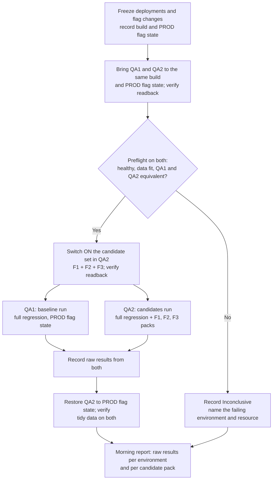
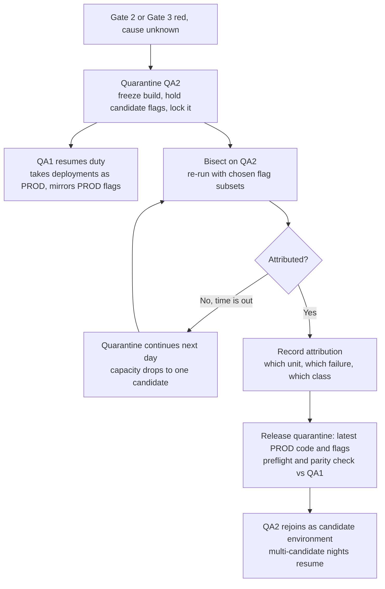

# QA Release Ways of Working — Endpoint State: Multi-Candidate, Two-Environment Model (v1)

> **This is a delta document.** It describes the state we intend to reach *after* the initial model
> in [`qa-release-wow.md`](./qa-release-wow.md) has been adopted and has settled. Every principle,
> definition, and safety rule in that document still applies. Only the differences are written here.
> Read the main document first; this one does not repeat it.
>
> **The objective.** Give the QA team the capability to take **several functionalities into testing
> and greenlight them in a single day**, instead of one per nightly cycle. Everything below exists to
> serve that one goal.
>
> **What makes it possible.** Three things, all of which are prerequisites rather than assumptions
> (section 3): a second QA environment, a regression pack short enough to run several times in a
> working day (~2 hours rather than ~7), and a team that already operates the initial model reliably.
>
> **The trade we make.** The initial model buys attribution by changing one thing per night. This
> model buys throughput by switching the whole candidate set on at once, and recovers attribution the
> next day by **quarantining** the environment that produced the failure and bisecting on it while the
> other environment carries on. Attribution is not given up; it is paid for later, and only when
> something actually fails.
>
> **Capacity flexes with free environments.** While an environment is quarantined for investigation,
> the team is running on one environment and drops back to one candidate per night — that is, back to
> the initial model. This is a designed degradation, not a new failure mode.
>
> **Status: draft for discussion.** The shape of the flow is defined. Numbers — candidates per night,
> quarantine limits, runtime and reliability thresholds — are deliberately left to be set from the
> initial model's pilot measurements.

---

## 1. What this document adds

The initial model is a single-environment, single-candidate nightly cycle: baseline run, then
candidate run, then a morning review with two gates. Its ceiling is arithmetic. A ~7-hour pack means
a night fits two runs, so at most one new functionality can be activated from each cycle, and a red
night has nowhere to go — the environment must return to production parity in the morning because the
day's deployments need it.

This document changes three things and leaves the rest alone:

1. **Two environments run in parallel overnight**, so the baseline and the candidate evidence are
   produced at the same time rather than one after the other.
2. **Several candidates are switched on together** in one candidate run, so a clean night can
   greenlight a whole set.
3. **A failing environment can be held out of rotation** (quarantined) and investigated during the
   working day, because the other environment keeps production parity and takes the day's
   deployments.

Everything else — the safety model, the vocabulary, the flag rules, the interpretation categories —
carries over unchanged.

---

## 2. What stays exactly the same

Do not re-derive any of this; it is settled in the main document.

| Area                                                           | Reference   |
| -------------------------------------------------------------- | ----------- |
| Deploy off, verify, then release on                            | main §5     |
| Deploy / greenlight / switch-on as three distinct events       | main §2     |
| All vocabulary and the release-unit state machine              | main §2     |
| QA mirrors production flags outside a scheduled run            | main §6     |
| A release unit is all its flags on, or all off — never partial | main §6     |
| Greenlight is same-day evidence, tied to the flag state tested | main §6     |
| The four morning interpretations and their effects             | main §2     |
| Preflight can stop the night; a stopped night is inconclusive  | main §7.2   |
| Declaring a release unit ready, including blast-radius         | main §8.4   |
| The pack is not flag-aware; stale assertions in handover       | main §8.5   |
| Fold-in of feature coverage happens after production switch-on | main §8.6   |
| Production monitoring and rollback ownership                   | main §8.7   |
| Scope: automated UI only, no production runs, Distribution out | main §3, §9 |

---

## 3. Entry conditions

This model is not a switch we can flip. It becomes available only when all three conditions below
hold, and it should be entered deliberately rather than drifted into.

### 3.1 At least one additional QA environment

Two environments, referred to here as **QA1** and **QA2**, both full copies of the system and both
capable of running the whole pack. They must be genuinely equivalent: same build, same
configuration, same effective feature-flag state, and comparable test-data capacity. Equivalence is
not a nicety in this model — it is the mechanism (section 5.2), and it becomes a preflight check
(section 10.2).

### 3.2 A regression pack fast enough to run repeatedly

The pack has to get to roughly **2 hours**, through the work already identified in the main
document's transition note:

- **Test data created inside each test, then cleaned up.** Each test owns its data for its lifetime
  and removes it afterwards. This is what makes higher parallelism possible and what removes
  "leftover state from the other run" as a standing explanation for a candidate failure.
- **More and more varied test data** — separate accounts, users, and hotels — so concurrent tests
  stop colliding. Note the pool now has to serve **environments × workers**, not just workers.
- **More parallel execution**, which the first two items unlock.

Two hours is the number that makes the day-time investigation in section 7 viable: three or four
full-pack runs fit inside a working day. At seven hours, only one does, which is precisely why the
initial model cannot park and unpick a failure.

### 3.3 A mature initial model

The endpoint model puts more judgement, not less, on the duty engineers. It assumes the initial flow
is genuinely second nature:

- every engineer on the rota has run the nightly cycle and the morning review unaided;
- the handover document exists, is used every day, and no stale assertion is carried informally;
- morning reports are published consistently, with the interpretation and the reasoning, not just a
  pass/fail;
- separating a product defect from an automation or environment failure is routine rather than an
  escalation;
- the pilot has produced enough measurement (main §11) to set this model's numbers.

If the initial model is still shaky, adding a second environment and three candidates a night
multiplies the confusion rather than the throughput. Prerequisite 3 is the one most likely to be
skipped and the one most likely to cause harm if it is.

---

## 4. Additional vocabulary

| Term                      | Meaning                                                         |
| ------------------------- | --------------------------------------------------------------- |
| **Duty environment**      | Holds production parity: takes deployments, mirrors PROD flags. |
| **Candidate environment** | Runs the candidate run, with the candidate set switched on.     |
| **Candidate set**         | Release units switched on together in one run (F1, F2, F3).     |
| **Quarantine**            | Holding an env on its frozen build and flags, out of rotation.  |
| **Bisect run**            | A run on a quarantined env with a chosen flag subset.           |
| **Attribution evidence**  | Answers *which unit caused this*. From bisect runs.             |
| **Promotion evidence**    | Answers *may this go on today*. Needs the current build.        |

The distinction in the last two rows carries a lot of weight in section 7.4. A quarantined
environment is very good at attribution and, past the first day, no longer valid for promotion.

---

## 5. The night

### 5.1 The flow

At the evening freeze, deployments and flag changes stop as they do today. The difference is that
**both** environments are brought to production parity and verified, and then the two runs execute
concurrently on separate environments rather than sequentially on one.

Nobody interprets anything overnight — unchanged from the initial model. Both runs are attempted
whatever the other produces, and only a technical blocker prevents one from executing.

Restoring QA2 to the production flag state at the end of the night (step I) is the default. It is
deliberately reversed in the morning if the result needs investigating, because the flag state is
part of the evidence — see section 7.1.

### 5.2 Why the runs go on separate environments

Halving the wall-clock is the obvious gain. The more valuable one is analytical: **the two runs
become a controlled comparison.** Same build, same test-suite version, same configuration, same
production flag state — with exactly one difference, the candidate set being on in QA2. So when a
journey fails in QA2 and passes in QA1, the difference is attributable to the candidate flags
immediately, before any investigation starts. In the initial model the same two runs are separated by
hours on shared data, and "did the first run leave something behind?" is always a live alternative
explanation.

That control only exists if the environments really are equivalent. Divergent build, config, flag
state, or data health turns the comparison into noise and quietly removes the main benefit of having
two environments. Hence the parity preflight in section 10.2.

### 5.3 Slack in the night

A 2-hour pack and two environments mean the night's evidence is complete a couple of hours after the
freeze. That spare capacity is worth spending on reliability rather than on more candidates:

- a run that aborts technically can be **re-run the same night**, so fewer nights are lost;
- a night that has to fall back to one environment still fits baseline plus candidate sequentially;
- weekend and earlier-Friday coverage becomes cheap enough to reconsider, which bears on the main
  document's open question about lost nights and weekends (main §13). Reducing that exposure is a
  likely benefit of this model, not a decision this document closes.

---

## 6. The morning

The review is still done by one named engineer, before daytime deployments and flag changes resume,
and still starts from the handover so a known cause is not re-investigated. There are now **three
gates**, read in order.

### 6.1 Gate 1 — the QA1 baseline (the control)

Exactly the main document's Gate 1, on the duty environment. Raw green continues to Gate 2. Raw red
is classified: automation or environment (engineer judges whether the remaining evidence is
sufficient), confirmed product defect (recommend reverting production to the previous day's code, and
no greenlights from this cycle), or unresolved (no greenlights, investigation continues).

### 6.2 Gate 2 — the baseline inside the QA2 candidates run

New, and the most important addition. The candidates run contains the full regression as well as the
feature packs, and that regression ran with the whole candidate set on. Its result is read against
QA1's:

| QA1 baseline | QA2 regression (set on) | Reading                                                |
| :----------: | :---------------------: | ------------------------------------------------------ |
|  **Green**   |        **Green**        | Nothing disturbed. Go to Gate 3.                       |
|  **Green**   |         **Red**         | The difference is the set. Quarantine and bisect.      |
|   **Red**    |        **Green**        | Contradictory. Treat QA1 red as automation or data.    |
|   **Red**    | **Red**, same failures  | Build-level regression. Recommend revert.              |
|   **Red**    | **Red**, other failures | Build regression *and* candidate effect. Revert first. |

**No greenlight is possible from a red Gate 2, even for a candidate whose own pack is green.** That
is counter-intuitive enough to state plainly: a green feature pack shows the feature works, not that
the feature left everything else alone. Until the regression failure is attributed, any member of the
set could be its cause.

### 6.3 Gate 3 — the feature packs

Once Gates 1 and 2 pass, each candidate's feature pack is classified independently using the main
document's Gate 2 table (main §7.3), including the stale-assertion judgement of main §8.5. Outcomes
can differ across the set: a green pack is greenlight-eligible, a red pack is investigated and its
release unit blocked or repaired, and one candidate's failure does not by itself block the others —
provided Gate 2 was clean, so no candidate is implicated in a shared regression.

### 6.4 Worked example — the night that mostly fails

Three functionalities are scheduled: **F1, F2, F3**. At the evening freeze both environments are
brought to the production build and flag state. QA1 runs the baseline; QA2 runs the candidates run
with F1, F2, and F3 all switched on plus all three feature packs.

**Gate 1 — QA1.** Some flakiness and a couple of automation errors, nothing unexpected. Classified as
automation, evidence judged sufficient, recorded. Move on.

**Gate 2 — QA2.** The regression has a real error. Gate 2 fails, so nothing from this cycle can be
greenlit yet.

**Gate 3 — the packs.** F1 green. F2 and F3 both red. Held, because Gate 2 has not passed.

Three explanations are open at this point, and the raw results do not separate them:

- a **candidate fails on its own** — F2 or F3 is simply broken;
- a **candidate breaks another candidate** — F3 breaks F2, so F2 looks faulty when the cause is the
  combination;
- a **candidate regresses existing behaviour** — one of the three caused the baseline error.

Investigation needs the environment in the state that produced the failure, and the developers need
to deploy within the hour. That conflict is what the next section resolves.

---

## 7. The day — quarantine and attribution

### 7.1 Declaring quarantine

The engineer **quarantines QA2**: it stops taking deployments, keeps its frozen build, and keeps (or
is returned to) the candidate flag state that produced the failure. **QA1 carries on as normal** — it
is the duty environment, it takes the day's deployments in step with production, and it mirrors
production's flags.

Recording quarantine is not optional. The handover must carry which environment is quarantined, the
frozen build, the held flag state, the owner, what has been ruled out so far, and when it is expected
to be released. An unrecorded quarantine looks exactly like a broken environment to the next engineer.

### 7.2 Locking the environment

A quarantined environment is **evidence**. While it is held, nobody else deploys to it, changes its
flags, or edits its test data, and no manual testing runs on it. One well-meant manual booking on a
test hotel can invalidate a day of bisecting. The lock has to be visible to the whole team, not
agreed in a private message.

### 7.3 Bisecting

The engineer re-runs on QA2 with different flag subsets until the failures are attributed — typically
the regression with one candidate on at a time, plus that candidate's pack. Two practical notes:

- **Start narrow.** Re-running the specific failing specs plus the relevant feature pack is minutes,
  not hours, and often answers the question. This is investigation, not a maintained targeted set —
  the pack itself remains all-or-nothing (main §9). Confirm with a full-pack run once the hypothesis
  is formed.
- **Know the arithmetic.** Cleanly separating *k* candidates costs up to *k* full-pack runs, because
  an environment holds one flag state at a time. At ~2 hours a run, three candidates is roughly a
  working day, and the day also contains the rest of the engineer's work. Spilling into a second day
  is expected, not a sign of failure — which is why *k* should start small and grow only on evidence
  (section 8).
- **A build regression can be investigated here too.** The quarantined environment holds the same
  frozen build as last night's baseline, so switching the candidate flags back off reproduces the
  Gate 1 state without disturbing the duty environment.

### 7.4 What a quarantined environment can and cannot authorise

The bisect can produce a genuinely clean result — for example the regression with **F1 only** on is
green and F1's pack is green, which rescues F1 from a night that otherwise produced nothing. Whether
that result can greenlight depends on how old the frozen build is:

- **Same release day.** The frozen build is last night's build, which is what the main document's
  greenlight rule already accepts (unrelated daily deployments do not invalidate a greenlight; a
  material change to the release unit does). A clean single-candidate bisect on day one is
  **promotion evidence** and may greenlight, on the same terms as any other greenlight.
- **Day two or later.** The frozen build is now behind production by a day or more, past the
  same-day tolerance. The bisect is **attribution evidence only**: it names the culprit and clears
  the innocent, but a release unit needs re-confirming in a candidate run on the duty environment
  before it can be switched on.

Stating this as a rule avoids the slow leak this model could otherwise develop, where an
increasingly stale environment keeps issuing greenlights against a build nobody is running.

### 7.5 Releasing quarantine

When attribution is done, QA2 is updated to the latest production code and production flag state,
preflighted, and checked for parity against QA1. It then rejoins as the candidate environment and
multi-candidate nights resume. Quarantine needs a named owner and a recorded expected release time,
and an escalation if it overruns — the limit is a number to agree from measurement, not to invent
here. The cost of a long quarantine is real: the environment drifts further from production, its
evidence loses promotion value (7.4), and the team stays at reduced capacity the whole time.

---

## 8. How many candidates tonight

The scheduling rule is the operational heart of this model, and it is short: **schedule only as many
candidates as you could afford to park and unpick tomorrow.**

| Environment state             |      Candidates tonight      | Shape of the night              |
| ----------------------------- | :--------------------------: | ------------------------------- |
| Both in parity (duty + spare) | Up to *N*, one set (start 3) | Baseline on duty, set on spare  |
| One quarantined               |            **1**             | Baseline then candidate on duty |
| Duty environment unfit        |            **0**             | Fix the env; night inconclusive |

The reason for the middle row is the one the example makes concrete: with QA2 held for
investigation, a multi-candidate night on QA1 risks reproducing exactly the situation that caused the
quarantine, and this time there is nowhere to park it. So the second engineer queues **one** feature,
expecting to be able to attribute it within a day if it fails. At a ~2-hour pack both runs still fit
sequentially on the single duty environment, so reduced capacity costs throughput, not the night.

Two invariants hold this together:

1. **At least one environment is always in production parity.** Something has to mirror production
   and take the day's deployments. The duty environment is never the one quarantined.
2. **At most one environment is quarantined at a time** (with two environments). If a second failure
   needs parking, the choice is explicit: abandon or conclude one investigation, or run baseline-only
   for a night. It is not a silent trade.

**Reduced capacity has a subtlety.** When the single duty environment produces a failure, freezing it
competes directly with production parity — the same bind as the initial model. The ~2-hour pack is
what usually rescues it: a single-candidate failure can often be bisected in one or two runs and the
environment re-synced before the evening freeze. When it cannot, releasing the other environment from
quarantine takes priority.

**Scaling past two.** A third environment removes the middle row: multi-candidate nights could
continue while one environment is quarantined. Whether that is worth its cost should be decided from
measured quarantine frequency, not assumed now. The candidate ceiling *N* is likewise a measured
number, bounded by pack runtime, morning review capacity, and how many failures a team can
realistically attribute in a day — start at 3, move on evidence.

---

## 9. Greenlight and switch-on with a set

One rule from the main document needs sharpening, because a set makes it ambiguous.

**The tested combination is the whole set.** The baseline had F1, F2, and F3 all off; the candidates
run had all three on. Every intermediate state — F1 and F2 on with F3 off, for instance — was never
tested. So:

- **A fully green cycle greenlights the set**, and the set is switched on as **one batch** in a
  single operation. That reproduces the tested state exactly and is the best case this model buys:
  three functionalities released in one day.
- **Partial switch-on is a different state** and is not covered by the run. If only some members are
  to be switched on, that combination has not been tested. The strict reading is that the retained
  members return to the queue and the others need re-testing against the new production state; the
  pragmatic reading is that the team accepts it with the risk recorded. **Which of the two we adopt is
  a decision to take deliberately** (section 15) — the point here is that it must not be taken by
  accident on a busy morning.
- **A single-candidate bisect result is the clean route to a partial release.** Where the day's
  investigation produced a green regression plus green pack with one candidate on alone, that state
  *was* tested, and section 7.4 governs whether it can promote.

Everything else about greenlights carries over unchanged: same-day validity, invalidation if
production's flag state changes first, invalidation on material change to the release unit,
re-queueing rules, and the main document's distinction between a candidate's own confirmed defect and
a candidate that was never fairly examined (main §7.4).

---

## 10. Supporting rules that change

### 10.1 Test data

The main document's ASAP follow-up — separate data pools for the baseline and candidate runs — is
superseded by something stronger. With data created inside each test and cleaned up afterwards, every
test owns its data for its lifetime, so cross-run contamination stops being an available explanation
for a candidate failure. Two consequences:

- **The pool scales with environments × workers**, not workers. Sizing has to account for both
  environments running the full pack at the same time.
- **Data creation and cleanup become a new class of automation failure.** A test that cannot create
  its data fails for a reason that is neither product nor environment in the old sense. It is
  recorded as an automation failure with the cause named, and a periodic sweeper is needed for data
  orphaned by runs that crashed before cleanup.

### 10.2 Preflight gains a parity check

Before the night starts, the preflight also confirms that QA1 and QA2 are equivalent: same build
identifier, same effective flag state, same relevant configuration, and both data pools healthy. A
parity failure stops the night in the same way any other preflight failure does, and the report names
which environment diverged and how. Without this check the controlled comparison in section 5.2 is
worthless, and worse, it looks fine.

### 10.3 Higher parallelism has side effects

Raising parallel execution and running two environments at once increases load on shared downstream
and third-party systems. Expect new contention, rate-limit, and quota effects that present as
flakiness, and expect to have to distinguish self-inflicted contention from product defects. Session
limits and connected-system constraints are already listed as things to measure in the main document
(main §13); this model makes them binding rather than academic.

### 10.4 Roles

The example needs two engineers on the same day, which is a genuine staffing dependency rather than a
detail.

| Role                           | Responsibility                                                 |
| ------------------------------ | -------------------------------------------------------------- |
| **Duty engineer**              | Owns duty env. Reviews the gates, reports, sets tonight count. |
| **Investigation engineer**     | Owns the held env. Bisects, attributes, re-syncs it.           |
| **Squad engineer**             | Unchanged (main §8.8). Leads investigation of its own failure. |
| **Pack owner / Release owner** | Unchanged (main §8.8).                                         |

Both roles can be the same person on a quiet day. They cannot be the same person on the day after a
failing multi-candidate night — which is itself a capacity input: **if only one engineer is
available, schedule one candidate.**

### 10.5 The handover carries more

In addition to stale assertions and overnight caveats (main §8.5), the handover records the
environment state: which environment is duty, which is quarantined, on what build and flag state,
who owns the investigation, what has been ruled out, and when release is expected. This is what lets
the next engineer work out tonight's candidate count without asking anyone.

---

## 11. Considered alternative — cumulative candidate runs

The main document notes that running candidates cumulatively (baseline, then plus F1, then plus F2,
then plus F3) preserves attribution and was ruled out on time alone. At ~2 hours a run, four runs fit
a night, so it becomes feasible again and should be kept in the toolkit rather than dismissed.

**In favour:** attribution comes free, on the night, with no quarantine and no day-time bisect —
each run adds exactly one thing, so a new failure names one squad immediately.

**Against:** it consumes the whole night on one environment with no slack for a re-run; it bakes in
an ordering dependency, so F3's evidence assumes F1 and F2 are on; and a failure at step two
invalidates the states tested after it, so you are bisecting anyway. It also tests intermediate
combinations that nobody intends to ship, rather than the all-on state that is the actual target.

**Where it fits:** as a tactical variant when the queue holds two candidates and the night is
otherwise quiet, cumulative gives attribution for nothing. The default remains all-on-together plus
bisect-on-failure, because it needs two runs instead of *k*+1 and leaves the night with slack.
Choosing between them per night is a judgement to formalise with evidence (section 15).

---

## 12. What we are still not doing

The main document's exclusions (main §9) all still hold. Additionally, in this model:

- **No interaction-matrix testing.** We test the all-on state and bisect when it fails. We do not
  test subsets pre-emptively.
- **No cumulative runs as the default** — see section 11.
- **No quarantine of the duty environment**, and never both environments at once.
- **No partial switch-on of a greenlit set as a routine step**, pending the decision in section 9.
- **No promotion evidence from a stale quarantined environment** past the same release day (7.4).
- **No third environment yet**, and no assumption that one is coming.
- **No flag-aware regression pack.** Unchanged, and revisited on the same terms as before (main
  §8.5).

---

## 13. Risks introduced or changed by this model

Everything in the main document's risk table (main §12) still applies. These are the additions. Each
risk's consequence is explained in the section referenced, so only the response is tabulated here.

| Risk                                  | Response                                            |
| ------------------------------------- | --------------------------------------------------- |
| **Set-level runs hide interactions**  | Bisect on the held env; keep *N* small.             |
| **QA1/QA2 environment drift**         | Parity check in preflight; fail the night.          |
| **Quarantine silently cuts capacity** | Record env state in handover; cap and escalate.     |
| **Long quarantine goes stale**        | Named owner, release time, attribution-only (7.4).  |
| **Held env disturbed**                | Team-wide lock: no deploys, flags, or data edits.   |
| **Partial switch-on of a set**        | Batch switch-on by default; decide the rule (§9).   |
| **Data setup or cleanup fails**       | Classify explicitly; add a sweeper; measure (10.1). |
| **Contention from parallelism**       | Measure before raising workers (10.3).              |
| **Two-engineer dependency**           | Candidate count follows staffing too (10.4).        |
| **Second failure while one is held**  | Conclude one first. Never hold both.                |

---

## 14. What to measure in this model

The initial model's metrics (main §11) continue. Add:

- candidates scheduled per night, and how many nights ran at full versus reduced capacity;
- greenlights and switch-ons per day — the objective this model exists for;
- attribution cost: runs and engineer-hours per bisect, and how often it spills past one day;
- quarantine days per week, and the reason each was opened;
- pack runtime distribution at the target worker count, on both environments concurrently;
- data creation and cleanup failure rates, and orphaned-data volume;
- parity preflight failures, by cause.

As before: evidence for later decisions, not targets.

---

## 15. Deferred decisions

Carried forward from the main document and still open: measurement and capacity, implementation
automation, the handover document's exact contents, the lost-night and weekend exposure window,
same-day activation operations, feature-pack integration, flag-aware tests, and queue prioritisation.

New to this model:

- **The candidate ceiling *N*.** Start at 3; derive the real number from attribution cost, morning
  review capacity, and measured runtime.
- **The partial switch-on rule** (section 9): strict re-queue, or accepted with recorded risk. Decide
  before the first mixed-result night, not during one.
- **Quarantine limits**: maximum duration, escalation path, and who can authorise an overrun.
- **Whether the day-one promotion tolerance in 7.4 is right**, or whether all bisect results should
  be attribution-only for simplicity.
- **When cumulative runs are preferred** over all-on-together (section 11), if we keep both.
- **Whether a third environment is justified**, decided from measured quarantine frequency.
- **Environment provisioning and parity ownership**: who owns QA2's lifecycle, how parity is
  enforced automatically, and how re-sync after quarantine is executed and verified.
- **Data pool sizing for environments × workers**, including the sweeper for orphaned data.
- **The entry decision itself**: who confirms the three conditions in section 3 are met, and on what
  evidence, before the team moves from the initial model to this one.
