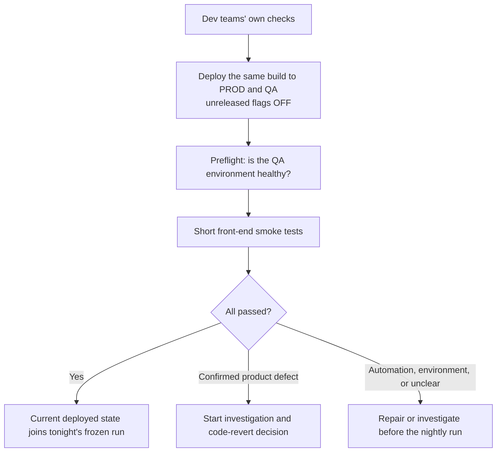
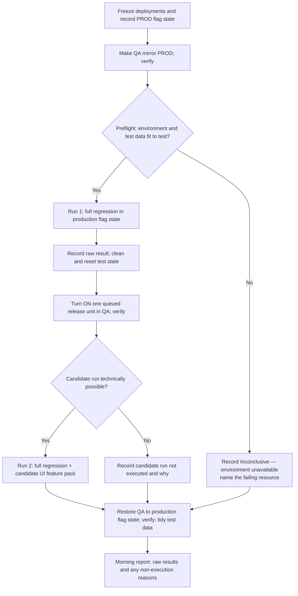

# QA Release Ways of Working — Nightly Test-and-Greenlight Model (v9)

> **Safety model — deploy off, verify, then release on.** The same daily build goes to production
> and QA at the same time with unreleased functionality switched off. Every night always attempts
> two runs: the production-state baseline, then one candidate switched on in QA. Nobody
> interprets results during the night; the morning engineer reviews both runs in order,
> recommends code revert for a confirmed baseline product regression, and greenlights only a trustworthy candidate result.
>
> **Start with one candidate per night.** This preserves a single production flag-state baseline
> and allows at most one new functionality to be activated from each nightly cycle. Testing several
> candidates independently would not prove how they behave together, so that is not a simple
> throughput dial and is not part of the initial setup.
>
>**Accepted risk.** Code reaches production throughout the working day with only the dev teams'
>integration tests and QA's short post-deployment smoke set behind it. The full regression runs
>only against the build frozen at end of day, and its result is not interpreted until the next
>morning. So a regression introduced by a daytime deployment normally sits in production for around
>24 hours before QA reports it. That figure is the typical case, not the worst: if a night is lost or
>comes back inconclusive the answer slips to the following morning, and a Friday deployment is not
>covered until Monday. We accept this because unreleased functionality stays switched off, the dev
>integration tests are the first line of defence, and a confirmed baseline failure triggers a
>recommendation to revert to the previous day's code. This exposure comes from daily deployment
>itself, not from the nightly model, but the lost-night and weekend cases still need a decision —
>see the final section.
>
>**Transition to more capacity.** Optimise the regression pack: manage test data differently (create
>on execution, then clean up), diversify it (separate accounts, users, and hotels so tests can run in
>parallel), and raise parallelisation. The aim is a 2–3 hour regression run, so that more features can
>be tested in a single night. Adding a second QA environment would also allow a code freeze longer
>than one day in one environment — giving room for investigation, debugging, and fixing — while the
>other keeps parity with the code in production.
>
> **Status: draft for discussion.** The core operating model is defined. Measurements and later
> implementation choices are deliberately deferred to the final section.

---

## 1. The idea in plain words

Two rhythms run each day.

**During the day.** After the dev teams' own checks, the same build is deployed to production and
QA at the same time. Every unreleased release unit stays switched off. Production receives code
daily, but no new functionality is exposed by that deployment. A QA preflight and short front-end
smoke set give fast post-deployment feedback; they do not replace the overnight regression. These
parallel deployments continue through the day until an hour before end of day, when deployment
freezes.

**Overnight.** Deployments and flag changes stop (1h before EOD), Test Engineers ensure everything is in order, a preflight confirms the environment and test data are fit to test, then two automated runs always execute without waiting for human interpretation:

1. **The baseline run** — QA mirrors the current production feature-flag state. This answers:
   *is the already-deployed build healthy in the covered existing journeys?* This normal regression
   is the complete candidate-OFF evidence; there is no separate OFF test.
2. **The candidate run** — after automated cleanup, one waiting release unit is temporarily
   switched on in QA. The full regression and that unit's feature pack answer:
   *does this functionality work, and does it disturb anything else in the current production state?*

The candidate run is attempted whatever raw result the baseline produced. Only a technical
inability to run it — for example QA being unreachable or the flag not taking effect — prevents
execution. QA is restored to the production flag state afterwards.

**Each morning.** One named engineer reviews the baseline first and investigates any red results. A
confirmed baseline product failure leads to a recommendation to revert production to the previous
day's code and blocks all greenlights. For automation or environment failures, the engineer decides
whether the evidence is sufficient and records the judgement. The candidate regression and feature
pack are then reviewed when eligible. Depending on the results of both the regression AND the
feature pack, the test engineer can perform one or more of the following actions: greenlight the
functionality, not greenlight the functionality, fix automation-related errors, or continue the
investigation into the next day.

**Why only one candidate a night.** The obvious reason is attribution — being able to say *which*
functionality is at fault. If F1, F2, and F3 were all switched on in the same run and something
failed, we could not tell which one caused it. Worse, if F3 breaks F2, then F2 looks faulty when the real problem is the
combination of the two. The report would say "something is broken" instead of naming the owner.

That rules out switching several on *together*, but it does not rule out testing several in a night.
Running them cumulatively would keep attribution intact: baseline, then baseline plus F1, then plus
F2, then plus F3. Each run adds exactly one thing, so a new failure still points at one squad.

What stops us doing that today is time, not attribution. Every extra candidate costs another full
pack run, and the pack is long enough that two runs is what fits in a night. One candidate per night
is therefore the number our current runtime allows, not the only safe design. Cumulative runs would
also introduce an ordering dependency — F2's evidence assumes F1 is switched on first — which needs
designing rather than assuming, and is listed under deferred work.

So the document describes two ways of working: the **initial model** we start with now (one QA
environment, one candidate per night) and a **future model** to grow into (a faster pack and a second
QA environment, several candidates per night, so a failure can also be unpicked during the day).

---

## 2. Words we use precisely

Three separate events, three separate words. Mixing them up is how this kind of model goes wrong.

| Word           | Meaning                                                          |
| -------------- | ---------------------------------------------------------------- |
| **Deploy**     | Code moves to production and QA. Unreleased units stay **off**.  |
| **Greenlight** | QA confirms a release unit may be switched on the same day.      |
| **Switch-on**  | The TPM turns the unit on for customers — the moment of release. |

Other terms:

| Term                 | Meaning                                                  |
| -------------------- | -------------------------------------------------------- |
| **QA environment**   | Shared full copy of the system; customers never see it.  |
| **Feature flag**     | Simple on/off switch for a new feature.                  |
| **Regression pack**  | Single large E2E journey test set; runs all or nothing.  |
| **Feature pack**     | Smaller test set a squad writes for its own feature.     |
| **Release unit**     | One feature + its flag(s), tested and greenlit together. |
| **Queue**            | Ordered list of ready release units waiting for a slot.  |
| **Baseline run**     | Regression with QA mirroring production flags.           |
| **Candidate run**    | Regression + feature pack with one unit switched on.     |
| **Smoke tests**      | Quick "is the site basically working" checks.            |
| **Preflight**        | Fast check that QA and its test data are fit to test.    |
| **Conclusive night** | A night whose evidence was trustworthy enough to decide. |

The overnight report records raw **green** or **red** outcomes. The morning engineer then assigns
one of four interpretations; a raw red result is not automatically a product defect:

| Morning interpretation           | Meaning                            | Effect                                           |
| -------------------------------- | ---------------------------------- | ------------------------------------------------ |
| **Passed**                       | Evidence completed successfully.   | Confirms health or supports greenlight.          |
| **Confirmed product defect**     | Real product problem found.        | Baseline: recommend revert. Candidate: keep off. |
| **Automation/environment issue** | Test, data, or infra was at fault. | Engineer decides if evidence is sufficient.      |
| **Inconclusive**                 | Not trustworthy enough to decide.  | No greenlight; continue investigation.           |

A release unit moves through these states (happy-path, simplified):

```
DEVELOPING → READY (declared, in PROD and QA env) → IN QUEUE → GREENLIT (same day) → SWITCHED ON → FLAG REMOVED
```

A candidate that is tested but not greenlit leaves this path at **IN QUEUE**: back to
**DEVELOPING** if its own defect was confirmed, or held in the queue for a retry if it was never
fairly examined (7.4).

If a queued or greenlit release unit's implementation, configuration, flag set, or tests change
materially, it goes back to **DEVELOPING** and must be declared ready again. Unrelated daily code
deployments do not invalidate its evidence. A pending greenlight is invalidated, however, if the
production feature-flag state changes before switch-on, because the candidate was not tested in
that new combination.

---

## 3. Problem statement

We are moving to daily deployments, one shared codebase, and features hidden behind flags. QA
needs a way of working that runs from "a new feature arrives in QA" to "the feature is switched
on for customers and its tests are part of the regression pack." What makes this hard:

- Several features become ready across a sprint, at unpredictable times.
- The full regression pack is long-running and is not suitable for the working day.
- "A feature deployed but switched off changes nothing" is a promise, made repeatedly. It should
  be measured, not trusted.
- A single red night can hold up everyone unless we can say precisely what caused it.

**Scope.** QA functional coverage in this model is automated and browser/UI-only. APIs may support
test setup, post-UI verification, and cleanup, but are not tested as standalone backend services.
Backend integration testing is owned by the dev teams; the QA UI layer is an additional line of
defence on top of theirs. We never run tests in production. Mobile apps and Distribution are out of
scope for this model, though mobile apps are expected to be brought in later.

**Expected volume.** Early discussion suggests roughly 6–12 release units per two-week sprint,
but there is not enough operating data to treat that as a reliable forecast. It is context for the
pilot, not a capacity commitment.

---

## 4. What we know, and how well we know it

**Confirmed.**

- The regression pack is app-spanning end-to-end journeys and cannot be cleanly split into
  smaller targeted sets very efficiently.
- Shared test data is one of our main sources of false alarms — test hotels whose settings get
  changed by another run or by manual testing. The team lives with this daily.
- The pack currently runs with only a few tests at once, which is the direct cause of its length.
- Feature flags are simple on/off switches. There are no targeting rules (no percentage rollouts,
  country or hotel targeting). *If targeting rules are ever introduced, this plan needs revisiting.*

**Not yet known.** Runtime after improvements, nightly reliability, arrival rate, and actual
release throughput all need to be measured during the pilot. Any current figures are rough working
assumptions and must not be used as promises or as the basis for detailed capacity planning.

---

## 5. The safety model: deploy off, verify, then release on

The same daily build is deployed to production and QA. Every unreleased release unit is off, so
customers receive code without receiving that functionality. Dev-owned integration testing is the
first line of defence. The front-end smoke set is the first QA signal after deployment — it detects
obvious breakage quickly but cannot stop a deployment that has already happened. The overnight
baseline run is the fuller post-deployment check of covered user journeys.

The overnight baseline runs while QA mirrors production's feature-flag state. Because the build is
already in production, this is a **health and revert signal**, not a promotion gate. The candidate
run follows automatically whatever raw result the baseline produced because nobody is available to
investigate overnight.

In the morning, a confirmed baseline product regression leads to a recommendation to revert
production to the previous day's code and blocks candidate greenlight. If failures are caused by
automation or the environment, the engineer decides whether the evidence is sufficient to continue
and explains that judgement in the morning report. An unresolved result does not greenlight the
candidate.

The second run temporarily enables one candidate in QA and runs the full regression plus its UI
feature pack. Its evidence is interpreted only after the baseline. Even a green candidate run cannot
authorise switch-on when the baseline has identified a real product regression or remains
inconclusive.

**What this proves.** The baseline shows covered existing journeys behaved in QA under the current
production flag state. The candidate run shows the covered journeys and feature behaviours worked
with that one release unit added to that state. Neither proves untested paths, production-only
configuration, production load, or production third-party behaviour.

**What protects production.** A confirmed baseline product defect produces a recommendation to
revert production to the previous day's code. A problem after switch-on is handled through
monitoring and the release unit's rollback: switch its flag back off.

---

## 6. How feature flags and greenlights are handled

These rules keep QA aligned with production and prevent old evidence being used against an untested
feature combination.

**QA normally mirrors production.** Every release unit has the same flag state in QA and production
except during its scheduled candidate run or a controlled daytime investigation. Before a temporary
change, record the production state. Afterwards, restore QA to production and verify the effective
values.

**A release unit is what we test.** Usually one feature, one flag. If a feature has several flags,
they all go on together or all stay off together. We do not test partial combinations.

**One candidate changes per nightly cycle.** The baseline uses the production flag state. This
normal regression is sufficient evidence for every unreleased candidate being off; there is no
candidate-specific OFF assertion or separate OFF feature pack. The candidate run then turns on only
the selected release unit. Existing production-on functionality stays on, and every other
unreleased unit stays off.

**A greenlight is same-day evidence.** A greenlit release unit may be switched on during that
release day while the production feature-flag state remains unchanged. It returns to the queue if:

- another release unit is switched on or off in production first;
- the candidate's implementation, configuration, flag set, or tests change materially; or
- it is not switched on during that release day.

Unrelated daily code deployments do not, by themselves, invalidate a greenlight; a material change
to the release unit does. Exact timings and operational ownership will be agreed later.

**Why production flag changes invalidate pending evidence.** If A was tested on while B was off,
then B switches on first, the untested target is now A+B. A must return to the queue and be tested
against the new production baseline. This is why the initial process allows at most one new
functionality activation from each nightly cycle.

---

## 7. Initial setup — one candidate per night, one QA testing environment

This is the intended starting flow. Supporting automation and operating details will be added as
the pilot provides real evidence; they are listed at the end rather than designed prematurely.

### 7.1 Daytime



Smokes are deliberately short and cover the three web apps' essential journeys. Their job is to
detect obvious post-deployment breakage quickly. They do not replace the overnight baseline and
they do not gate a deployment that has already happened.

### 7.2 Overnight

When the nightly test window starts, deployments to production and QA stop. Record the deployed
build, test-suite version, and production feature-flag state; make QA match that state and verify it.
A preflight then confirms the environment and test data are fit to test before either run starts.
No engineer is expected to inspect results until morning, so the orchestration does not branch on
test failures.



The preflight is the one thing that can stop the night before it starts, and that is the point: a
broken environment or a test hotel whose configuration has drifted would otherwise produce hours of
red that looks exactly like a product defect. Failing fast and naming the resource costs minutes
instead of a whole night, and the result is recorded as inconclusive rather than as a failure.

Once the preflight passes, both runs are attempted regardless of Run 1's raw result. Only a technical
blocker such as QA becoming unreachable or the flag failing readback can prevent Run 2 from
executing. A red Run 1 therefore does not save time overnight; it is classified by the morning
engineer before Run 2 is used for any greenlight decision.

### 7.3 The morning

The duty engineer reviews results before normal daytime deployments and flag changes resume. There
are two gates, reviewed in order.

#### Gate 1 — classify the production-state baseline

Start by reading the handover from previous mornings, so failures with an already-known cause — such
as a stale assertion (8.5) — are not investigated again.

- **Raw green:** continue to Gate 2.
- **Raw red, automation or environment issue:** the engineer decides whether the evidence is
  sufficient to continue and records the judgement in the morning report.
- **Raw red, confirmed product defect:** recommend reverting production to the previous day's code.
  Do not greenlight the candidate; Run 2 is diagnostic evidence only.
- **Unresolved:** do not greenlight and continue the investigation.

#### Gate 2 — classify the candidate run

Gate 2 can produce a greenlight only once Gate 1 has passed — meaning the baseline was green, or its
failures were confirmed as automation or environment issues and the engineer judged the remaining
evidence sufficient. A confirmed baseline product defect or an unresolved baseline blocks Gate 2
regardless of what the candidate run shows.

| Candidate regression | Feature pack | Action                                                                    |
| :------------------: | :----------: | ------------------------------------------------------------------------- |
|      **Green**       |  **Green**   | Greenlight. Begin feature-pack integration.                               |
|      **Green**       |   **Red**    | Product defect → block. Automation issue → engineer decides.              |
|       **Red**        |  **Green**   | Expected behaviour change → greenlight. Candidate defect → block.         |
|       **Red**        |   **Red**    | No greenlight. Investigate and raise/repair issues.                       |

The engineer records the evidence, decision, and required follow-up in the morning report. An
unresolved result does not produce a greenlight.

Because the pack is not flag-aware (8.5), a red candidate regression has one extra possible cause:
the feature deliberately changed that journey and the old assertion is simply out of date. Separating
that from a real defect is part of the morning investigation. An expected change does not block the
greenlight; the test is corrected as part of folding the feature in.

A successful candidate result is valid only during the same release day and while production's
feature-flag state remains the one used by the run. If another release unit changes production
state first, this candidate returns to the queue.

A regression observed during the candidate run does not by itself prove that the candidate caused
it. The candidate stays off while its squad leads the first investigation; only a reproduced
product failure attributable to the candidate-on state is reported as a candidate defect. Likewise,
a green feature pack proves only the behaviours it covers.

### 7.4 Candidate selection

The pilot schedules one declared-ready release unit each night — at most one candidate tested and at
most one new functionality activated per cycle. Until a wider prioritisation model is agreed, use
oldest-ready first. Detailed queue policy is deferred, and actual throughput is not yet known well
enough for a forecast; the pilot will measure it.

**When a candidate is not greenlit**, what happens next depends on whether it was at fault:

- **Its own confirmed defect** — the candidate broke its own feature pack or the regression. It gives
  up its slot and returns to its squad, rejoining the queue only when re-declared ready. Handing it
  the next night rarely helps, because a fix and a re-declaration seldom land within a day.
- **It was never fairly examined** — the baseline blocked the cycle, the preflight stopped the night,
  the environment failed, or Run 2 could not execute. Nothing is known about the candidate and it did
  nothing wrong, so it keeps its place and is retried. Where the block was a baseline product defect,
  it is retried once the recommended revert has landed and the baseline is green again.
- **Investigation still open** — the engineer decides whether re-running the same candidate helps
  reproduce the problem or wastes the slot. This one stays a judgement call.

---

## 8. Supporting rules

### 8.1 Test data in the pilot

We have one shared pool of test hotels and accounts, and no per-run data creation yet.

**For the pilot** the baseline run and the candidate run share that pool, relying on the tests'
existing tidy-up (bookings cancelled after each test) and on the preflight check catching hotels
whose configuration has drifted.

**The known consequence:** a candidate-run failure could be caused by state left behind by the
baseline rather than by the feature. The morning investigation must consider this and may re-run the
relevant UI test before attributing a product defect.

> **ASAP follow-up — high priority.** We need enough test hotels and accounts to give the baseline
> run and the candidate run **separate pools**, so neither can affect the other. This is not part of
> the later upgrade work; it should be raised as soon as the pilot starts. First step is to count
> what we have and work out what is missing.

### 8.2 Keeping the night's state trustworthy

The two runs must use the same deployed build and test-suite version. No deployment or unrelated
flag change may occur between them, and the selected candidate must be the only functional change.
After Run 2, QA must return to production's feature-flag state. The exact automation for snapshots,
verification, restoration, cleanup, and reporting is deferred.

### 8.3 Handling failed automation

The morning engineer investigates failures, separates product defects from automation or environment
issues, decides whether the available evidence is sufficient, and explains the decision in the
report. A confirmed product defect blocks the relevant greenlight. An unresolved result does not
produce a greenlight.

### 8.4 Declaring a release unit ready

Committed alongside the tests, so a half-finished feature never wastes a nightly slot:

- the feature name, its squad, and its flag (or all its flags, if several);
- the blast-radius: supposed impacted functionalities;
- a statement that it is ready.

Anything not declared ready does not enter the queue. The blast-radius is the squad's best
understanding, not a guarantee — it gives the morning investigation a head start rather than a
definitive list (see 8.5).

### 8.5 Deliberate behaviour changes show up as regression failures

When a feature intentionally changes an existing journey, the old regression test fails even though
the feature is working exactly as designed. The test expects the old screen; the feature correctly
shows the new one. The red result is right about the difference and wrong about the cause.

**We are not making the regression pack flag-aware for now**, for two reasons. First, we would need
to be told reliably which journeys each feature changes, and in practice that information will be
incomplete — we would end up working it out ourselves anyway. Second, the pack is tightly written,
so retrofitting dual-behaviour assertions across it is a large change for the value it returns
today.

So the morning engineer carries this instead. When the candidate regression is red, part of the
investigation is deciding whether a failure is a genuine defect or the expected consequence of the
feature behaving correctly. An expected change is recorded as such, does not block the greenlight,
and the affected test is updated as part of folding the feature into the pack.

The cost is honest: it puts more judgement on the duty engineer and makes a red candidate regression
slower to read. We accept that for now rather than pay for flag-awareness up front. Revisiting it is
listed under deferred work.

**When fold-in is not finished in time.** Updating the affected tests competes with the rest of the
day's work, so it will sometimes be unfinished by the evening freeze. Once the release unit is
switched on in production, QA mirrors that state — so from that night the stale assertion fails in
the **baseline**, not just the candidate run, and it keeps failing every night until the test is
updated.

That is accepted, on three conditions:

- **It is recorded, not remembered.** A stale assertion is written down for whoever is on duty next,
  with the test, the release unit that changed it, the date raised, the owner, and when the fix is
  due. The next engineer reads it before investigating, so nobody re-diagnoses the same failure from
  scratch. **A handover document still needs to be created for this** — it is where stale assertions
  and any other overnight caveats are carried between duty engineers. Where it lives and what else
  it holds is listed under deferred work.
- **It is called what it is.** This is a stale test, not a false positive — the test is right that
  behaviour changed and wrong about what to expect. Recording it as *automation issue, known stale
  assertion* keeps it distinct from a flaky test and from a real defect.
- **The coverage gap is stated.** While the assertion is stale, that journey is not being checked.
  If the feature also broke something the same test would have caught, we would not see it. So
  finishing the fold-in is the duty engineer's first priority the next morning, and the list is
  expected to be empty most days.

### 8.6 What happens after greenlight

A greenlight does not change QA's default state. QA continues to mirror production, and the engineer
begins integrating the candidate's feature coverage into the regression pack, including any existing
tests the feature deliberately changed. Because the pack is not flag-aware, tests that assert the new
behaviour are only folded in once production has the release unit switched on — otherwise the
production-state baseline would start failing against functionality that is still off. If the
fold-in is not finished before that night's freeze, the stale assertion is recorded in the handover
as described in 8.5.

If the release unit is switched on during the same release day, QA mirrors the new production state.
If it is not, or production's flag state changes first, the release unit returns to the queue. Exact
fold-in and pack-optimisation rules are deferred.

### 8.7 Production monitoring and rollback

After switch-on, production monitoring and rollback are owned by the release and development teams.
This strategy supplies the QA greenlight evidence; it does not replace production observability or
the ability to switch the feature back off.

### 8.8 Who does what

| Role               | Who                   | Responsibility                                         |
| ------------------ | --------------------- | ------------------------------------------------------ |
| **Morning duty**   | Engineer on the rota. | Review both runs, investigate, decide, publish report. |
| **Squad engineer** | Candidate's squad.    | Declare readiness and blast-radius, own defects.       |
| **Pack owner**     | Rotating owner.       | Integrate greenlit feature coverage into regression.   |
| **Release owner**  | TPM + dev/ops owner.  | Decide switch-on; own monitoring and rollback.         |

---

## 9. What we are deliberately not doing

- **No multiple pending greenlights from independent runs.** The initial model tests one candidate
  and allows at most one new functionality activation per nightly cycle.
- **No smaller targeted test sets per feature.** The journeys cannot be split, so each run is the
  whole pack.
- **No dependency on per-request flag control.** With one release unit on at a time, we use the
  ordinary flag switch. This also means the nightly run uses the real flag mechanism, so there is
  no separate "does it work through the real switch?" check to do before switch-on.
- **No separate candidate-specific OFF run.** The normal regression with QA mirroring production is
  the full OFF-state evidence.
- **No flag-aware regression pack.** We do not retrofit dual-behaviour assertions across the pack.
  The morning engineer separates a deliberate behaviour change from a real defect instead (8.5).
- **No routine manual substitute for automation.** A morning engineer may use a manual UI check as
  part of investigating an automation failure and records that evidence in the report.
- **No permanent QA-only on state after greenlight.** Outside a scheduled candidate run or targeted
  investigation, QA mirrors production's feature flags.
- Mobile apps and Distribution are out of scope, though mobile apps are expected to be brought in
  later. **Distribution has no user interface, so it gets no QA automated coverage in this model** —
  its safety rests with the dev teams. This is stated in the report rather than left to look covered.
- No authoring tests on throwaway environments as standard practice. We author on QA and fix what
  makes QA painful instead.

---

## 10. What the model gives us

| Property                 | How the model delivers it                                             |
| ------------------------ | --------------------------------------------------------------------- |
| **Attribution**          | One unit changes between runs; its squad owns the investigation.      |
| **No long daytime runs** | Full pack runs overnight; daytime has short smokes only.              |
| **Flag-state baseline**  | QA mirrors production flags; normal regression = OFF evidence.        |
| **Recovery**             | Confirmed baseline defect → recommend revert.                         |
| **Causes distinguished** | Morning engineer classifies: product, automation, env, or unresolved. |
| **Clear report**         | Duty engineer publishes decision and follow-up.                       |
| **Evidence stays valid** | Greenlight is tied to the flag state it was tested against.           |
| **Simple start**         | One candidate per cycle; multi-candidate needs separate design.       |
| **Unattended overnight** | Run 2 always attempted; interpretation waits for morning.             |

---

## 11. Pilot metrics

Track only enough during the pilot to learn whether the flow works:

- whether both runs complete overnight and their actual runtimes;
- how many nights were conclusive, and what cost the rest;
- candidate arrivals, waiting time, and greenlight outcomes;
- failures caused by product, automation, environment, or shared data; and
- morning investigation time.

These measurements are evidence for later planning, not targets or commitments.

---

## 12. Risks

| Risk                                    | Consequence                                     | Response                                       |
| --------------------------------------- | ----------------------------------------------- | ---------------------------------------------- |
| **Shared data creates false failures**  | Candidate blamed for baseline's leftover state. | Preflight + cleanup; separate data pools ASAP. |
| **Pack is not flag-aware**              | Deliberate changes look like defects.           | Morning judgement; revisit if cost is high.    |
| **Stale assertions accumulate**         | Known red masks a real defect on that journey.  | Tracked list with owner and due date.          |
| **Both runs don't complete overnight**  | One-night cycle can't run as intended.          | Measure first, then choose topology.           |
| **Flag state changes before switch-on** | Candidate not tested in the new combination.    | Invalidate greenlight; re-queue.               |
| **No monitoring or rollback ready**     | Switched-on feature may fail silently.          | Release owner confirms readiness.              |
| **Lost night or weekend widens gap**    | Production runs longer without a QA verdict.    | Decide a countermeasure; see deferred work.    |
| **Distribution has no coverage here**   | Gap could be misunderstood.                     | State exclusion in every report.               |
| **Flag targeting introduced later**     | Model may not mirror the rollout.               | Revisit strategy.                              |

---

## 13. Deferred decisions and later work

The following topics are intentionally outside the initial operating flow. They will be designed
from pilot evidence rather than from today's rough assumptions:

- **Measurement and capacity:** establish real runtimes, reliability, arrival rate, parallel-session
  limits, connected-system constraints, and sustainable throughput before creating forecasts or
  capacity targets.
- **Implementation automation and readiness:** define the queue and readiness tooling, preflight and
  smoke implementation, flag snapshot/readback, unattended sequencing, cleanup and crash recovery,
  QA-state restoration, reporting, and checks that command scripts preserve test exit status.
- **Duty handover document:** create it and decide where it lives, what each entry must record, and
  how open items are closed. It carries known stale assertions (8.5) and anything else the next duty
  engineer needs, so a known cause is never investigated twice.
- **Exposure window on lost nights and weekends:** the accepted risk assumes a roughly 24-hour gap
  between a daytime deployment and QA's verdict. A lost or inconclusive night doubles it, and a
  Friday deployment is not covered until Monday. Decide whether that is acceptable as it stands or
  needs a countermeasure — a weekend run, an earlier Friday freeze, a smoke set that runs at the
  weekend, or a rule that a lost night is re-run before new code is accepted. Until this is agreed,
  the model carries a longer real exposure than the headline figure suggests.
- **Exact same-day activation operations:** agree the decision cutoff, TPM or delegate availability,
  hand-offs, handling of late investigations, and the precise sequence for production and QA flag
  updates.
- **Feature-pack integration:** decide which feature tests to merge, retain, combine, or retire and
  how regression-pack runtime will be controlled as coverage grows.
- **Flag-aware regression tests:** revisit once we can see how often deliberate behaviour changes
  cause red candidate regressions, and how much morning time that judgement actually costs. If the
  overhead proves high, make the affected tests assert both flag states rather than the whole pack.
- **Two-night topology:** if both runs cannot complete overnight, separately decide whether to add a
  stable environment, freeze the shared environment, or use another design that preserves the same
  build and flag baseline.
- **Queue prioritisation:** replace the pilot's oldest-ready rule only after management agrees who
  owns priority and how failed or delayed candidates re-enter the queue.
- **Future multi-candidate scaling:** design and prove cumulative flag combinations, activation
  ordering, invalidation, and partial-approval recovery before allowing more than one candidate or
  activation per cycle.
