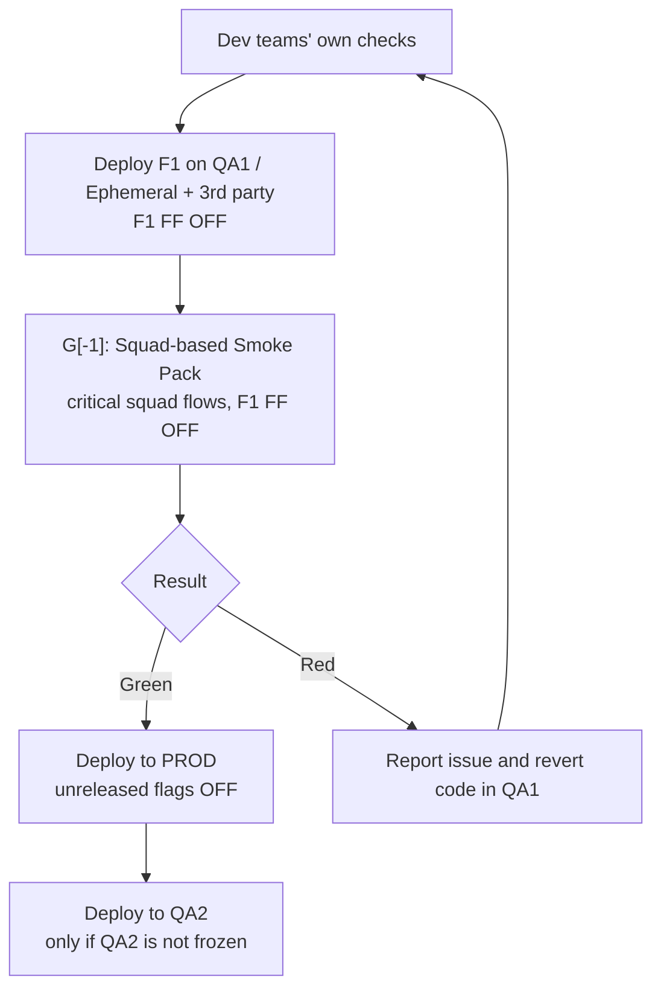
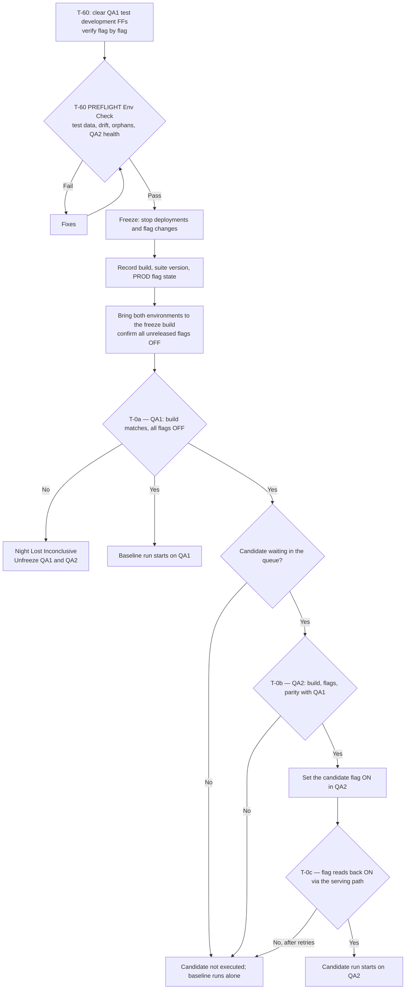
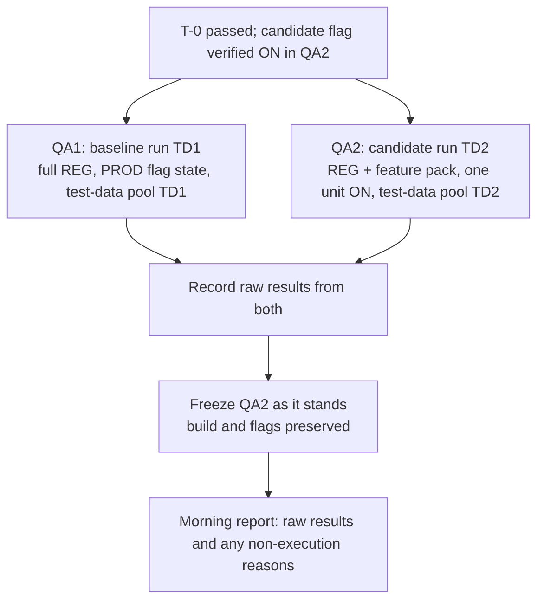
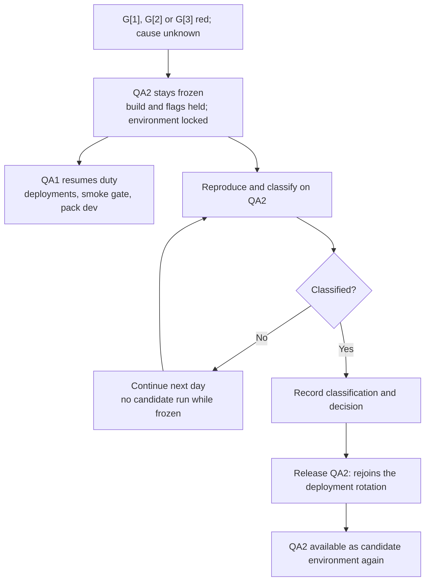

# QA Release Ways of Working — Operating Model (v11)

> This document is the written companion to the **Digital Functionality QA Lifecycle Map**. Where the
> two differ, the map is the source of truth and this document is corrected to match it.

> **Two QA environments, one candidate per night.** The same daily build reaches production with
> every unreleased feature switched off. A Squad-based Smoke Pack on QA1 gates the production
> deployment. Overnight, two runs execute in parallel: the production-state baseline on QA1, and
> the candidate run on QA2 with one queued feature switched on. Nobody interprets results during the
> night. In the morning one engineer reviews both runs in order and promotes only a trustworthy
> candidate result.
>
> **Each environment has a day job and a night job.** QA1 takes every deployment and hosts
> feature-pack development with flags on during the day, then mirrors production's flag state for
> the overnight baseline. QA2 hosts investigation when a night needs it, and runs the candidate at
> night. Neither has a single role, which is why they are described by what they do and when.
>
> **A feature's test pack is finished before it is queued.** After a feature lands, a test engineer
> finishes its feature pack against the real thing on QA1. Defects found there go back to the squad,
> and a feature whose pack is not green does not enter the queue. That is why we expect feature packs
> to pass on the night they are tested — it is a designed property, not a hope.
>
> **Accepted risk.** Code reaches production through the day behind the dev teams' integration tests
> and QA's smoke gate. The full regression only runs against the build frozen at end of day, and its
> result is not read until the next morning. So a regression introduced by a daytime deployment
> normally sits in production for around 24 hours before QA reports it, longer if a night is lost
> and longer again over a weekend. We accept this because unreleased functionality stays off and a
> confirmed baseline failure triggers a recommendation to revert to the previous day's code.
>
> **Prerequisites.** Parallel nightly runs depend on test-data partitioning, and the smoke gate
> depends on per-environment deployment control. Section 15 lists what must be true before this
> model can run as written.
>
> **Status: draft for discussion.** The operating flow is defined. Numbers and later implementation
> choices are deliberately deferred to section 15.

---

## 1. The idea in plain words

Four rhythms. Three happen every day; the fourth only after a night that came back red.

**During the day.** After the dev teams' own checks, the build is deployed to QA1. The Squad-based
Smoke Pack runs there — this is gate G[-1]. If it passes, the build goes to production with every
unreleased feature switched off, and then to QA2 if QA2 is free. Meanwhile QA1 carries **test
development FFs** — features under test are switched on there so engineers can finish their feature
packs against real integrations.

**In the evening.** Deployments and flag changes stop. Test development FFs are cleared automatically.
Both environments are brought to the frozen build with every unreleased feature off, verified flag
by flag. Two checkpoints confirm the environments and test data are fit — one an hour early, one at
the freeze itself.

**Overnight.** Two runs execute in parallel, drawing on separate test-data pools:

1. **The baseline run** on QA1, mirroring production's flag state. This answers: *is the build that
   is already in production healthy in the journeys we cover?*
2. **The candidate run** on QA2, with one queued release unit switched on. The full regression plus
   that unit's feature pack answer: *does this feature work, and does it disturb anything else?*

**Each morning.** QA2 is frozen first, so the state that produced the result is preserved. One named
engineer then reads three gates in order — G[1], G[2], G[3]. A clean cycle promotes the candidate and
releases QA2.
A red one leaves QA2 frozen for investigation while QA1 goes back to taking the day's deployments.

**The day after a red night.** The engineer reproduces and classifies on the frozen QA2 while
everything else carries on. Deployments continue, feature-pack development continues, and the
baseline still runs that night. Only the candidate slot is lost.

---

## 2. The two environments

| Where    | Daytime                                             | Night                                     |
| -------- | --------------------------------------------------- | ----------------------------------------- |
| **PROD** | Takes the build; unreleased features off            | Unchanged                                 |
| **QA1**  | Takes the build first; smoke gate; pack dev (FF on until T-60) | All unreleased off → baseline REG (F1 FF OFF) |
| **QA2**  | PROD code, FF off — or held frozen for investigation | One candidate on → REG + feature pack (F1 FF ON) |

The diagram frames the two runs as certifications, which is a sharper way to read them than
"pass/fail":

- the **baseline run** on QA1 (F1 off) **certifies that FF-off does not affect the production
  build** — it is the evidence that the code already live is healthy in the journeys we cover;
- the **candidate run** on QA2 (F1 on) **certifies the feature** — that F1 works and does not disturb
  the existing journeys.

Five invariants hold this together:

1. **QA1 receives every deployment and is never frozen.** The safety model requires the same build
   in QA and production, so the deployment target must always be available.
2. **QA1 holds production's flag state from the pre-freeze cut-off until the morning release.**
   Outside that window it carries test development FFs. Parity is a night-time guarantee, not an
   all-day one.
3. **QA2 is the only environment that can be frozen**, and it never carries test development FFs.
   When it is not frozen it holds production code with all flags off, so it is ready to take the
   freeze build — it is not an idle spare.
4. **At the evening freeze both environments hold the same build.** If QA2 cannot be brought to it,
   there is no candidate run that night.
5. **Exactly one release unit is switched on for the candidate run.** Everything else unreleased is
   off.

Neither environment has a single role, so we do not give them one. "QA1" and "QA2" are used
throughout with the day and night job named where it matters.

---

## 3. Words we use precisely

Three separate events, three separate words. Mixing them up is how this kind of model goes wrong.

| Word          | Meaning                                                          |
| ------------- | ---------------------------------------------------------------- |
| **Deploy**    | Code moves to QA and production. Unreleased units stay **off**.  |
| **Promote**   | QA confirms a release unit may be switched on the same day.      |
| **Switch-on** | The TPM turns the unit on for customers — the moment of release. |

**Promote, not greenlight.** The lifecycle map says **Promote F1**, **Do not promote F1** and **No
Promotion**, so this document uses *promote* and *promotion* throughout. Earlier drafts said
*greenlight*; the two mean the same thing.

| Term                       | Meaning                                                                 |
| -------------------------- | ----------------------------------------------------------------------- |
| **F1**                     | The unit under test: all feature flags for **one complete functionality**. F2, F3 … are the other units in the queue. |
| **Release unit**           | The generic name for an F1 — one feature plus its flag(s), tested and promoted together. |
| **Feature flag (FF)**      | Simple on/off switch. No targeting rules.                               |
| **Test development FF**    | An FF switched on in QA1 by day so a feature's pack can be built. Cleared at T-60. |
| **REG / BASELINE**         | The same thing: the complete set of automated E2E scripts covering all functionalities and squads. Runs per app, all or nothing. Also called the *regression pack*. |
| **Feature pack**           | The smaller set covering one F1. Also called the *func pack*.            |
| **Squad-based Smoke Pack** | Critical flows of squad business scenarios. Gates the PROD deployment.   |
| **T-60 check**             | Pre-freeze gate on test data and QA2 health. Finds problems.             |
| **T-0 check**              | At-freeze gate on build and flag state. Decides what runs.               |
| **Evening freeze**         | The nightly stop on deployments and flag changes.                        |
| **Frozen (QA2)**           | Pinned to its build and flag state, out of rotation.                     |
| **Baseline run (TD1)**     | REG on QA1 with production's flag state, on test-data pool TD1.          |
| **Candidate run (TD2)**    | REG plus feature pack on QA2, one unit on, on test-data pool TD2.        |
| **Predicted-red list**     | One maintained list of specs to subtract at the gates, in two parts (10.4): *feature* entries (a feature's expected breaks, temporary) and *known-defect* entries (standing unfixed regressions). |
| **Queue / pool**           | Business-owned, priority-ordered list of ready units (packs finished) awaiting a slot. |
| **Conclusive night**       | A night whose evidence was trustworthy enough to decide.                 |

**REG and BASELINE are one pack, used in two roles.** The legend on the lifecycle map equates them,
and the distinction that matters is not between two packs but between two *runs* of the same pack:
the **baseline run** executes it on QA1 with every unreleased flag off, and the **candidate run**
executes it on QA2 with F1 on, plus F1's feature pack. Reading "baseline" as a separate suite is the
easiest mistake to make here.

**The five quality gates.** A gate is a point where defects can be caught and a decision about the
functionality can be made. Two are passed during the day, three the following morning.

| Gate       | Where            | Question it answers                                              |
| ---------- | ---------------- | ---------------------------------------------------------------- |
| **G[-1]**  | Day, QA1         | Squad-based Smoke Pack: did the new code break a critical business flow? Gates the PROD and QA2 deployments (8.1). |
| **G[0]**   | Day, QA1         | Is F1 a complete feature, with a finished feature pack? Certifies F1 into the queue (8.2). |
| **G[1]**   | Morning, QA2     | Baseline run: is the build already in production healthy? (8.5)  |
| **G[2]**   | Morning, QA2     | REG inside the candidate run: did F1 disturb anything else? (8.5) |
| **G[3]**   | Morning, QA2     | Feature pack: does F1 itself work? (8.5)                         |

The morning gates are read on QA2 because QA2 is the investigation environment by day — it still
holds the state that produced the result.

Note the two freezes. The **evening freeze** is the nightly stop that applies to everything. A
**frozen QA2** is an environment deliberately held back for investigation. They are different
events.

The overnight report records raw **green** or **red**. The morning engineer then assigns one of four
interpretations; a raw red is not automatically a product defect.

| Morning interpretation           | Effect                                           |
| -------------------------------- | ------------------------------------------------ |
| **Passed**                       | Confirms health or supports promotion.          |
| **Confirmed product defect**     | Baseline: recommend revert. Candidate: keep off. |
| **Automation/environment issue** | Engineer decides if evidence is sufficient.      |
| **Inconclusive**                 | No promotion; continue investigation.           |

A release unit — an **F1** — moves through these states, with the gate that decides each transition
named where there is one:

```
DEVELOPING → DEPLOYED (in QA1, PROD; flag off in PROD)   [G[-1] gates PROD and QA2]
           → DEVELOPING PACK (feature pack built on QA1 with the flag on)
           → READY  [G[0] certifies F1 complete]
           → IN QUEUE (as F1, F2, F3 … by priority)
           → PROMOTED  [G[1], G[2], G[3] read in the morning]
           → SWITCHED ON → FLAG REMOVED
```

A unit whose pack is not finished returns to **DEVELOPING**. A candidate that is tested but not
promoted leaves at **IN QUEUE**: back to **DEVELOPING** if its own defect was confirmed, or held in
the queue for a retry if it was never fairly examined (8.5).

If a queued or promoted unit's implementation, configuration, flag set, or tests change materially,
it returns to **DEVELOPING** and its pack must be finished again. Unrelated daily deployments do not
invalidate its evidence. A pending promotion *is* invalidated if production's flag state changes
before switch-on, because the candidate was not tested in that combination.

---

## 4. Problem statement and scope

We are moving to daily deployments, one shared codebase, and features hidden behind flags. QA needs
a way of working that runs from "a new feature arrives in QA" to "the feature is switched on for
customers and its tests are part of the regression pack." What makes this hard:

- Features become ready across a sprint, at unpredictable times, sometimes late in the day.
- The regression pack is long-running and unsuitable for the working day.
- All QA environments share one OPERA, so test data is global no matter how many environments exist.
- A red night can hold up everyone unless we can say precisely what caused it.
- An environment held for investigation must not block deployments.

**Scope.** QA functional coverage here is automated and browser/UI-only. APIs may support test
setup, verification, and cleanup, but are not tested as standalone services. Backend integration
testing is owned by the dev teams; this UI layer is an additional line of defence on top of theirs.
We do not run tests in production — a limited read-only production smoke was considered and is
deferred (15). Distribution has no user interface, so it gets no coverage in this model. Mobile is
out of scope and expected to be brought in later.

**Expected volume.** Early discussion suggests roughly 6–12 release units per two-week sprint. There
is not enough operating data to treat that as a forecast. It is context, not a capacity commitment.

---

## 5. What we know, and how well we know it

**Confirmed.**

- The regression pack is app-spanning end-to-end journeys and cannot be split cleanly into smaller
  targeted sets.
- It runs **per app** (`APP=pi|pib|ccui`), with separate reports, so "the pack" is three
  invocations.
- **All QA environments connect to the same OPERA.** Bookings, hotels, rates and room types are
  shared globally. Adding environments does not isolate data; only partitioning does.
- Shared test data is one of our main sources of false alarms — test hotels whose configuration gets
  changed by another run or by manual testing.
- Execution runs on LambdaTest with **5 parallel workers** today, and **1 retry** is configured, so
  a test that fails then passes is reported as flaky rather than failed.
- Feature flags are simple on/off switches with no targeting rules. *If targeting is ever
  introduced, this model needs revisiting.*

**Not yet known.** Real runtime per app and for the whole pack, nightly reliability, arrival rate,
and sustainable throughput. Any current figures are working assumptions and must not be used as
promises.

---

## 6. The safety model

The same daily build reaches production with every unreleased release unit off, so customers receive
code without receiving that functionality. There are four lines of defence, in order:

1. **Dev integration tests**, owned by the squads, before the build leaves their hands.
2. **The QA smoke gate on QA1**, which can stop the build reaching production.
3. **The overnight baseline**, which reports on the build already in production.
4. **The candidate run and promotion**, which decide whether a feature may be switched on.

The smoke gate is what makes prevention possible rather than only detection: it runs on QA1 *before*
the build reaches production, so an obviously broken build is stopped rather than reported after the
fact. Subtle regressions still wait for the overnight baseline, so the gate narrows the exposure
window rather than closing it.

**What the evidence proves.** The baseline shows covered journeys behaved in QA under production's
flag state. The candidate run shows those journeys and the feature's own behaviours worked with that
one unit added. Neither proves untested paths, production-only configuration, production load, or
production third-party behaviour.

**What protects production.** A confirmed baseline product defect produces a recommendation to
revert to the previous day's code. A problem after switch-on is handled through monitoring and
switching the unit's flag back off.

**What each check contains.** Five automated checks run in this model. Keeping their scopes distinct
is what stops them duplicating each other or leaving a gap between them.

They are not all the same kind of thing, and the difference matters when reading a failure. The smoke
set, the regression pack and the feature pack are **browser suites that execute on an environment**.
T-60 and T-0 are **gates that run from the CI job and target the environments** — they query build
metadata, the flag provider, OPERA and Auth0 rather than driving a browser, so they cost seconds and
create no test data. One exception is noted under T-0.

**Squad-based Smoke Pack (G[-1])** — a browser suite covering the critical flows of each squad's
business scenarios. Runs on QA1 after every deployment with the candidate flag **off**, and on QA2
when QA2 takes the build. The QA1 run is gate G[-1]; it gates the production deployment (8.1). Its
purpose is to confirm the new code has not broken an existing critical flow, so it deliberately does
not exercise the unreleased feature. Illustrative flows:

- home page and search load; availability returns results for a known hotel and date;
- hotel detail page renders; ancillaries and guest-details steps reachable;
- login with a dedicated account, and my-bookings renders;
- one booking through to confirmation, then cancelled;
- organised per squad, covering the critical flows each squad owns.

**T-60 readiness check** — a gate, run from the CI job an hour before the freeze, mostly against the
shared backend. Covers what drifts slowly and takes time to repair (8.3).

- every test-data pool has its hotels, accounts and date ranges present and usable — queried from
  OPERA and Auth0;
- test-hotel configuration matches a recorded baseline — the drift check;
- orphaned data from earlier runs swept;
- QA2 reachable and responding. QA1's health is already evidenced by the day's smoke runs, so it is
  not re-proved here.

**T-0 state verification** — a gate, run from the CI job at the freeze, after the state has been set.
It decides what runs that night (8.3).

- **T-0a, targeting QA1:** build identifier matches the recorded freeze build, and every unreleased
  flag reads back **off**, checked flag by flag. From build metadata and the flag provider API.
- **T-0b, targeting QA2:** the same two checks, then compared against QA1's values — the parity check
  the morning comparison depends on.
- **T-0c, targeting QA2:** the candidate flag reads back **on** via a request to the running app, on
  the path the runs will use. This is the one part of T-0 that touches the application, because the
  flag store accepting a write does not prove the serving path is honouring it.

**Regression pack** — the full app-spanning E2E journey set, run per app. Used twice each night: as
the baseline on QA1 with production's flag state, and inside the candidate run on QA2 with one unit
switched on. It is not split into targeted subsets (11).

**Feature pack** — the release unit's own coverage, written during feature-pack development (8.2).
Runs only in the candidate run, alongside the regression.

**One honesty note.** The dev teams' integration tests are doing double duty in this document: they
justify why a ~24-hour daytime exposure window is tolerable, and they underpin the expectation that
features with a finished pack come back green. Each argument is reasonable alone. Relied on together
they compound, and that is worth stating rather than leaving implicit.

---

## 7. Flags, test development FFs, and promotion

**Where flags stand.**

| Where    | By day                                         | At night                              |
| -------- | ---------------------------------------------- | ------------------------------------- |
| **PROD** | Every unreleased unit off                      | Unchanged                             |
| **QA1**  | Test development FFs on for units in pack dev  | All unreleased off (production state) |
| **QA2**  | Whatever an investigation needs                | Production state plus one candidate   |

**Test development FFs are governed, not casual.** Every test development FF is recorded in a visible
register with the unit, the owner, and when it went on. At a hard cut-off one hour before the evening
freeze, an automated job clears all test development FFs and verifies the result **flag by flag**.
The cut-off is an hour early so a failed reset can be fixed rather than discovered at the freeze. It
is announced, because an engineer working at that moment loses their environment state.

This automated reset is the single most important control in the model. A test development FF left on
corrupts the baseline, and the baseline is the signal that protects production.

**A release unit is what we test.** Usually one feature, one flag. If a feature has several flags
they all go on together or all stay off together. We do not test partial combinations.

**One candidate per night.** The baseline provides the off-state evidence for every unreleased unit;
there is no separate off-state assertion. The candidate run turns on only the selected unit.
Existing production-on functionality stays on, everything else unreleased stays off.

**A promotion is same-day evidence.** A promoted unit may be switched on during that release day
while production's flag state is unchanged. It returns to the queue if another unit is switched on
or off in production first, if the unit changes materially, or if it is not switched on that day.
Unrelated daily deployments do not by themselves invalidate a promotion.

**Why production flag changes invalidate pending evidence.** If A was tested on while B was off, and
B switches on first, the untested target is now A+B. A returns to the queue and is tested against
the new baseline. This is why at most one new activation comes out of each nightly cycle.

---

## 8. The daily cycle

### 8.1 Daytime — deployment and G[-1], the smoke gate



The Squad-based Smoke Pack covers the critical flows of each squad's business scenarios. It runs with
the candidate feature's flag **off** — its job is to confirm the newly introduced code has not broken
an existing critical flow, not to exercise the new feature. Because it runs in the production flag
state, its result reads directly against production and a red is a real signal, not an artefact of a
flag being on.

**Where the build is deployed for the gate.** The diagram deploys F1 to **QA1 / Ephemeral + 3rd
party** with the flag off before running the pack. QA1 is the standing environment; an ephemeral
environment is a short-lived deployment target that can be stood up per build so the smoke can run
without waiting for or disturbing QA1. Either way the target integrates with real third parties, so
the gate reads against real integrations rather than mocks. The essential property is unchanged: the
smoke runs on a real-integration target with F1 off, and its green is what lets the build proceed.

**A red stops the build and sends it back.** The gate sits before both the production and the QA2
deployments, so a red blocks the code from reaching either. The build does not go forward; the issue
is reported and the code is reverted in QA1, and the squad returns to development. There is no
wave-through: with F1 off, a smoke red is a genuine regression in an existing journey, so the safe
default is to stop rather than to reason about whether it can be excused.

**Only the candidate's flag is off, not every flag.** Other features being worked on that day keep
their test development FFs on — their testers still need them to finish their own packs. So in
principle a different feature's flag, not the deployed code, could turn the smoke red. Two things keep
this small. The pack is **squad-specific**: it exercises the critical flows of one squad's business
area, and it is unlikely that several features are being worked on in that same narrow area at once.
And a red is investigated before the code is reverted, so a flag-caused red is identifiable rather
than silently blocking. It remains a real risk to watch, not one the model pretends away.

**One consequence to own.**

The gate makes QA1 a dependency of production deployment. If QA1 is broken for environmental
reasons, deployments stop. That needs a documented bypass with named authority, agreed before it is
needed.

Deployments land on the environment where engineers are building feature packs, so the build changes
under them several times a day. That is inherent to daily deployment. The mitigation is to record
the build each feature pack was finished green against, so an overnight failure can be tested
against the build delta.

### 8.2 Feature-pack development, and G[0]

Feature-pack development is the stage between "the feature landed" and "the feature is queued." It is
where the feature pack gets built, and — just as importantly — where the feature gets tested from
QA's side for the first time. It ends at **G[0]**, the gate that certifies F1 is a complete feature
and sets it into the queue.

**It starts at the requirements phase, in parallel with development.** The diagram's very first QA
step is **Start Developing Feature Test Pack (REQ phase)**, running alongside **Dev building F1** —
the pack is not something that begins after the feature lands. As soon as requirements and acceptance
criteria are known, the engineer starts the pack: skeleton work, shared steps and page objects need
no flag and no deployed feature, so they are prepared while the squad is still building. This is the
"start" half of the stage; the "finish" half is G[0].

**Entry to the finish half.** The feature is deployed to QA1 with its flag off in production, and the
skeleton pack from the REQ phase is ready to be completed against the real thing.

**The activity — Finish Developing Feature Test Pack.** The feature's test development FF goes on in
QA1. The engineer finishes the pack against the real feature with real integrations, runs it until
green, and raises whatever they find.

**Exit — pass (G[0] green).** The pack is green against a named build and no blocking defects are
open. F1 is certified a complete feature, becomes READY, and is set into the queue/pool.

**Exit — fail (G[0] defects found).** Defects are unresolved at the cut-off. They are reported, and
the unit stays in development or returns to DEVELOPING. It does not queue. **This is a normal
outcome, not an incident.**

**Outputs**, all of which the nightly cycle depends on:

- the feature pack, committed;
- the **predicted-red list** — one entry per existing regression spec this feature legitimately
  breaks, kept minimal, with the fields and constraints in 10.4. It is what stops a known behaviour
  change reading as a defect (8.5);
- the **observed** blast-radius, which is better evidence than the squad's declared best guess;
- the build the pack was green against;
- defects raised.

**Lead time is explicit.** A feature that lands after the feature-pack cut-off is not eligible for
that night's candidate run. A rushed pack costs a wasted slot and a day of investigation, so waiting
a night is the cheaper option. The complementary ask on the squads is to deploy feature-bearing
builds in the morning rather than late in the day.

**Several feature packs are built at once.** QA1 will often carry several test development FFs at the
same time, one per feature being worked on. That is an unmanaged combination, so a failure can be
caused by another feature's flag rather than the one under test. The register is what lets an
engineer see that possibility.

**What feature-pack development is not.** It is not a regression run, so it says nothing about whether
the feature disturbs anything else. It is not promotion evidence, because it is one feature switched
on in a hand-driven state rather than a controlled comparison. It does not replace the candidate run.

### 8.3 The evening freeze and its two checkpoints

There are two checkpoints, not one, because they do different jobs. The earlier one **discovers
problems** while there is still time to fix them. The later one **confirms that the state was
actually set**, which can only be done after setting it. Contents of each are in section 6.

**T-60 — the readiness check.** An hour before the freeze, in the same slot as the automated clear of
QA1's test development FFs. It covers the things that drift slowly and take time to repair:
test-data pool fitness, test-hotel configuration drift, orphaned data from earlier runs, and QA2's
health. A failure here has an hour of working day to act on, sometimes involving someone outside QA.
That runway is the entire reason it is not left until the freeze. A failure goes to **Fixes** and
then back through the check — T-60 and Fixes are a loop, and the check is re-run until it passes
rather than being waved through once a fix is attempted.

**Why stopping deployments and clearing flags happen at different times.** These two are easy to
bundle into one "freeze" step, and they should not be. Deployments are the dev teams' activity, so
freezing them earlier than necessary shortens their working day for no benefit. Clearing QA1's
test development FFs is QA's own activity, and it is the risky half: a flag that fails to clear
leaves the baseline running with an unreleased feature switched on, which corrupts the one signal
that protects production — silently, because the run still looks like a normal baseline. So the
clearing moves an hour earlier where a failure has runway, and the freeze only **confirms** the
result rather than producing it.

**T-0 — state verification.** At the freeze, after the state has been set. It confirms that both
environments really are on the recorded build with every unreleased flag off, that they agree with
each other, and that the candidate's flag is actually live in QA2. Nothing here *sets* state except
the candidate flag; everything else is verification. If T-60 did its job, T-0 should almost always
pass.

**T-0 is a gate, not a test run.** It drives no browser and creates no test data. It runs from the
nightly CI job and *targets* the environments rather than executing on them, so it costs seconds. It
breaks into three sub-checks:

| Sub-check | Targets | How it gets its answer                                      |
| --------- | ------- | ----------------------------------------------------------- |
| T-0a      | QA1     | Build metadata and the flag provider API for QA1            |
| T-0b      | QA2     | The same two sources for QA2, then compared against QA1's   |
| T-0c      | QA2     | A request to the running app, on the path the runs will use |

T-0c is the only part that touches the application, and it is the one most worth getting right.
Reading "candidate = on" back from the flag store only proves the store accepted the write. With SSR,
Apollo Router and CDN caching in between, the store and the serving path can disagree for a while, and
a run that starts mid-propagation tests neither the on state nor the off state — the worst possible
evidence, and it looks exactly like a flaky interaction. So T-0c observes the flag through the same
path the tests will use.

State-setting steps are retried automatically a bounded number of times before being recorded as
failed. A flag that needed a second attempt is not a reason to lose a candidate.

**T-0 decides what runs tonight.** It is best read as four yes/no decisions in sequence, producing
three possible outcomes. Drawing it as a single gate labelled "decides what runs tonight" is a fair
simplification for a diagram; the detail matters to whoever implements it.



Three properties of that shape are deliberate. **T-60 and Fixes form a loop** — a failed check goes
to Fixes and then **back to T-60 to be re-verified**, not straight to the freeze; the hour of runway
exists precisely so this loop can run to a clean result before deployments stop. **T-0a is the only
gate on the night** — one arrow reaches "night lost", and it comes from QA1. **The baseline starts at
T-0a**, so it waits for neither QA2, the queue, nor the flag. And **three arrows reach "candidate not
executed"** for three different reasons, only two of which are failures.

**What a failure costs depends on which environment it lands on.** A broken environment, a drifted
test hotel, or a divergence between QA1 and QA2 would otherwise produce hours of red that looks
exactly like a product defect, so failing fast and naming the resource is always cheaper. But
"failing fast" is not the same as abandoning the night:

| What happened                                       | Effect                            |
| --------------------------------------------------- | --------------------------------- |
| QA1 unfit, or its build or flags cannot be verified | **Night lost** — no baseline      |
| Baseline test-data pool TD1 unfit                   | **Night lost** — baseline invalid |
| Nothing waiting in the queue — *not a failure*      | Baseline only, as designed        |
| QA2 unfit, or cannot be brought to the freeze build | Candidate lost; baseline runs     |
| QA1/QA2 parity fails                                | Candidate lost; baseline runs     |
| Candidate flag will not read back after retries     | Candidate lost; baseline runs     |
| Candidate test-data pool TD2 unfit                  | Candidate lost; baseline runs     |

**Only a QA1 failure aborts the night.** Everything else degrades to baseline-only. The baseline is
still testing the build that is in production, which is the signal that protects customers —
abandoning it because the candidate environment is unfit would be self-defeating.

**A lost night unfreezes both environments.** The diagram's outcome node is **Night Lost
Inconclusive — Unfreeze QA1 and QA2**. When the night is abandoned there is neither a baseline nor a
candidate to preserve, so nothing needs to be held for a morning review. Both environments are
released back into the deployment rotation so the next working day starts clean, and the night is
recorded as inconclusive. This is different from a degraded night, where the baseline *did* run and
QA2 is frozen as it stands for the morning read.

A parity failure is the clearest case. If the two environments are on different builds the morning
comparison in 8.5 is meaningless and G[2] cannot be read, so the candidate is worthless. QA1's
baseline is unaffected and still worth having.

A degraded night is recorded exactly like a frozen-QA2 night (8.7): baseline conclusive, candidate
not executed, with the reason and the failing resource named.

### 8.4 Overnight — two runs in parallel



Nobody interprets anything overnight. Both runs are attempted whatever the other produces; only a
technical blocker prevents one from executing.

**The runs use separate test-data pools.** Two full packs against one shared OPERA will otherwise
contend on hotel inventory, dates and account state, and a contention failure that happens to hit
QA2 reads exactly like "the candidate caused it." Partitioning is what makes the parallel night
trustworthy, which is why it is a prerequisite rather than an improvement (9, 15).

**QA2 is frozen as it stands at the end of the run.** The flag state that produced the result is
part of the evidence, so it is preserved rather than restored and later reconstructed. QA2 is
released only once the morning review clears it.

**If the runs ever have to be serialised**, the baseline goes first. If the night runs short you
would rather lose the candidate slot than the production health signal. Note that serialising also
puts the two runs on different calendar days, which for a booking product means different dates and
different inventory — a difference that lands directly in the morning comparison. Parallel runs
share one wall clock and avoid it.

### 8.5 The morning — G[1], G[2], G[3]

One named engineer reviews before daytime deployments and flag changes resume, starting from the
handover so a known cause is not investigated twice. Three gates, read in order. They are the last
three of the model's five quality gates (3); G[-1] and G[0] were passed during the day.

**Two subtractions, applied to different gates.** Not all expected failures are the same, and they do
not apply to the same run:

- **Feature entries** in the predicted-red list describe what a feature breaks *when it is on*. They
  apply to G[2] and G[3] — the candidate run — and **never to G[1]**, whose baseline ran with the
  candidate off. Using a feature entry to excuse a baseline failure would wave away a real regression.
- **Known-defect and stale-assertion entries** (10.4) describe failures that appear with the
  candidate off — a standing unfixed defect, or a switched-on feature whose fold-in is incomplete.
  These apply to **G[1]** as well, because they show up in the baseline.

A failure that matches the applicable part is recorded as its category and does not count towards the
gate. Only unexplained red matters. A predicted-red spec that *didn't* fail is itself worth a look —
the feature may not be active. The subtraction is done **by eye** to begin with; automating it is
deferred (15.3). The engineer may reject any entry they do not find justified and treat the failure as
unexplained (10.4). Acting on the lists afterwards is part of the same duty — see 10.4.

#### G[1] — the QA1 baseline

G[1] has four outcomes. As with G[2], **only a confirmed defect leaves the gate sequence** — the
other three continue to G[2] so the candidate is still read; a baseline that is green, flaky, or
still unresolved does not by itself stop the candidate from being examined:

| G[1] outcome                     | Reading                                                   | Route                                       |
| -------------------------------- | --------------------------------------------------------- | ------------------------------------------- |
| **All GREEN**                    | The production build is healthy in covered journeys.      | Continue to G[2].                           |
| **RED, automation or env (flaky)** | Not a product problem; engineer records the judgement.  | Continue to G[2].                           |
| **Unresolved**                   | Not yet classified; no promotion while it stands.         | Continue to G[2]; investigation continues.  |
| **RED, confirmed issue**         | The build already in production is broken. **Request code revert on QA1, QA2 and PROD (No Promotion).** | Do not promote; the candidate run is diagnostic only. |

The three non-defect outcomes still reach G[2] because the candidate run is worth reading regardless
— it either confirms the build is fine (supporting a later promotion) or adds evidence to the
investigation. A confirmed baseline defect is the one outcome that removes promotion from the table
for the night, whatever G[2] and G[3] then show.

Because feature packs are built on QA1 during the day, a red baseline has one cause worth calling out
explicitly: **daytime development activity**. Leftover bookings, an abandoned journey, or an altered
test-hotel setting can all show up here. That cause belongs on the engineer's list alongside product,
automation and environment.

**The revert is a production revert, and QA does not own the decision.** A confirmed baseline defect
means the build already in production is broken in a covered journey, so the fix has to reach
production — reverting QA1 alone would leave customers on the bad build. QA *recommends*; the release
owner (10.6) decides, because a production revert is a consequential change with its own risk and may
be refused or delayed.

What QA controls is the consequence, not the decision. While the defect is live and unreverted, Gate
1 stays red and no candidate is promoted — nothing ships on top of a known-broken build. That
is the pressure that forces a resolution, and there are two ways out: the revert lands and the next
baseline is clean, or someone with authority accepts the risk in writing and the defect is recorded
as a known-defect entry in the predicted-red list (10.4) so it stops blocking G[1] every night.
Accepting a live production defect is a deliberate, recorded decision — not a default, and not QA's
to make alone.

#### G[2] — the regression inside the candidate run

The candidate run contains the full regression as well as the feature pack, and that regression ran
with the candidate on. Read it against QA1's. There are five outcomes; **all of them continue to
G[3]** — G[2] classifies and may trigger a revert, but it does not by itself end the cycle:

| QA1 baseline | QA2 regression | Reading                                                   | Consequence            |
| :----------: | :------------: | --------------------------------------------------------- | ---------------------- |
|  **Green**   |   **Green**    | Nothing disturbed.                                        | Go to G[3].            |
|  **Green**   |    **Red**     | The difference is the candidate. Freeze QA2, reproduce.   | Go to G[3].            |
|   **Red**    |   **Green**    | The candidate may be masking the failure. Do not dismiss. | Go to G[3].            |
|   **Red**    | **Red**, other | Build regression *and* candidate effect. **Raise Issue.** | Go to G[3].            |
|   **Red**    | **Red**, same  | Build-level regression. **Request code revert on QA1, QA2 and PROD — No Promotion.** | Go to G[3] only if accepted by business. |

**Two Red/Red rows, two consequences.** The diagram splits them because the candidate's fate differs:

- **Red+Red, same specs** — the candidate made no difference to those specs. This is a build-level
  regression, so it triggers **Request code revert on QA1, QA2 and PROD (No Promotion)**. The
  candidate is blameless, was never fairly examined, and keeps its place in the queue for a retry
  once the revert lands. Normally the cycle stops here — but if the business accepts the issue rather
  than reverting, it continues to G[3] (the **IF ACCEPTED BY BUSINESS** path).
- **Red+Red, different specs** — the extra failures on QA2 are the candidate's own effect, so **Raise
  Issue**: there are two problems, and the candidate has a confirmed defect of its own. It returns to
  its squad and its pack must be finished again rather than waiting in the queue.

**Why "continue to G[3]" rather than stop.** G[2] is an investigation gate, not a stop gate. Even
when it recommends a revert, reading the feature pack at G[3] is still worth doing — it tells the
squad whether the feature itself works independently of the build-level problem, which the revert
does not answer. Promotion still cannot happen while a revert is outstanding (G[1] and the No
Promotion outcome both block it); reaching G[3] is about completing the diagnosis, not about shipping.

**With one candidate, attribution is free.** A red G[2] points at that unit, so the investigation
is about *classification* — product defect, automation, environment, data, or expected change — not
about working out which of several features is guilty.

The **Red / Green** row deserves care. It is tempting to dismiss QA1's red as flakiness, but a
feature can legitimately mask a baseline failure by bypassing the broken path. Compare the failures
directly before concluding, and keep G[1]'s revert consideration alive.

#### G[3] — the feature pack

Every G[2] outcome reaches G[3], so this gate is read even when G[1] or G[2] recommended a revert.
What it decides is whether the feature pack itself is a reason **not** to promote. The diagram is
decisive here — it does not leave the red causes to "engineer judgement":

| Feature pack                 | Cause                             | Route                                          |
| ---------------------------- | --------------------------------- | ---------------------------------------------- |
| **Green**                    | —                                 | → sign-off gate → **Promote F1**               |
| **Red**                      | Automation / Env / TD (flaky)     | → **Promote F1** (not the feature's fault)     |
| **Red**                      | Expected change (predicted-red)   | → **Promote F1** (a known, listed behaviour change) |
| **Red**                      | Defect                            | → **Raise Issue** → **Do not promote F1; return it to queue/pool** |
| **Inconclusive during Day1** | Cannot yet be classified          | No promotion today; carry into the next day's investigation (8.6) |

Only a genuine **defect** or an **inconclusive** result prevents promotion in this cycle. A red the engineer classifies as automation, environment,
test-data flakiness, or a predicted-red expected change is not the feature failing, so the candidate
still promotes. A defect goes to **Raise Issue**, and the unit does not promote — it returns to the
queue/pool.

**Inconclusive during Day1.** The diagram carries a third top-level G[3] outcome alongside Green and
Red: a result that cannot be classified within the morning review. It produces no promotion that day.
Rather than force a call, the investigation carries into the day-after flow (8.6) — the frozen QA2
holds the evidence, and the unit keeps its place until the read is conclusive. This is the G[3]
counterpart to an unresolved G[1]: no promotion, no discard, investigation continues.

**Sign-off before promotion (the diagram's `PERF? KIOSK? Digital Signoff?` gate).** A green feature
pack does not go straight to Promote F1. The diagram places a sign-off checkpoint — performance,
kiosk, and the wider digital sign-off — between the green pack and **Promote F1**, which is what
authorises the TPM switch-on.

> **Open — needs alignment with the PERF team.** Where performance sign-off sits relative to
> promotion is not yet decided. The diagram's `PERF?` checkpoint is drawn *before* Promote F1, but
> performance sign-off may instead land *after* QA promotion and before the TPM switch-on. This has
> to be agreed with the PERF team before the sequence is fixed; until then, treat the checkpoint's
> position as provisional.

**Business acceptance can still promote a raised issue.** The diagram carries an **IF ACCEPTED BY
BUSINESS** edge from **Raise Issue** to **Promote F1**. A defect that the business formally accepts —
a recorded, owned decision, not a default — can be promoted despite the raised issue. This is the
same shape as accepting a live baseline defect at G[1]: QA raises and records; the business owns the
decision to proceed.

The engineer records the evidence, the decision and any follow-up in the morning report. An
unresolved result does not produce a promotion. A green feature pack proves only the behaviours it
covers.

**When a candidate is not promoted**, what happens next depends on whether it was at fault:

- **Its own confirmed defect** — it gives up its slot and returns to its squad, rejoining the queue
  only after its pack is finished again.
- **It was never fairly examined** — the baseline blocked the cycle, a checkpoint stopped the
  night, or the candidate run could not execute. It keeps its place and is retried.
- **Investigation still open** — the engineer decides whether re-running the same candidate helps or
  wastes the slot.

**Candidate selection.** One ready unit per night, pack finished. Selection follows the
**business-owned queue/pool**: the highest-priority ready unit goes into the next night's candidate
run. The queue is a formal, business-owned list of prioritised functionalities — ordering is the
business's call, not QA's, and QA takes the top ready unit from it.

### 8.6 The day after a red night

QA2 stays frozen. QA1 goes back to normal duty — it takes the day's deployments, runs the smoke gate,
and hosts feature-pack development.



**A baseline failure can be reproduced here too.** QA1 has already moved on and taken the day's
deployments, so QA2 is the only place still holding last night's build. Switching the candidate's
flag back off on QA2 reproduces the G[1] state without disturbing anything.

**The environment is locked while frozen.** No deployments, and no flag changes, manual testing or
test-data edits **by anyone other than the investigating engineer**. That exception matters: the
investigating engineer does change flags — switching the candidate off is how the baseline state gets
reproduced — and their reproduction runs create and cancel data of their own. The prohibition is on
everyone else, where one well-meant manual booking can invalidate a day of work.

Three things are recorded with the lock and **visible to the whole team**, not agreed in a private
message: a **named owner**, an **expected release time**, and an escalation if it overruns. Visibility
is what makes the prohibitions work at all — from outside, a frozen environment and a broken one look
identical, and the helpful response to a broken environment is to redeploy it.

**How this differs from the evening freeze.** The same prohibitions apply to QA1 during the overnight
window (10.1), but the risk is not comparable. The evening freeze runs while nobody is working, it is
a scheduled daily event nobody needs telling about, and it ends automatically in the morning because
deployments need the environment back. A frozen QA2 spans a working day or more, it is unscheduled,
and it ends only when someone decides the investigation is finished. That asymmetry is why a frozen
QA2 needs an owner, a date and a visible lock, and the nightly freeze needs none of them.

**Frozen preserves the build and the flags, not the world.** OPERA is shared, so the data the
environment reads keeps moving while engineers work on QA1. A reproduction run is therefore not a
perfect replay of the night, and the investigation should reserve its own data slice rather than
assume otherwise.

**What a frozen environment can authorise.**

- **Same release day.** The frozen build is last night's build, which is what the promotion rule
  already tolerates. A clean result here can promote.
- **Day two or later.** The build is now behind production by more than a day. The result is
  **attribution evidence only** — it names the cause but the unit needs re-confirming in a candidate
  run before it can be switched on.

**What a frozen day costs.**

| Activity           | While QA2 is frozen            |
| ------------------ | ------------------------------ |
| Deployments to QA  | Continue on QA1                |
| Smoke gate         | Continues on QA1               |
| Feature-pack dev   | Continues on QA1               |
| Overnight baseline | Continues on QA1               |
| Candidate run      | **Lost until QA2 is released** |

Deployment flow and the production health signal both survive. That is the whole reason for the
second environment.

**Releasing QA2** means it rejoins the deployment rotation and takes the day's deployments like QA1.
That is what makes it current; the evening sequence then brings it to the freeze build as normal and
the nightly checkpoints remain the only gate. There is no separate release-time check.

Do the release **during the working day**, not at the freeze. A stale environment is exactly where a
catch-up deployment goes wrong — migrations, config drift, cold caches — and a first deployment at
17:00 that fails costs the night. Released at midday, the same failure has hours of runway.

### 8.7 When the freeze lasts more than one night

An investigation can run past the end of the day. The rule for that night is short: **the baseline
runs on QA1 as normal, and there is no candidate run.**

**Never abort the night.** The baseline is the production health signal and it needs one environment.
Aborting would leave the build sitting in production unverified for another day on top of what the
investigation has already cost — giving up the protection to save nothing.

**Do not run both runs sequentially on QA1**, at least not at current runtime. Two runs plus
checkpoints, flag work and cleanup is around 15 hours against a window of roughly 16, and duration is
not fixed: retries are enabled, so a flaky-heavy baseline can push to 8 or 9 hours and the candidate
then misses the morning review. The candidate slot is lost anyway and the night is burned with it.

Two data problems come with it as well, and they are the same ones that ruled sequential out for the
normal night (8.4): the two runs land on different calendar days, so date-relative booking tests hit
different inventory; and the baseline's leftovers precede the candidate on shared OPERA, biasing the
noise against the thing on trial. Sequential-on-one-environment becomes available once the pack is
short enough for two runs to fit with real margin **and** test data is date-relative — not before.

**Baseline plus feature-pack-only is not worth it.** It fits easily, but a feature pack alone cannot
produce a promotion: the regression *with the flag on* is the only evidence that the feature does
not break existing journeys, and that is the gate that blocks. Evidence nobody can act on does not
justify the data contention.

**Put the frozen environment's night to work.** QA2 sits idle from the end of the working day until
morning while it is frozen. Running the investigation's reproduction runs overnight on it shortens
the freeze, and shortening the freeze is the only thing that actually recovers the lost slots.

**Cap the freeze.** Every additional frozen night costs another candidate slot, so the cost grows
linearly with freeze duration while the value of continuing does not. Freezes need a named owner, a
recorded expected release time, and an escalation where the choice is explicit: conclude the
investigation, or abandon it and release the environment. Repeated baseline-only nights are a signal
that the freeze is too long, not that the night design is wrong.

**Bookkeeping.** Two rules keep the record honest:

- The candidate scheduled for that night **keeps its place in the queue.** It was never fairly
  examined and it did nothing wrong.
- The night is **not** recorded as inconclusive. The baseline ran and G[1] is conclusive. The
  report reads: baseline conclusive, candidate not executed, reason QA2 frozen since [date], owner
  [name]. Keeping *nights lost* and *candidate slots lost* as separate numbers matters, because they
  have different causes and different fixes.

Feature-pack development continues on QA1 throughout, so the queue keeps filling while throughput is
halted. That is why the freeze cap matters more than it first appears.

---

## 9. Test data

### 9.1 The constraint

Every QA environment connects to the same OPERA. Bookings, hotels, rates and room types are shared
globally, so **adding environments does not isolate data**. Only partitioning does. This is the
single biggest technical constraint on the model and it shapes everything below.

### 9.2 Partition by activity

Four consumers draw on one pool, and they are what collide:

- the baseline run;
- the candidate run;
- feature-pack development (ideally per engineer);
- investigation and reproduction.

Because OPERA is shared, partitioning is by property, room type and date range rather than by
connection. The baseline run draws from **TD1** and the candidate run from **TD2**, and the two must
be **disjoint**, or a contention failure on QA2 will read as a candidate defect.

**Audit before engineering.** The pack is not uniform: specs depend on hotels with particular
characteristics — DE properties, POA, accessible rooms, family rooms, business-booker setups.
Partitioning needs a **matched pair** for each characteristic, not simply a longer list. Where only
one property has a given configuration, those specs cannot be split and need either a second
property configured or separate handling. The audit sizes all of this and costs a day.

### 9.3 Date spreading

Making bookings date-relative with a per-worker offset — worker *n* books D+30+*n* — multiplies the
effective pool along an axis that needs no new properties. It is the cheapest lever available and it
also removes the midnight-boundary problem that appears whenever runs are serialised.

### 9.4 Creation and cleanup

Bookings and guest accounts are transactional and can be created and disposed of per test. **Hotels,
room types and rate plans are configuration and never can be** — so partitioning is permanent work,
not a stopgap that per-test creation replaces, and configuration drift remains a live explanation
for a failure however good the seeding gets.

Three rules for when seeding lands:

- **Cleanup belongs in fixture teardown**, not in the test body. Teardown runs on failure, and
  failing tests are exactly when leftover state does the most damage.
- **Seeding failures must be distinguishable in the report.** A test that could not create its
  booking failed for a reason that is neither product nor environment, and if it reads as a normal
  failure it pollutes the gates.
- **An orphan sweeper** is needed for runs that die before teardown.

Note the dependency: the API client library is queries-only today and the only OHIP module present
is cancellation. So cleanup has a path and creation does not. Whether a booking-creation API exists
and whether QA is permitted to use it is an open question (15), and it is the same dependency as the
API-seeded booking prologue in the regression-pack migration work — price them together.

### 9.5 Drift detection

The T-60 test-data check earns its place here: it catches a test hotel whose configuration
has drifted before a night is spent on it. That check matters more, not less, once several
activities share the pool.

---

## 10. Supporting rules

### 10.1 Keeping the night trustworthy

Both runs must use the same deployed build and test-suite version. No deployment or unrelated flag
change may occur between the freeze and the morning release. The selected candidate must be the only
functional difference between the two environments. Snapshots, verification, restoration and cleanup
are automated; the exact implementation is deferred.

### 10.2 Handling failed automation

The morning engineer investigates failures, separates product defects from automation, environment,
data and expected-change causes, decides whether the evidence is sufficient, and explains the
decision in the report. A confirmed product defect blocks the relevant promotion. An unresolved
result does not produce a promotion.

Remember that retries are enabled, so a test that failed and then passed is reported as flaky rather
than failed. Whether a flaky result counts as red for gate purposes needs an explicit answer,
because a red G[2] costs a day (15).

### 10.3 Declaring a release unit ready

Committed alongside the tests, at the end of feature-pack development:

- the feature name, its squad, and its flag or flags;
- the observed blast-radius — which journeys the pack work actually touched;
- the predicted-red list, with reasons;
- the build the pack was green against;
- a statement that it is ready.

Anything without a finished pack does not enter the queue.

### 10.4 Deliberate behaviour changes

When a feature intentionally changes an existing journey, the old regression test fails even though
the feature works exactly as designed. The test expects the old screen; the feature correctly shows
the new one. The red result is right about the difference and wrong about the cause.

**We are not making the regression pack flag-aware.** We would need to be told reliably which
journeys each feature changes, and the pack is tightly written, so retrofitting dual-behaviour
assertions is a large change for the value it returns today.

Instead the **predicted-red list from feature-pack development** carries this. The engineer who
built the pack already discovered which specs the feature breaks, so they record it, and the morning
subtraction in 8.5 keeps those failures out of the gates. That converts a judgement call under time
pressure into information captured days earlier by the person best placed to know.

**One list, two parts with different lifetimes.** The diagram draws a single **predicted-red list**,
and that is how it is maintained — one list the morning subtraction reads from. But its entries come
in two kinds, and the two must stay labelled, or the standing ones get tidied away by someone who
assumes every entry is temporary:

- **Feature entries** are *temporary*. Each exists only until the feature's fold-in completes, then
  it is removed. Owned by the pack developer, applied to the candidate run (G[2] and G[3]) only.
- **Known-defect entries** are *standing*. These are existing regressions nobody intends to fix that
  break the pack every night, with the candidate off as well as on — so they apply to G[1] too.
  Owned centrally, reviewed periodically, and never silently inherited.

They live in one list because they share the subtraction mechanism; they carry a part label because
they apply to different gates. Applying a feature entry to G[1] — the baseline, which ran with the
candidate off — would wave away a real regression, so the label is a correctness property, not
bookkeeping.

A known defect is only safe to suppress while it fails the *same* specs in the *same* way. The moment
it starts masking a **new** failure on that journey, the suppression is a coverage hole and the entry
must be re-examined rather than trusted. The periodic review exists to catch exactly this.

**The list is also a way to hide a defect, so it needs constraints.** Every entry removes a signal
from the gates, which means the length of the list is the size of that night's blind spot.

- **One entry per spec**, carrying the spec file, the test title, what it asserts today, what the
  feature changes it to, and who recorded it.
- **Keep it minimal.** An entry is only justified by an observed change, not by a suspicion that the
  feature might affect something.
- **Under-list rather than over-list.** A missed expected change simply reads as red and gets
  investigated, which costs time in the safe direction. An over-broad list hides real defects
  silently, which does not.
- **The morning engineer may reject an entry** and treat the failure as unexplained. The list is
  evidence offered by the pack developer, not an instruction.

**Acting on the list after the morning review** is the duty engineer's job, and what "acting" means
depends on the outcome. Updating a spec to assert the new behaviour is only safe once production has
the feature switched on — otherwise the baseline, which mirrors production, starts failing against
functionality that is still off.

| Morning outcome                  | What happens to the list                                    |
| -------------------------------- | ----------------------------------------------------------- |
| Promoted and switched on today   | Update the affected specs on QA1, before the evening freeze |
| Promoted but not switched on     | Entries stay open; the unit returns to the queue with them  |
| Not promoted — its own defect    | Entries discarded; the old assertions are still correct     |
| Code reverted, or never examined | Entries held with the unit for its retry                    |

Where the feature was switched on, that pack update happens on QA1 the same day and has to land
**before the evening freeze**. Miss it and the same specs fail in that night's baseline — at which
point each remaining entry becomes a stale-assertion entry in the handover, with an owner and a due
date, closed when the test is updated. That transition is what keeps the two mechanisms joined up
rather than drifting apart.

**If a switched-on feature is later rolled back**, the mirror of the above applies. Production no
longer has the behaviour, but the pack was already updated to assert it, so those specs now fail in
the baseline every night. The engineer who performs the rollback must reopen the predicted-red
entries — reverting the fold-in, or re-listing the specs — until the feature is switched on again. A
switch-off in production is a flag-state change, so it also returns any pending promotion to the
queue (7).

**When fold-in is not finished in time.** Updating the affected tests competes with the rest of the
day, so it will sometimes be unfinished by the freeze. Once the unit is switched on in production,
QA mirrors that state — so from that night the stale assertion fails in the **baseline**, and keeps
failing until the test is updated. That is accepted on three conditions:

- **It is recorded, not remembered.** The handover carries the test, the unit that changed it, the
  date raised, the owner and the due date. The next engineer reads it before investigating.
- **It is called what it is.** A stale test, not a false positive. Recording it as *automation
  issue, known stale assertion* keeps it distinct from a flake and from a real defect.
- **The coverage gap is stated.** While the assertion is stale, that journey is not being checked,
  so finishing the fold-in is the next morning's first priority.

### 10.5 After promotion

A promotion does not change either environment's default state. Promotion authorises the **TPM
Switch On F1** — the moment the feature goes live for customers — and the diagram shows two distinct
QA activities branching off the switch-on, not one:

- **Update REG Pack.** Fold in any *existing* regression tests the feature deliberately changed, so
  the pack asserts the new behaviour rather than the old. This is the predicted-red fold-in from
  10.4.
- **Merge F1 Func Pack in Reg Pack.** Bring the feature's own pack — the coverage written during
  feature-pack development — into the standing regression pack, so from now on the baseline exercises
  the feature as part of normal coverage.

They are related but separate: one *edits* existing specs to track a changed journey, the other
*adds* the feature's new specs. Keeping them distinct matters because they have different triggers
and different risks — the update is only safe once production has the unit on (see below), while the
merge grows the pack and feeds the feature-pack integration policy (15.3).

Because the pack is not flag-aware, tests asserting the new behaviour are folded in only once
production has the unit switched on — otherwise the baseline starts failing against functionality
that is still off.

If the unit is switched on that day, QA mirrors the new production state from that night. If it is
not, or production's flag state changes first, the unit returns to the queue.

### 10.6 Production monitoring and rollback

After switch-on, production monitoring and rollback are owned by the release and development teams.
This model supplies the QA promotion evidence; it does not replace production observability or the
ability to switch the feature back off.

### 10.7 The handover

The handover carries what the next duty engineer needs so nothing is diagnosed twice:

- known stale assertions, with owner and due date;
- the standing known-defect entries in the predicted-red list (10.4), so nightly failures with a
  known cause are not re-investigated;
- environment state — which environment is frozen, on what build and flag state, who owns the
  investigation, what has been ruled out, when release is expected;
- active test development FFs and their owners;
- anything unresolved from the last morning report.

### 10.8 Who does what

| Role                       | Responsibility                                              |
| -------------------------- | ----------------------------------------------------------- |
| **Duty engineer**          | Reviews the gates, reports, acts on predicted-red (10.4).   |
| **Investigating engineer** | Owns the frozen QA2. Reproduces, classifies, releases it.   |
| **Pack developer**         | Builds the feature pack; produces the predicted-red list.   |
| **Gate owner**             | Classifies a red smoke and decides whether PROD is blocked. |
| **Squad engineer**         | Owns the feature and its defects; deploys early in the day. |
| **Pack owner**             | Integrates promoted coverage into the regression pack.      |
| **Release owner**          | TPM plus dev/ops. Decides switch-on; owns monitoring.       |

The duty and investigating roles can be the same person on a quiet day. They cannot be on the day
after a red night, so **engineer availability is a capacity input alongside environment
availability**.

---

## 11. What we are deliberately not doing

- **No more than one candidate per night.** Multiple candidates need a shorter pack and a separate
  design; that belongs in the roadmap.
- **No smaller targeted test sets per feature.** The journeys cannot be split, so each run is the
  whole pack. Ad-hoc re-runs of individual specs during investigation are fine and expected.
- **No dependency on per-request flag control.** With one unit on at a time we use the ordinary
  switch, so the nightly run exercises the real flag mechanism.
- **No separate candidate-specific off run.** The baseline with production's flag state is the full
  off-state evidence.
- **No flag-aware regression pack.** The predicted-red list carries deliberate behaviour changes
  instead (10.4).
- **No tests in production.** A read-only production smoke was considered and deferred (15).
- **No feature-pack development on QA2**, and no unreleased flag on QA1 between the pre-freeze
  cut-off and the
  morning release.
- **No freezing QA1**, ever. It is the deployment target.
- **No authoring on DIT.** DIT mocks third parties and backends, and this model's value is real
  integrations.
- **No routine manual substitute for automation.** A manual UI check is legitimate evidence during
  investigation and is recorded as such.
- Distribution has no user interface, so it gets no automated coverage here. Stated in every report
  rather than left to look covered. Mobile is expected later.

---

## 12. What the model gives us

| Property                           | How the model delivers it                                  |
| ---------------------------------- | ---------------------------------------------------------- |
| **Deployments never blocked**      | QA1 always takes the build and is never frozen.            |
| **Attribution**                    | One unit differs between the two runs; its squad owns it.  |
| **A control comparison**           | Same build, same data discipline, one flag different.      |
| **Prevention, not just detection** | The smoke gate can stop a broken build reaching PROD.      |
| **Pack development never stalls**   | It lives on QA1, so an investigation cannot block it.      |
| **Evidence is preserved**          | QA2 is frozen as it stands until the review clears it.     |
| **Expected changes handled**       | Predicted-red list, produced by the person who found them. |
| **Recovery**                       | Confirmed baseline defect → recommend revert.              |
| **Bounded degradation**            | A frozen night costs one candidate slot, nothing else.     |
| **Unattended overnight**           | Both runs attempted; interpretation waits for morning.     |

---

## 13. What to measure

Enough to learn whether the flow works, not to set targets:

- whether both runs complete overnight, and their real runtimes per app;
- how many nights were conclusive, and what cost the rest;
- smoke gate: blocks raised, and how many were test-development-FF false alarms;
- feature-pack development: effort per pack, and how often a unit misses the cut-off;
- candidate arrivals, waiting time, and promotion outcomes;
- failures by cause — product, automation, environment, shared data, expected change;
- **nights lost** and **candidate slots lost**, counted separately (8.7);
- freeze duration in nights, the reason each was opened, and queue depth while frozen;
- morning investigation time;
- pre-freeze flag reset failures;
- **T-60 failures** versus **T-0 failures**, by cause. A T-60 failure is a near-miss you fixed; a
  T-0 failure got past the check that should have caught it, so the two mean different things;
- nights degraded to baseline-only, split by which check and which environment caused it.

---

## 14. Risks

| Risk                                   | Response                                              |
| -------------------------------------- | ----------------------------------------------------- |
| **Test development FF left on at freeze** | Automated reset, per-flag verify, T-0 backstop.    |
| **Daytime activity dirties baseline**  | Named cause at G[1]; pre-freeze data cleanup.         |
| **Runs contend on shared OPERA**       | Disjoint pools per run; date spreading (9).           |
| **Smoke gate blocks PROD on env fault** | Smoke runs FF OFF so reds are real; QA1 bypass (8.1).  |
| **QA1 unavailable stops deployments**  | Documented bypass with named authority (8.1).         |
| **QA1/QA2 drift**                      | Parity check at T-0; lose the candidate, keep night.  |
| **Long freeze goes stale**             | Named owner, release time, attribution-only past D+1. |
| **Each frozen night costs a slot**     | Cap the freeze; run reproduction overnight (8.7).     |
| **Queue grows while throughput = 0**   | Freeze cap plus prioritisation when backlogged (8.7). |
| **Frozen environment disturbed**       | Team-wide lock: no deploys, flags, data edits.        |
| **Flaky counts as red**                | Decide the rule explicitly (15); retries are on.      |
| **Configuration drift in OPERA**       | T-60 drift check; record and revert changes.          |
| **Feature lands too late**             | Explicit cut-off; squads deploy in the morning.       |
| **Two-engineer dependency**            | Availability is a capacity input (10.8).              |
| **Stale assertions accumulate**        | Tracked in the handover with owner and due date.      |
| **Over-broad predicted-red list**      | Minimal entries, justified each; engineer may reject. |
| **Pack update misses the freeze**      | Becomes a handover stale assertion, owned and dated.  |
| **Rollback leaves pack asserting new** | Reopen predicted-red entries on switch-off (10.4).    |
| **Known defect masks a new failure**   | Periodic review; re-examine when the failure changes. |
| **Flag targeting introduced later**    | Revisit the model.                                    |

---

## 15. Prerequisites and deferred decisions

### 15.1 Must be true before this model runs as written

- **A second QA environment with real integrations**, at parity with the first. A mock-backed
  environment cannot serve as QA2.
- **Per-environment flag control with an audit trail**, and QA able to switch flags without waiting
  on someone else.
- **Per-environment deployment control**, so a frozen QA2 can be excluded while QA1 keeps receiving.
- **Automated pre-freeze flag reset with per-flag verification**, and the cut-off scheduled early
  enough to fix a failure.
- **Test-data partitioning** — the audit, then disjoint pools for the baseline and candidate runs,
  with a selector in `src/test-data/`. This is what makes the parallel night trustworthy.
- **Execution concurrency for two packs at once.** Five workers today; two concurrent full packs
  need roughly double.
- **The new environment added to the suite's typed config** and to the CI environment mapping.

### 15.2 Numbers to establish first

- **Real pack runtime**, per app and in total. Whether the ~7 hours quoted so far is one app or
  three changes what fits in a night.
- **How long feature-pack development actually takes** per pack. If it is the binding constraint, it
  caps
  throughput regardless of environments.
- Nightly reliability, arrival rate, and sustainable throughput.

### 15.3 Deferred

- **Whether a flaky result counts as red** for gate purposes. Retries are enabled, so this is a live
  decision, not a detail.
- **A limited production smoke** — read-only journeys, no booking or payment, as the only check that
  can see production's real configuration. Needs security sign-off for bot-protection allowlisting
  and analytics exclusion.
- **A booking-creation API for seeding**, and whether QA may use mutations. The client is
  queries-only today.
- **More than one candidate per night**, which needs a shorter pack and its own design. Roadmap.
- **Both runs sequentially on one environment**, so a frozen night keeps its candidate slot (8.7).
  Available only once the pack is short enough for two runs with real margin and test data is
  date-relative.
- **The freeze cap** — maximum nights, escalation path, and who authorises an overrun (8.7).
- **A third environment**, if frozen days prove frequent enough to justify one.
- **Per-request flag override**, which would remove the test-development-FF conflict entirely but
  reverses a deliberate decision and needs the override to propagate through SSR safely and never in
  production.
- **Flag-aware regression tests**, revisited if the predicted-red list proves insufficient.
- **Automating the predicted-red subtraction** — spec annotations or a suppression file keyed to the
  candidate. Done by eye to begin with; at hundreds of specs G[2] depends on it being reliable.
- **Weekend and Friday coverage**, since a Friday deployment is not covered until Monday and a
  Friday freeze holds QA2 stale across three days.
- **How the business maintains the queue** — the ordering rule is decided (business-owned, highest
  priority next), but the mechanics of keeping it current and visible are still to be worked out.
- **Exact same-day activation operations** — decision cutoff, TPM availability, and the precise
  sequence for production and QA flag updates.
- **Feature-pack integration policy** — which tests to merge, retain, combine or retire, and how
  pack runtime is controlled as coverage grows.
