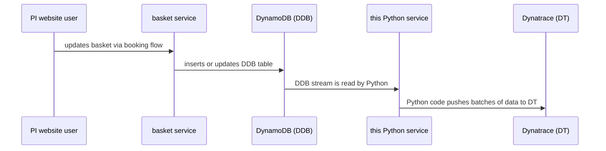

# PI basket DynamoDB Stream to Dynatrace Business Events

This tool connects to a DynamoDB table (used by the PI basket service), reads new and updated items from its [stream](https://docs.aws.amazon.com/amazondynamodb/latest/developerguide/Streams.html), summarizes the data (removing PII and keeping only monitoring-relevant fields), and POSTs batches of these summaries to the [Dynatrace Business Events API](https://docs.dynatrace.com/docs/dynatrace-api/environment-api/business-events).

---

## Features
- Connects to [DynamoDB Streams](https://docs.aws.amazon.com/amazondynamodb/latest/developerguide/Streams.html) for a given table
- Summarizes and anonymizes stream records
- Batches and POSTs events to [Dynatrace Business Events API](https://docs.dynatrace.com/docs/dynatrace-api/environment-api/business-events)
- Supports local testing with [DynamoDB Local](https://docs.aws.amazon.com/amazondynamodb/latest/developerguide/DynamoDBLocal.html) and Docker Compose
- Unit and integration tests included

---

## Architecture & Design

### Stream Processing Model
This service uses a **multi-process architecture** where each [DynamoDB shard](https://docs.aws.amazon.com/amazondynamodb/latest/developerguide/Streams.html#Streams.Processing) is monitored by a separate Python process:

- **Main process**: Periodically discovers open shards in the stream and spawns child processes
- **Worker processes**: Each monitors a single shard, reads records, summarizes them, and POSTs to Dynatrace
- **Shard discovery**: Runs every 10 seconds to detect new shards (from table splits/scaling)

### Batching Strategy
Records are batched **per shard** rather than globally:
- Each shard process accumulates records from [`GetRecords`](https://docs.aws.amazon.com/amazondynamodb/latest/APIReference/API_streams_GetRecords.html) calls (AWS returns up to 1000 records per call)
- The batch size is determined by what DynamoDB returns in a single `GetRecords` response
- All records in a batch are posted together to [Dynatrace Business Events API](https://docs.dynatrace.com/docs/dynatrace-api/environment-api/business-events/post-business-event)
- If a POST fails, the shard iterator is **not advanced**, ensuring at-least-once delivery

### Iterator Position
- **New shards** (discovered after startup): Start from [`TRIM_HORIZON`](https://docs.aws.amazon.com/amazondynamodb/latest/APIReference/API_streams_GetShardIterator.html) (oldest available record)
- **Existing shards** (at startup): Start from `LATEST` (new records only)
- This prevents reprocessing historical data on every restart while catching up on new shards

### Error Handling & Backoff
- Failed Dynatrace POSTs trigger **exponential backoff** (sleep `2^error_count` seconds)
- After **5 consecutive failures** on any shard, the service sets a shutdown event
- All child processes are terminated and the service exits with code 70
- Shard iterators remain unchanged during failures, enabling safe retries

### Data Summarization
Only monitoring-relevant fields are extracted from DynamoDB records:
- Basket metadata: `basketId`, `type`, `hotelId`, `threeLetterHotelId`, `channel`, `subChannel`
- Timestamps: `createdAt`, `lastModifiedAt`
- Payment info: `paymentID`, `paymentOption`, `paymentStatus`, `currency`, `totalCost`
- Reference: `reference` (the basket `status` is not emitted as its own field — it is folded into `event.type`, see below)
- Errors: `errorCode`, `errorDescription`, `errorType` (extracted from nested `basketError` field)
- **All PII is excluded** from the summary

Each event sent to Dynatrace includes:
- `event.provider`: Always set to `"whit.pi.basket"`
- `event.type`: Derived per record as `"<prefix>.<status>"`, where `status` is the basket
  status and `prefix` is `DISTR` for the DISTR channel, otherwise the `subChannel`, otherwise
  the literal `null` (e.g. `WEB.COMPLETED`). A single `watcher-started` event is also emitted
  at startup as a liveness check.
- `build.timestamp`: Image build time, so a data change can be attributed to a code version.

---

## Quick Start

### Prerequisites
- Python 3.14 (pinned by `.python-version` and `requires-python = ">=3.14"`)
- [AWS credentials](https://docs.aws.amazon.com/cli/latest/userguide/cli-configure-files.html) (for real DynamoDB)
- [Dynatrace API key](https://docs.dynatrace.com/docs/dynatrace-api/basics/dynatrace-api-authentication) with Business Events ingest permission
- Docker & Docker Compose (for local/integration testing)

### Installation
Install dependencies using [uv](https://github.com/astral-sh/uv) (recommended for faster installation):
```bash
uv sync
```

### Usage
Run against a real DynamoDB table:
```bash
export DT_API_KEY=your_dynatrace_api_key
uv run basket_stream_to_dynatrace.py <table_name> [--dt-env ENV] [--log-level LEVEL] [--debug]
```
- `<table_name>`: Name of the DynamoDB table to monitor
- `--dt-env`: Dynatrace environment name (default: `whitbread-non-prod`)
- `--log-level`: Set log level: `DEBUG`, `INFO`, `WARNING`, `ERROR`, or `CRITICAL` (overrides `--debug` and `LOG_LEVEL` env var)
- `--debug`: Enable verbose debug logging (shortcut for `--log-level DEBUG`)

### Environment Variables
- `DT_API_KEY` (required): Dynatrace API key for authentication
- `LOG_LEVEL` (optional): Set log level (`DEBUG`, `INFO`, `WARNING`, `ERROR`, `CRITICAL`). Can be overridden by `--log-level` or `--debug` flags.

**Log level priority** (highest to lowest):
1. `--log-level` command-line flag
2. `LOG_LEVEL` environment variable
3. `--debug` flag
4. `INFO` (default)

---

## Testing

### Unit Tests
Run unit tests:
```bash
uv run python -m unittest
```

### Integration Tests (with a local DynamoDB and no Dynatrace POST)
Integration tests require a [local DynamoDB](https://docs.aws.amazon.com/amazondynamodb/latest/developerguide/DynamoDBLocal.html) run from Docker Compose (v2):
```bash
docker compose up
```
This will:
- Start DynamoDB Local
- Create a test table with a stream
- Start the Python app
- Fire a couple of batch writes at the table

You should see log lines like:
```
basket_stream_to_dynatrace-1  | 2025-10-16 11:09:13,396 INFO Process-1 Posting 25 summaries to Dynatrace
basket_stream_to_dynatrace-1  | 2025-10-16 11:09:13,397 INFO Process-1 I would have posted 25 summaries to Dynatrace as follows:
```

Failures in POSTing to Dynatrace can be simulated with:
```bash
DT_ENV=fail docker compose up
```

### Build Timestamp Tracking
Each event posted to Dynatrace includes a `build.timestamp` field for tracking code versions. The timestamp is **automatically captured during the Docker build** and baked into the container image.

**Automatic timestamp (recommended):**
```bash
# Docker build - timestamp auto-generated at build time
docker build -t basket-stream .

# Docker Compose - timestamp auto-generated at build time
docker compose build
docker compose up
```

**Manual timestamp override (optional):**
If you need to set a specific timestamp (e.g., from CI/CD), pass it as a build argument:
```bash
# Manual Docker build with custom timestamp
docker build --build-arg BUILD_TIMESTAMP="2026-03-18 10:30:00 UTC" -t basket-stream .

# Docker Compose with custom timestamp
BUILD_TIMESTAMP="2026-03-18 10:30:00 UTC" docker compose build
```

For non-containerized runs (testing/development), the timestamp defaults to the app start time.

---

## Compatibility

### Python Version
- **Required**: Python 3.14 (`requires-python = ">=3.14"`, pinned by `.python-version`)

### Dependencies
This project has minimal external dependencies (see `pyproject.toml` for the authoritative
constraints; the exact resolved versions are pinned in `uv.lock`):
- **boto3** (`>= 1.43.68`) - AWS SDK for Python (DynamoDB & DynamoDB Streams client)
- **requests** (`>= 2.34.2`) - HTTP library for Dynatrace API calls
- **urllib3** (`>= 2.7.0`) - pinned transitively for CVE currency

Dependencies are declared in `pyproject.toml` and resolved via `uv.lock`.

### AWS Services
- **DynamoDB Streams**: Requires streams to be enabled on the target table (stream view type: `NEW_IMAGE` or `NEW_AND_OLD_IMAGES`)
- **AWS SDK**: Uses boto3 with standard credential chain (environment variables, AWS CLI config, IAM roles, etc.)

### Platform Compatibility
- **Operating Systems**: Linux, macOS, Windows (any OS supporting Python 3.14)
- **Container Runtime**: Docker 20.10+ and Docker Compose v2+ for local testing
- **Deployment**: Suitable for EC2, ECS, Lambda (with custom runtime/handler), or containerized environments

---